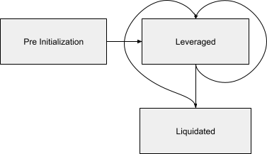

# **STIP - Aave Leverage Module**

**_Using template v0.1_**

## Abstract

We are currently in the midst of a bull market. Demand for leverage is extremely high, and we want to continue building products to satisfy this demand. Currently, our only leverage product in the market. ETH2x-FLI which has already exceeded our expectations and is our most profitable product. We will likely be launching more FLI products on Compound based on this initial success. These include BTC 2x, ETH -1x, BTC -1x, UNI 2x, ETH/BTC Ratio 2x etc. However, Compound does not support other high volume ERC20 tokens such as LINK, YFI, DPI etc. 

## Motivation

### Feature

Add AaveLeverageModule to enable launching products based on Aave.

AaveLeverageModule: 
    Smart contract that enables leverage trading using Aave as the lending protocol. It is paired with the debt issuance module that will call functions on this module to keep interest accrual and liquidation state updated.

#### Product States

	

1. **Pre Initialization:**
    1. SetToken is deployed with AaveLeverageModule added as a module. 
    2. SetToken only has default positions.
    3. SetToken has an aToken as a position.
2. **Leveraged:** 
    1. Target leverage is initialized. A 2x position requires calling rebalance twice to get into the target position. 
    2. SetToken has 2 positions, one aToken default position and one debt token external position.
    3. Should remain in this state through rebalances in perpetuity barring black swan risk of liquidation.
3. **Liquidated:**
    1. In a black swan event, SetToken position is synced with Aave.
    2. If entire borrow position is repaid, remove position during sync.
    3. Leftover collateral position can be reengaged by calling rebalance.

### Why is this feature necessary?

1. To launch the LINK 2x which is only available on Aave. LINK has over $1B in liquidity and is the most traded ERC20 token higher than UNI, MATIC etc.
2. To enable third party Set managers to margin trade using Aave.
3. To deploy on Matic L2 and enable MATIC2x token.

## Background Information

### Set System / Previous Work

*   CompoundLeverageModule
    *   Sync positions in module hooks
    *   Entering markets to enable collateral
    *   Lever interface: borrow -> trade -> mint
    *   Delever interface: redeem -> trade -> repay
*   Compound External Library
    *   An external library that houses all the Compound external interactions

### Aave Research

#### [Docs](https://docs.aave.com/developers/the-core-protocol/lendingpool/ilendingpool)

#### LendingPoolAddressProvider

*   `function getLendingPool() external view returns (address)`
    *   LendingPool address should be fetched from the LendingPoolAddressesProvider as contract addresses could change in Aave

#### LendingPool

The main entry point into the Aave Protocol. Most interactions with Aave will happen via the LendingPool.

*   `function deposit(address asset, uint256 amount, address onBehalfOf, uint16 referralCode) external`
    *   Deposits an `amount` of underlying asset into the reserve, receiving in return overlying aTokens.
*   `function withdraw(address asset, uint256 amount, address to) external returns (uint256)`
    *   Withdraws an `amount` of underlying asset from the reserve, burning the equivalent aTokens owned
*   `function borrow(address asset, uint256 amount, uint256 interestRateMode, uint16 referralCode, address onBehalfOf) external;`
    *   Allows users to borrow a specific `amount` of the reserve underlying asset, provided that the borrower already deposited enough collateral
    *   Mints an equivalent `amount` of stable/variable debt tokens depending upon `interestRateMode`
*   `function repay(address asset, uint256 amount, uint256 rateMode, address onBehalfOf) external returns (uint256);`
    *   Repays a borrowed `amount` on a specific reserve, burning the equivalent debt tokens owned
*   `function setUserUseReserveAsCollateral(address asset, bool useAsCollateral) external;`
    *   Allows depositors to enable/disable a specific deposited asset as collateral

#### ProtocolDataProvider

*   `function getReserveTokensAddresses(address asset)`
    *   Returns the aToken and variableDebtToken addresses associated with `asset`

#### AToken

Minted and burned upon `deposit` and `withdraw` on LendingPool. 

Value is pegged to the value of the corresponding deposited asset at a 1:1 ratio.

*   `function balanceOf()`
    *   Returns the latest collateral balance (principal + interest).
*   `function UNDERLYING_ASSET_ADDRESS() returns (address)`
    *   Returns the underlying asset of the aToken
*   `function POOL() returns (address)`
    *   Returns the address of associated LendingPool for the aToken

Example: [aWETH](https://etherscan.io/address/0x030bA81f1c18d280636F32af80b9AAd02Cf0854e)

#### VariableDebtToken

Minted and burned upon `borrow` and `repay` on LendingPool.

Represent a debt to the protocol with a variable interest rate.

**Non-transferrable tokens.**

*   `function balanceOf() `
    *   Returns the most up to date accumulated debt of the user.
*   `function UNDERLYING_ASSET_ADDRESS()`
*   `function POOL()`

Example: [Variable debt USDC](https://etherscan.io/token/0x619beb58998eD2278e08620f97007e1116D5D25b#balances)

### Differences between Compound and Aave

High level implementation differences in between and Aave. These do not include the obvious difference between their contract interfaces. 

<table>
  <tr>
   <td>Compound
   </td>
   <td>Aave
   </td>
  </tr>
  <tr>
   <td>Markets refer to different asset pools that can be used to lend/borrow.
   </td>
   <td>Markets refer to different deployments of Aave. Currently aave supports 3 markets:

1. Main market (on Ethereum)
2. AMM market (on Ethereum)
3. Polygon market (on Polygon)

Each asset pool in a market is called a reserve.
   </td>
  </tr>
  <tr>
   <td>WETH is not supported natively. Thus additional steps to wrap and unwrap are required.
   </td>
   <td>WETH is supported natively in Aave.
   </td>
  </tr>
  <tr>
   <td>cTokens are the primary means of interacting with the protocol. They allow to deposit underlying (or mint cToken), withdraw (or redeem underlying), borrow and repay. \
Each market has a different cToken contract.
   </td>
   <td>Most interactions with the protocol happen via the LendingPool contract. It allows deposit, withdrawal, borrow and repayment of all assets that are present on a given market (Note: Market consists of multiple asset reserves). All tokens are approved to LendingPool contract.
   </td>
  </tr>
  <tr>
   <td>In order to supply collateral or borrow in a market it needs to be entered first.
   </td>
   <td>Can directly deposit/borrow an underlying asset by calling the LenindgPool contract. No explicit step such as entering the markets is required. \
However, to use a deposited asset as collateral, we need to notify the LeningPool contract by calling `setUserUseReserveAsCollateral()`.
   </td>
  </tr>
  <tr>
   <td>While exiting markets, compound reverts if there is any balance (collateral/debt) left in the protocol
   </td>
   <td>There is no explicit step required to exit a reserve. While exiting positions of a SetToken, need to <strong>natively</strong> verify that there is no balance (collateral/debt) left in the protocol
   </td>
  </tr>
  <tr>
   <td>Compound does not use Chainlink price feeds, thus we have to post the oracles prices on-chain
   </td>
   <td>Aave uses Chainlink price feeds
   </td>
  </tr>
  <tr>
   <td>Compound mints cTokens on depositing collateral and these cTokens can later be redeemed for underlying asset, with an exchange rate > 1
   </td>
   <td>Aave mints aTokens on depositing collateral and the interests are accrued by increasing the aToken holders balances in each block. aTokens can later be redeemed for underlying, with an exchange rate = 1 (1 aToken = 1 underlying)
   </td>
  </tr>
  <tr>
   <td>Accrual of interests happen in a market each time the cToken contract associated with that market is invoked. Thus sometimes we use stored debt values to save on gas and avoid paying the gas fees to accrue interest up to the current block.
   </td>
   <td>Accrual of interests happen each block, irrespective of whether the LeningPool contract was invoked or not. We can always use the most up to date balances (principal + interest).
   </td>
  </tr>
</table>

#### Do these differences have an impact on different flows like issuance and redemption?

*   Issuance flow handles replicating the current debt position by borrowing assets from the Lending protocol, while redemption handles paying back the debt. 
*   DebtIssuanceModule flows are Lending protocol agnostic.
    *   The borrowing and repayment parts of the flows are handled entirely by the associated Leverage Module, which is triggered by the issue/redeem hooks.
*   Issuance/redemption are also not dependent on the interest rate accrual mechanism. The only requirement is that the sync function must be called before issuance/redemption.
*   Hence **No**, issuance and redemption are not affected by these differences. And we can use our current DebtIssuanceModule along with the new ALM.

#### Do these differences affect how often and where we call sync? Do we need to sync balances more/less often in ALM?

*   What does the sync function do?
    *   It keeps the SetToken position units in sync with the lending protocol balances.
*   When do we call the sync function?
    *   In CLM, we call the sync function
        *   Before Issuance
        *   Before redemption
        *   Before exiting markets
*   What happens when we do not call the sync function before issuance/redemption?
    *   Case 1: When notional SetToken positions are greater than balances on lending protocol
        *   This case might occur after a partial liquidation of the SetToken
        *   Example in case of Aave when ETH price is 200$ and target leverage is 2x
            *   1 aETH = 1 ETH = 200 USDC = 200 variableDebtUSDC
            *   Notional SetToken positions : (1 aETH, 100 variableDebtUSDC)
            *   Actual balance of SetToken : (0.8 aETH, 80 variableDebtUSDC) 
        *   Issuer pays a premium to issue the SetToken, SetToken becomes overcollateralized after issuance
        *   Redeemer receives a discount on redeeming the SetToken, while SetToken becomes undercollateralized after redemption
    *   Case 2: When notional SetToken positions is lesser than balances on lending protocol
        *   This case happens as interests accrue on both the collateral and debt
        *   This case wasn’t possible in CLM, as the cToken balances in the SetToken always remained constant
        *   Example in case of Aave
            *   Notional SetToken positions : (1 aETH, 100 variableDebtUSDC)
            *   Actual balances of SetToken: (1.2 aETH, 120 variableDebtUSDC)
        *   Issuer receives a discount, SetToken becomes undercollateralized
        *   Redeemer pays a premium, SetToken becomes overcollateralized
*   Using the above analysis, we can conclude that
*   Sync function is not affected by the way the interest is accrued
*   It must be called at the right places, which is before issuance and redemption and also before exiting markets

#### Do these differences in interest accrual mechanisms affect the number of arbitrage opportunities available?

*   Arbitrage opportunities arise due to difference in notional value of the SetToken and price of the SetToken on DEXes
*   Value of a SetToken (in USDC) = (collateral position unit * collateral price in USDC - debt position unit * debt price in USDC) / totalSupply
*   On Aave the collateral and debt accrue on-chain on every block, unlike compound, but the off-chain bots can calculate the exact balance (principal + interest) value for every block, for both Compound and Aave
    *   The off-chain bots can invoke the compound market to accrue interest (and they can do it every block, if it’s in their favor)
    *   Hence the differences between interest accrual mechanism doesn’t affect the number of arbitrage opportunities available

#### Does Aave using Chainlink price feeds affect the number of arbitrage opportunities available?

*   Aave relies on Chainlink price feeds, which has higher granularity compared to Compound price feeds (which many times we have to update ourselves)
*   Keeping other things equal this allows greater number of arbitrage opportunities 
*   And it reduces any premium/discount upon the SetToken, and keeps the price of the SetToken on DEXes in close sync with it’s notional value

#### Does Aave using Chainlink oracles increase the volatility decay of products based on ALM?

*   Volatility decay in leveraged ETFs is proportional to the choppiness of the price of underlying assets
*   Chainlink oracles have a higher granular price feed thus increasing the choppiness of the on-chain price of the underlying asset
*   With livelier oracles, If the leverage exceeds the max or min bounds, it would trigger a rebalance
*   Keeping other things equal, this leads to products with higher volatility decay

### Resources

*   [Aave docs](https://docs.aave.com/developers/the-core-protocol/lendingpool/ilendingpool)
*   [Aave flash loans](https://docs.aave.com/developers/guides/flash-loans)
*   [Github](https://github.com/aave/protocol-v2/tree/ice/mainnet-deployment-03-12-2020/contracts/protocol)
*   [Aave addresses](https://docs.aave.com/developers/deployed-contracts/deployed-contracts)
*   [PRD](https://docs.google.com/document/d/1A_-MfSUm7C7dU5YqhH4NtUK9L6Jz7OBV5rSpxOE_bn8/edit#)
*   [Presentation](https://docs.google.com/presentation/d/12dhVzlVXFLOVV_hipoxOoLloTcr_pfLird54qKBgYoM/edit#slide=id.g38420732af_0_142)

## Open Questions

*   Allow a Set to have multiple leverage positions on Aave (similar to CLM)? I.e. leverage ETH with USDC as collateral and leverage WBTC with DAI as collateral in the same SetToken
    *   Yes
*   Do we incorporate Aave flash loans directly into the AaveLeverageModule?
    *   No, max LTV is not as big of a limiting factor as max trade size, punt on flashloans for now
*   Should the AaveLeverageModule work for recursive leverage?
*   Do we want to have a protocol fee that we can turn on for trade() the same as TradeModule?
    *   Yes

## Feasibility Analysis

**Option 1**: GeneralLeverageModule (GLM) and LendingProtocolAdapters

*   GLM would be a protocol agnostic module
*   It would be extended by LendingProtocolAdapters
*   LendingProtocolAdapters are protocol specific contracts which encapsulate all interactions with a given Lending protocol
*   LendingProtocolAdapters allow the GLM to interact with various current lending protocols
    *   There are 6 lending protocols with TVL > 1B and 13 protocols with TVL > 100M (Source: [DeFi Pulse](https://defipulse.com/))
*   Allows supporting new lending protocols relatively easier compared to writing a new module for each lending protocol
*   Reduces development effort required by third party protocols, building on top of Set Protocol, to support lending protocols of their choice
*   Implementation would involve taking functionalities from the Compound Leverage Module and dividing them into two buckets, protocol agnostic (GLM) and protocol `dependent (LendingProtocolAdapter)
*   LendingProtocolAdapter would return calldata for different interactions with the external protocol, which can then be invoked on the SetToken.
*   Functions in LendingProtocolAdapter
    *   deposit
    *   withdraw
    *   borrow
    *   repay
    *   updateCollateralAsset
    *   updateBorrowAsset
    *   getCollateralPosition
    *   getBorrowPosition
*   Functions in GLM

	

<table>
  <tr>
   <td>GLM Functions
   </td>
   <td>LendingProtocolAdapter functions called by the GLM function
   </td>
  </tr>
  <tr>
   <td>lever
   </td>
   <td>borrow,  deposit
   </td>
  </tr>
  <tr>
   <td>delever
   </td>
   <td>withdraw, repay
   </td>
  </tr>
  <tr>
   <td>deleverToZeroBalance
   </td>
   <td>withdraw, repay, updateCollateralAsset
   </td>
  </tr>
  <tr>
   <td>initialize
   </td>
   <td>updateCollateralAsset, updateBorrowAsset
   </td>
  </tr>
  <tr>
   <td>sync
   </td>
   <td>getCollateralPosition, getBorrowPosition
   </td>
  </tr>
  <tr>
   <td>issueHook
   </td>
   <td>borrow
   </td>
  </tr>
  <tr>
   <td>redeemHook
   </td>
   <td>repay
   </td>
  </tr>
</table>

*   High initial design and development cost
*   Need further analysis on
    *   If we would support other lending protocols in the future (apart from Compound and Aave) 
    *   if it is a requirement for third party protocols building on top of Set Protocol
*   Off-chain workers would need to be updated to work with Aave, as small changes in interface might be introduced

**Option 2**: AaveLeverageModule (similar pattern to CompoundLeverageModule)

*   Similar to CLM:
    *   Parts of the protocol agnostic code can be directly imported from CLM
    *   An external library that houses all the Aave external interactions
    *   Allow for multiple positions and potentially open it to 3rd party managers
*   Low initial development cost
*   External interface would be exactly similar to CLM
    *   Existing FlexibleLeverageStrategyAdapter contract design can be used to interact with the AaveLeverageModule
    *   Note: Will need to write a new FlexibleLeverageStrategyAdapter for ALM, cause the existing one is meant specifically for CLM
    *   Existing off-chain infrastructure can be used to support new leverage products on Aave
*   Both FlexibleLeverageStrategyAdapter and Aave will use chainlink price feeds
    *   Increases security of products based on ALM compared to CLM. In CLM we do face the risk of liquidation in case of difference in compound and chainlink oracles prices
*   Will need to write a new module for every lending protocol that we support in future (if any)

**Why should we go ahead with Option 2?**

Option 2 has a moderate initial development cost but allows us to tap into 19 Billion dollars worth of liquidity on Aave across all it’s markets. Time is a major factor in a bull run, and it is in our favor to enable leverage products quickly without compromising the security of our products. The CLM is a tried and tested design and replicating that to work with Aave is the most optimal implementation considering both security and time. Implementing an Aave Leverage Module also increases our understanding of how a General Leverage Module (Option 1) would look like, if we develop one in future. 

Note: We haven’t discussed collecting stAAVE LM rewards in this STIP, as that would be specced out in another STIP.

## Timeline

|  Action               |  Start Date   |  End Date  |
|---                    |---            |---         |
| Kickoff               |               |            |
| Feasibility Analysis  |               |            |
| Technical Spec        |               |            |
| Implementation        |               |            |
| Auditors              |               |            |
| Launch                |               |            |
