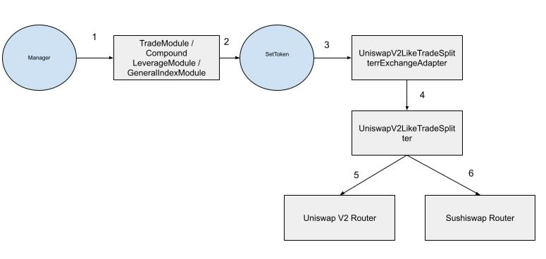

# STIP-002
## Abstract
As Set Protocol begins to support larger products, liquidity will increasingly become an issue for rebalances. Currently, we are limiting the size of trades for the FLI products, and using a TWAP strategy to accommodate these liquidity constraints. An on-chain aggregator that allows us to direct our trades to multiple sources can allow us to solve these problems trustlessly.

## Motivation
This feature would be a trade adapter that uses some strategy to direct trades to the deepest liquidity, potentially splitting trades to use multiple liquidity sources. This is most useful for managers and product developers. It provides the most benefits for automatic products such as the FLI suite, since rebalances must be able to occur trustlessly, with all computation done on-chain. This feature would likely become integrated deeply into current and future products that require making large trades automatically.

## Background Information
Three of the largest sources for on-chain liquidity are Uniswap V3, Uniswap V2, and Sushiswap. While Uniswap V2 and Sushiswap are constant coefficient AMMs, making computing optimal trade splits between the two easy, Uniswap V3 uses a much more nuanced strategy, which makes computing optimally sized trades much more inefficient.

Useful links:  
https://docs.uniswap.org/  
https://uniswap.org/docs/v2/  
https://github.com/ncitron/TradeSplitterResearch  


## Open Questions
- What is the proper balance of gas optimization to trade price optimization?

## Feasibility Analysis
## Computing efficient splits between Uniswap V2 and Sushiswap:
Since price impact scales linearly with liquidity, the trade size must be split proportionally to the pool size for single hop trades. For multihop trades, the ratio between Sushiswap and Uniswap is:
```
Ts/Tu = ((Pua + Pub) * Psa * Psb) / ((Psa + Psb) * Pua * Pub)  

Ts  = Sushiswap trade size
Tu  = Uniswap trade size
Pua = Uniswap liquidity for pool A
Pub = Uniswap liquidity for pool B
Psa = Sushiswap liquidity for pool A
Psb = Sushiswap liquidity for pool B
```
There derivation of this equation is:
```
If we begin with the approximation that the price impact for a trade is:
I = 2T / P
This approximation holds under the assumption that the trade size does not make up a significant percentage of the total trade volume.

Next, we approximate that the total price impact of a multi hop trade is equal to the sum of the price impacts:
I = 2Ta / Pa + 2Tb / Pb
This approximation holds under the assumption that the price impact is a relatively low percentage (after 20% or so it become a bad approximation)

The optimal trade split will be when the Uniswap and Sushiswap trades experience the same price impact. This situation can be represented as:
2Ts / Psa + 2Ts / Psb = 2Tu / Pua + 2Tu / Pub

Which can be simplified as follows
Ts / Psa + Ts / Psb = Tu / Pua + Tu / Pub
(Ts * Psa + Ts * Psb) / (Psa * Psb) = (Tu * Pua + Tu * Pub) / (Pua * Pub)
Ts * (Psa + Psb) / (Psa * Psb) = Tu * (Pua + Pub) / (Pua * Pub)
Ts * (Psa + Psb) * Pua * Pub = Tu * (Pua + Pub) * Psa * Psb
Ts/Tu = ((Pua + Pub) * Psa * Psb) / ((Psa + Psb) * Pua * Pub)
 ```
This strategy assumes that the price on Uniswap is equal to the price on Sushiswap. In cases where the trade size is exceedingly large, it is likely that this assumption is fair, as the price difference is likely much less than the price impact.

## Computing splits between Uniswap V3 and Uniswap V2
During this section, we will establish different strategies for aggregating trades between Uniswap V2 and V3. One thing to note here is that each of these strategies can be easily modified to aggregate liquidity between Uniswap V3, Uniswap V2, and Sushiswap.
### Strategy 1: Off-chain exact split
This is likely the simplest, but least trustless strategy. This requires that we calculate the price impact experienced at regular interval splits between v2 and v3. When we find a percentage split where the price impact is identical for v2 and v3, we have found the one that experiences the least total slippage. An example of this method can be seen here: https://github.com/ncitron/TradeSplitterResearch/blob/master/scripts/offchainV2V3Splitter.ts. This method's main drawback is requiring a trusted keeper to calculate this split off-chain. Additionally, this method is slow to compute with a high degree of accuracy. There may be some optimizations we can make to increase its speed.
### Strategy 2: Optimistic execution of V3, with V2 as a fallback
This strategy makes use of the Solidity's try/catch statement, to perform well in both the average case, and worst case scenario. First calculate the price impact of a V2 swap. Next calculate a minOutput parameter for the V3 swap guarantees that the V3 swap perform better than V2. We can wrap this is a try/catch. If the V3 swap is successful then we finish execution. If the swap reverts (since it could not provide a better price than V2), then it catches and executes the swap on V2. The reason we execute the V3 swap optimistically is because getting a price quote for Uniswap V3 is nearly as expensive as actually executing the trade. This strategy has many of the same positive properties as strategy 3, but at a much lower gas price.
### Strategy 3: On-chain routing
On-chain routing would simply select between Uniswap V2 and V3 by receiving quotes for each, and routing the trade using whichever provides the most optimal price. This strategy is simple, but has the drawback of not being particularly gas efficient since receiving a Uniswap V3 quote costs ~120k gas for single-hop trades, and ~170k gas for multi-hop trades.
### Strategy 4: Off-chain routing
This strategy is similar to strategy three, except it allows the keeper bot the select whether to execute a trade with Uniswap V3 or V2. The FlexibleLeverageStrategyAdapter will store max trade size for both Uniswap V2 and V3, which if tuned correctly, will prevent keepers from executing large trades on V2. The main benefit of this is increased gas efficiency compared to strategy three.

## Implementation Discussion
### Trade Routing:
Trade routing, where only the deepest liquidity source is used in each transaction, can be implemented in a variety of different ways. The simplest allows us to only use a single adapter with no need for any periphery contracts. This adapter would get quotes for trades using Uniswap V3, Uniswap V2, and Sushiswap, and then produces the calldata for whichever exchange gave the best quote. Additionally, this strategy can use the adapters of each exchange as a helper for producing the required calldata. This strategy has the benefit of simplicity, but also has additional gas overhead since receiving a quote for Uniswap V3 costs nearly as much as actually performing the swap.

A more gas efficient strategy for routing trades using an optimistic execution of Uniswap V3. This strategy requires that we use a periphery contract to execute the trade, and write an exchange adapter that routes trades through our custom exchange contract. To start, we receive quotes for the trade using Uniswap V2 and Sushiswap, and provide the best quote as the minOutput parameter for a Uniswap V3 swap. If Uniswap V3 provides a better price than Uniswap V2 or Sushiswap, then this trade will execute successfully. If it does not, this trade will revert, and using solidity's try/catch functionality, we can continue execution and instead use Uniswap V2 or Sushiswap. This strategy has the benefit of increased gas efficiency over the prior strategy, since it does not have to make the redundant call to get a Uniswap V3 quote. This strategy's main drawback is that it not possible to know the trade size prior to execution, meaning we may be left with unused tokens, requiring additional gas costs to handle.

The most gas efficient way to route trades is to decide whether to use V3 or V2 off-chain. This can be accomplished with a view function of the FLIStrategyAdapter. For additional efficiency, we can route between Uniswap V3, or a V2/Sushi split. The implementation can be done by creating an adapter and peripheral contract that allows us split trades between Uniswap V2 and Sushiswap. Then, the FLIStrategyAdapter would need to be modified to be able to select between using this new adapter, or the Uniswap V3 adapter.

### Trade Splitting
Trade splitting, where we send liquidity through multiple liquidity sources in a single transaction can be implemented using a periphery exchange contract, or through a new module. The first strategy is likely the simplest, since it uses the existing trade adapter system, while giving us the most flexibility. This strategy would also allow us to do a combination of trade routing and trade splitting, where we perform strategy two, with a perfect Uniswap V2 / Sushiswap split as the fallback to Uniswap V3.

Creating a new module would give us a system that may be more reusable, but with additional handicaps, since many splits would have to be precomputed, removing the possibility of executing trades optimistically. The TradeSplitterModule would work much like the current TradeModule, but would allow for making multiple trades using different exchanges.

## Recommendation
The off-chain split/route combo satisfies the most requirements out of all the proposed solutions. It allows us to select between using Uniswap V3 or a V2/Sushi split off-chain, which saves the gas of receiving the Uniswap V3 quote on-chain. Utilizing different max trade sizes for Uniswap V3 and V2 still allows us to potentially open up the rebalancing functions publicly in the future.

Implementing this strategy requires two different changes. First, the FlexibleLeverageStrategyAdapter must be updated to allow for selecting between different exchanges for rebalances. This requires adding a view-only function that informs the keeper bots which exchange to use, adding different max trade sizes for each available exchange, and adding a parameter to each rebalancing function that specifies which exchange to use. The second change will be to write a periphery UniSushiSplitter contract which splits trades into the optimal Uniswap V2 / Sushiswap percentages utilizing the equations derived in the earlier sections of this STIP. A new exchange adapter will be written to connect with this periphery exchange contract.

## Table

| Strategy | Optimistic Split/Route Combo | On-chain Split/Route combo | Off-chain Split/Route combo |
|----------|------------------------------|-------------------|----------------|
| Pros | Gas efficient, better trades | More Trustless, ok trades | Gas efficient, ok trades |
| Cons | Requires peripheral contract or new module, less gas efficient then off-chain | Not gas efficient | Less trustless |

## Timeline
- Spec + review: 4-5 days
- Implementation: 4-5 days
- Internal review: 2 days
- Deployment scripts: 1 day
- Deploy to testnet: 1 day
- Testing: 3-5 days
- Write docs: 1-2 days

## Checkpoint 1
**Reviewer**:

## Proposed Architecture Changes
This feature will be built as an exchange adapter, and index exchange adapter, and a peripheral contract. The adapters will utilize the peripheral contract as if it were an exchange, as it will be responsible for executing the trades split.

## Requirements
- All calculations performed on-chain
- Supports at least 2 hops on Uniswap and Sushiswap
- Works even when there is no liquidity on one of the supported exchanges
- Has functions for both exact input and exact output
- Performs slippage checks

## User Flows

1. Manager calls trade() on TradeModule / GeneralIndexModule / CLM passing in the relevant parameters and “UniswapV2LikeTradeSplitterExchangeAdapter” as exchange.
2. module invokes a call from SetToken.
3. Get approval and trade calldata via UniswapV2LikeTradeSplitterExchangeAdapter
4. The SetToken invokes an approval and trade on the UniswapV2LikeTradeSplitter, a contract we write that is a layer above Uniswap V2 and Sushi. 
5. UniswapV2LikeTradeSplitter.trade() routes to Uniswap V2 and Sushi, using the optimal trade split


## Checkpoint 2
**Reviewer**:
Reviewer: []

## Specification
### UniswapV2LikeTradeSplitterExchangeAdapter
#### Inheritance
- IExchangeAdapter
#### Constants
| Type 	| Name 	| Description 	| Value 	|
|------	|------	|-------------	|-------	|
|string |EXACT_INPUT|function signature for exact input trade|"tradeExactInput"|
#### Public Variables
| Type 	| Name 	| Description 	|
|------	|------	|-------------	|
|address|tradeSplitter|address of the trade splitter contract|
#### Functions
| Name  | Caller  | Description 	|
|------	|------	|-------------	|
|getTradeCalldata|TradeModule|Gets trade calldata|
|getSpender|TradeModule|Returns the address of the UniswapV2LikeTradeSplitter so that the tokens can be approved|
#### Functions
> function getTradeCalldata(address _sourceToken, address _destinationToken, address _destinationAddress, uint256 _sourceQuantity, uint256 destinationQuantity, bytes calldata /* _data */)
- _sourceToken: the input token
- _destinationToken: the output token
- _destinationAddress: where the outputs should be sent to
- _sourceQuantity: the input amount
- _destinationQuantity: the output amount
- Returns: the calldata for the Uniswap V3 trade
> function getSpender()
- Returns: the spender that needs to have the appropriate approvals for the swap


### UniswapV2LikeTradeSplitterIndexExchangeAdapter
#### Inheritance
- IIndexExchangeAdapter
#### Constants
| Type 	| Name 	| Description 	| Value 	|
|------	|------	|-------------	|-------	|
|string |EXACT_INPUT|function signature for exact input trade|"tradeExactInput"|
|string |EXACT_OUTPUT|function signature for exact output trade|"tradeExactOutput"|
#### Public Variables
| Type 	| Name 	| Description 	|
|------	|------	|-------------	|
|address|tradeSplitter|address of the trade splitter contract|
#### Functions
| Name  | Caller  | Description 	|
|------	|------	|-------------	|
|getTradeCalldata|TradeModule|Gets trade calldata|
|getSpender|TradeModule|Returns the address of the UniswapV2LikeTradeSplitter so that the tokens can be approved|
#### Functions
> function getTradeCalldata(address _sourceToken, address _destinationToken, address _destinationAddress, bool _isSendTokenFixed, uint256 _sourceQuantity, uint256 destinationQuantity, bytes calldata /* _data */)
- _sourceToken: the input token
- _destinationToken: the output token
- _destinationAddress: where the outputs should be sent to
- _isSendTokenFixed is whether to use exactInput or exactOutput for the trade
- _sourceQuantity: the input amount
- _destinationQuantity: the output amount
- Returns: the calldata for the Uniswap V3 trade
> function getSpender()
- Returns: the spender that needs to have the appropriate approvals for the swap


### UniswapV2LikeTradeSplitter
#### Constants
| Type 	| Name 	| Description 	| Value 	|
|------	|------	|-------------	|-------	|
|string |EXACT_INPUT|function signature for exact input trade|"swapExactTokensForTokens"|
|string |EXACT_OUTPUT|function signature for exact output trade|"swapTokensForExactTokens"|
#### Public Variables
| Type 	| Name 	| Description 	|
|------	|------	|-------------	|
|IUniswapV2Router|uniRouter|Uniswap Router|
|IUniswapV2Router|sushiRouter|Sushiswap Router|
|IUniswapV2Factory|uniFactory|Uniswap Factory|
|IUniswapV2Factory|sushiFactory|Sushiswap Factory|
#### Functions
| Name  | Caller  | Description 	|
|------	|------	|-------------	|
|tradeExactInput|Set Token (via invoke)|executes an exact input trade|
|tradeExactOutput|Set Token (via invoke)|executes an exact output trade|
|getQuote|manager|helper function for getting a quote|
#### Functions
> function tradeExactInput(uint256 _amountIn, uint256 _amountOutMin, address[] calldata_path, address _destination) external returns (uint256)
- _amountIn: the amount to trade
- _amountOutMin: the minimum output amount received
- _path: an array representing the path of the trade
- _destination: address to send outputs to
- returns: output amount

> function tradeExactOutput(uint256 _amountInMax, uint256 _amountOut, address[] calldata_path, address _destination) external returns (uint256)
- _amountInMax: maximum input amount
- _amountOut: output amount received
- _path: an array representing the path of the trade
- _destination: address to send outputs to
- returns: input amount

> function getQuote(uint256 _amountIn, address[] calldata _path, bool _isExactInput) external view returns (uint256)
- _amountIn: the amount to trade
- _path: an array representing the path of the trade
- _isExactInput: whether to get a quote for an exact input of exact output
- returns: expected output amount

## Checkpoint 3
Before we move onto the implementation phase we want to make sure that we are aligned on the spec. All contracts should be specced out, their state and external function signatures should be defined. For more complex contracts, internal function definition is preferred in order to align on proper abstractions. Reviewer should take care to make sure that all stake holders (product, app engineering) have their needs met in this stage.

**Reviewer**:

## Implementation
[Link to implementation PR]()
## Documentation
[Link to Documentation on feature]()
## Deployment
[Link to Deployment script PR]()  
[Link to Deploy outputs PR]()
