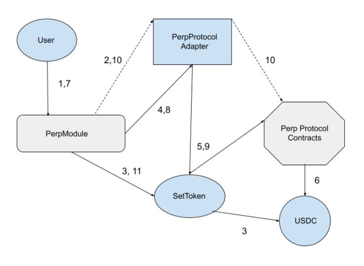

# STIP-005
*Using template v0.1*
## Abstract

This STIP explores possible designs for a PerpetualProtocol module.

## Motivation

We’re interested in perpetual futures protocols as a vehicle for designing:

* FLI products for a wider range of base tokens
* FLI products with larger leverage multiples (ex: BTC-FLI3X)
* Inverse FLI products
* Basis trading products, e.g for products that capture futures markets funding flows while remaining market neutral with respect to the underlying asset's price action

## Background

### Perpetual Contracts

A perpetual futures contract is an agreement to buy or sell an asset at some point in the future. Perpetual futures are cash-settled and are held indefinitely without the need to roll over contracts. Payments are periodically exchanged between holders of the two sides of the contracts, long and short, with the direction and magnitude of the settlement based on the difference between the contract price and that of the underlying asset, as well as  the difference in leverage between the two sides.

Cryptocurrency perpetuals are characterised by the availability of high leverage, sometimes over 10 times the margin, and by the use of auto-deleveraging, which compels high-leverage, profitable traders to forfeit a portion of their profits to cover the losses of the other side during periods of high market volatility, as well as insurance funds, pools of assets intended to prevent the need for auto-deleveraging.

Perpetual futures for the value of an asset require the payment of a periodic settlement, intended to mirror the value of the flow from one side of the contract to the other. At any time *t*, the dividend paid from shorts to longs, is defined as:


where  is the price of the perpetual at time _t_,  is the dividend paid to owners of the underlying asset at time _t_, and is the return on an alternative asset (expected to be a short-term, low-risk rate) between time _t_ and _t+1_.

In summary, the difference in crypto prices from one moment to another can be thought of as the dividend due to owners of the asset. Settlement between different sides of the trade, known as **funding**, typically occurs every eight hours, although other arrangements including per-block settlement are possible. In addition, the base interest on cryptocurrency perpetuals (the low-risk rate) is usually a fixed percentage set by the exchange.

### Liquidation and Insurance Funds

Contract liquidation in response to adverse price movement can occur when the contract's (or account’s) remaining margin reaches a pre-specified value (the maintenance margin, which determines the liquidation price). The liquidation proceeds are typically inserted into the exchange's insurance fund, which guarantees the profitable side when counterparty margin is insufficient, usually when the price of the asset has moved sharply in one direction and the exchange was unable to liquidate at a profit.


### Auto-Deleveraging

If the exchange's insurance fund is depleted, whether globally or for a particular contract, accounts are ranked according to their profit and leverage. This is used to form an "auto-deleveraging" queue, where the positions of traders at the front of the queue are closed, at the bankruptcy price, to prevent market losers from going into default. Auto-deleveraging is intended to reduce counterparty risk by penalising the riskiest traders, as opposed to the more evenly-spread "mutualised" model used by central clearing.

[(Source: Wiki)](https://en.wikipedia.org/wiki/Perpetual_futures)

[(Source: Perpetuals V2 (Curie) AMA)](https://medium.com/perpetual-protocol/perpetual-protocol-ama-the-curie-release-b8ecc0ad2fb4)


## Protocols

### Perpetual Protocol V2

#### Overview

Perpetual Protocol virtualizes assets on an AMM and allows users who have deposited USDC into the system to act as takers or makers for them.

* **Takers** open long or short positions and can redeem these at a profit if the price for a virtual asset _on the AMM_ moves in their favor. Takers can trade on margin, allowing them to lever their positions.
* **Makers** provide liquidity at or around the market price and receive fees in return.

#### Uniswap Pricing Engine

PerpV2 uses UniswapV3 as its pricing engine, minting virtual tokens to pools in response to liquidity provision events and relying on pool dynamics to determine settlement payments as positions are closed.

There is no secondary market for PERP’s virtual asset tokens; they are wholly controlled by the protocol and used for internal accounting to help with price binding.

The realizable value of a long position is the sum of:
+ the vAsset swap value on the AMM (positive)
+ debt (the USDC paid to put on the poition) (negative)
+ vault collateral (USDC deposits) (positive)
+ pending funding accrued at the time of settlement (positive or negative)

#### Oracle Valuation Engine

Oracles (for spot prices) are used to:

* calculate funding payments
* value account positions for the purposes of margin calculations.

#### Trading

Traders interact with the protocol through the [ClearingHouse][1] contract which provides an API to open and close positions. The interface follows the Uniswap pattern for swaps and _openPosition_ can be configured to

[1]: https://github.com/perpetual-protocol/perp-lushan/blob/main/contracts/ClearingHouse.sol

* open or add to a long position
* open or add to a short position
* reduce the size of any position

Uniswap V3 returns_ token1/token0_  prices where _token0_ and _token1_ are calculated by comparing assets _(token0 < token1_). PERP fixes the order of base (synthetic) and quote (collateral) tokens as  **B0Q1** (base=token0, quote=token1). At the moment the system supports a single collateral token (USDC). Account and position values are denominated in USDC and all positions close to USDC.

For example, to open a long vETH position worth 1 USDC, the trader would configure openPosition as below

```ts
IClearingHouse.OpenPositionParams params = IClearingHouse.OpenPositionParams({
   baseToken: VETH_ADDR,
   isBaseToQuote: false, // false for longing
   isExactInput: true,
   amount: parseEther("1"),
   sqrtPriceLimitX96: 0 // 0 for no price limitation
   ...
})
```

The trader could sell their entire vETH position by inverting the _isBaseToQuote_ value as below

```ts
const basePositionSize = await ch.getPositionSize(_taker.address, VETH_ADDRESS);

IClearingHouse.OpenPositionParams params = IClearingHouse.OpenPositionParams({
   baseToken: VETH_ADDR,
   isBaseToQuote: true, // true for shorting
   isExactInput: true,
   amount: basePositionSize,
   sqrtPriceLimitX96: 0 // 0 for no price limitation
   ...
})
```

#### Margin/Leverage

PERP provides accounts with an initial margin ratio of 10% and sets their minimum margin ratio at 6.25%. Margin levels are evaluated as a sum of an account’s positions - e.g the system is cross-margin by default. In practice, traders can open positions whose spot market valuation is  ~9X the value of collateral they’ve deposited into the system. For margin requirement purposes, positions are priced using Chainlink oracles for the parent asset of a virtual asset.

As the oracle price for a parent asset changes, the total margin requirement for an account scales with it such that the leverage ratio for a position maintains a constant relation to the position’s value in spot markets. (See  Appendix/Simulations/Leverage for an example).

#### Funding

Funding is a payment flow between makers and takers in the Perp system that acts as a balancing force to bring the AMM price of the virtual asset closer to the oracle price.

A simplified formula for how these payments are calculated is:

```
   time = seconds since position opened / 86400
   pendingFundingPayment = _positionSize * (AMM market price - Oracle price) *  time
```

If a taker opens a long position and the oracle price is below AMM market, they pay funding fees. If the oracle price is above AMM market price, they receive them. Funding payments are settled when the trader closes a position, realizing their PNL. They are calculated using the  AMM price and the 15 min TWAP oracle price read during settlement.

Traders settle their pending funding payments whenever they open, modify or close a position. For the module's purposes this means funding is credited or debited during issuance, redemption, lever, and delever.

#### Insurance Fund

This is currently WIP with no unit tests in the perp-lushan repository, as of commit: 56ab296 (Sept 15)

#### Source Code
+ [Github](https://github.com/perpetual-protocol)


### Futureswap

#### Resources
+ [FutureSwap docs][400]
+ This project’s code [is not open sourced](https://github.com/futureswap/Protocol) at the moment. (We've approached them about getting access.)

#### Pricing Engine

Futureswap trades the futures contract's underlying assets directly on UniswapV3 out of reserves capitalized with trader collateral and staker liquidity.

Traders deposit collateral to manage a position in a specific asset/stable pair market. In principle ETH could be the "stable" side of the pair (enabling ETH collateralization) if the market is structured that way but typically "stable" is USDC-like and "asset" is a crypto volatile.

The realizable value of a Futureswap long position is the sum of:

+ the asset's swap value on UniswapV3 (positive)
+ debt (the stable amount borrowed to put on the poition) (negative)
+ pending funding accrued at the time of settlement (positive or negative)

#### Funding

Futureswap funding fees incentivize long and short positions to balance each other out. If there are more longs than shorts, longs pay asset to shorts and vice versa. This payment is modelled as happening continuously in each time interval and the funding rate is charged on every contract interaction, per the following formula:

*fundingCharged = (long.asset + short.asset) * fundingRate * deltaTime*

The rate at which an asset is transferred is proportional to the imbalance between longs and shorts.

#### Auto-deleveraging

Futureswap doesn't have an insurance fund. Instead it uses an auto-deleveraging mechanism to balance its ledger when trades attempted on UniswapV3 fail due to liquidity shortages. ADL skips the Uniswap pool and executes orders by force-closing positions on the opposite side of the book, beginning with the most highly leveraged counterparties.

This means it's possible to be liquidated even when your position is in profit. ADL'd positions are closed at a small premium to market and low-leverage positions are at least risk of being unwound by force.

#### Trade API

**User flow**

1. Read the address of Perp pair exchange (ex: ETH/USD) from a registry where ETH is "asset" and USDC is "stable"
2. Approve exchange for amount to transfer on the stable token (ex: USDC.approve(...)).
3. Use ExchangeAddress.changePosition() to deposit, withdraw and trade

**Interface: changePosition()**
```solidity
ExchangeAddress.changePosition(
  int256 deltaAsset,  // Buy amount in asset decimals, long = positive, short = negative
  int256 deltaStable, // Stable to deposit (positive) or withdraw (negative) in stable decimals
  int256 stableBound  // Max amount stable to pay for asset (net slippage and fees). Long = negative, Short = positive
);

Returns:
(
  int256 startAsset   // Asset amount the position had before changePosition() was called
  int256 startStable  // Stable amount the position had before changePosition() was called
  int256 totalAsset   // Asset amount the position had after execution of changePosition()
  int256 totalStable  // Stable amount the position had after execution of changePosition()
  int256 traderPayout // Stable amount sent to the trader
)
```

**Example Usage: changePosition()**

Where ETH = 10 USDC, slippage is 1%

| Action | Call |
| ---- | ---- |
| Deposit 10 USDC | changePosition(0, +10_000_000, ...) |
| Withdraw 10 USDC | changePosition(0, -10_000_000, ...) |
| 2X Long ETH, incl. deposit | changePosition(2, +10_000_000, -20_200_000) |
| Long 2 ETH, no deposit | changePosition(2, 0, -20_200_000) |
| Short 2 ETH, no deposit | changePosition(-2, 0, 20_200_000) |

**PerpV2 & Futureswap equivalents** (hypothetical)

| PerpV2 | Futureswap |
| ------ | ------ |
| deltaBaseAvailable | totalAsset - startAsset |
| deltaQuoteAvailable | totalStable - startStable |
| getPositionSize() | (asset,...) = getPosition() |
| getPendingFunding() | [recipe][401] |
| vault.balanceOf() + getOpenNotional() | (,stable,...) = getPosition() |
| realizedPnL | traderPayout (return param of *changePosition()*) |
| carriedOwedRealizedPnL | always settled to stable balance |

[401]: https://docs.futureswap.com/protocol/developer/trade#get-funding-rate
[400]: https://docs.futureswap.com/protocol/trading/trading-flow

### Mai-protocol-v3

The Mai protocol shares many of the same properties as PERP but has a broader set of features for liquidity providers and manages leverage and funding differently.

#### AMM / Orderbook

Mai’s futures market is a custom AMM serviced by liquidity providers who receive funding payments. LPs can create their own perpetual markets using the price feed of arbitrary underlying assets and choose any ERC20 as collateral. They can also configure a perpetual market’s margin rate and certain risk parameters that help LPs manage market making operations.

It's worth noting that arbitrary market creation is regarded as a desireable feature and Mai seems to be only protocol offering this. A recent [Derbit market research paper][500] notes:

> The key value of the AMM model is the ability to easily and permissionlessly create new markets. As of yet, none of the protocols are able to offer that. The first protocol to crack a sustainable model, where users are incentivised to create their own perpetual futures markets on anything with a price feed, is likely to see a significant moat.

[500]: https://insights.deribit.com/market-research/the-quest-for-perp-amms/

Another major difference between Mai and PERP is the way their pricing engine incorporates oracle prices alongside AMM liquidity conditions to anchor futures prices in the spot market.

Per the [Pricing Strategy](https://docs.mcdex.io/amm-design#features-of-the-pricing-strategy) section of their docs:


* The AMM price automatically follows the spot price
* Liquidity tends to concentrate near the spot price, reducing slippage

#### Trading

Traders open and reduce positions using a [Trade API](https://github.com/mcdexio/mai-protocol-v3/blob/03d70a5b3801949ffcb7df82e57fd35c07ec91c7/contracts/Perpetual.sol#L146-L203). Each trade realizes funding payments and calculates the current margin available before executing.

Mai's interfaces for trade, deposit and withdrawal are:

```solidity

 // Trades and returns the updated position amount of the trader
 function trade(
     uint256 perpetualIndex,   // The index of the perpetual in the liquidity pool
     address trader,           // The address of trader
     int256 amount,            // The position amount of the trade
     int256 limitPrice,        // The worst price the trader accepts
     uint256 deadline,         // The deadline of the trade
     address referrer,         // The referrer's address of the trade
     uint32 flags              // The flags of the trade
 ) external returns (int256);
```

Deposit and withdraw have the same signature
```solidity
function deposit(
   uint256 perpetualIndex, // The index of the perpetual in the liquidity pool
   address trader,         // The address of the trader
   int256 amount           // The amount of collateral to deposit
);
```

#### Summary

Mai’s documentation is thin and difficult to draw conclusions from. However, on the surface it seems like it would be possible to build adapters to map its trading inputs and outputs to an interface which PERP could share.

Resources:

* [Read API](https://github.com/mcdexio/mai-protocol-v3/blob/master/contracts/reader/Reader.sol): this returns data about account balances, liquidity pool state and a way to simulate outcome of a trade.
* [Trade API](https://github.com/mcdexio/mai-protocol-v3/blob/03d70a5b3801949ffcb7df82e57fd35c07ec91c7/contracts/Perpetual.sol#L146-L203)


## PerpV2 Feasibility Analysis

**Fundamental Concepts**

* Issuance replicates the set's current positions (e.g its leverage and ratio of components).  USDC enters our system and we allocate resources to preserve the set's existing properties as we open positions on the external protocol.
* Redemption is about replicating the current position as USDC leaves our system and we reduce positions on the external protocol.

**Design Goals**

* Works seamlessly with the existing DIM and SetToken
* Works well with rest of the SetProtocol architecture and processes for managing Sets
* Encapsulates all PerpV2 interactions in a dedicated module

**Set System Compatibility Issues**

+ We plan to track the components that make up Perp position as addresses (of virtualAssets or pools) and read quantities from the external protocols on the fly using protocol specific viewer methods. For back-end purposes we will need to provide an API for viewing Perp position details and assigning a value to the Perp account.

**Design Challenges**

+ **vAsset Pricing**: For most operations, we'll need to get a spot price for virtual assets from UniswapV3.

 	One approach is to use Perp’s Quoter API to get a quote for `1.0101 USDC` worth of vBase (e.g amountOut per vUSDC net of Perp protocol fees). This would look like:

	```solidity
	vBaseAmountOut  = Quoter.swap({
  		isBaseToQuote: false,
  		isExactInput: true,
  		amount: toPreciseUnit(1.0101),
		...
	});

	spotPrice = 1 / vBaseAmountOut
	```

	*Quoter.swap* simulates a trade on the AMM and is very gas intensive.

	~~A safe math Solidity algorithm to derive the price from the Uniswap price square root would be more gas efficient but requires additional research. (We wrote a convenience Solidity method to do this for our scenario tests ([see here][720]) but it reverts with multiplication overflow for prices as low as $20.  Maybe there’s another technique.)~~

  We found [an inexpensive mathematical solution][721] for this which converts Uniswap's priceSqrt into a mid-price in PerpV2's own code...

+ **AMM Market Manipulation (via flash loan)**: TODO (attack description)
  + [Our initial modeling][722] of flash-loan attacks suggest they're not profitable.

[720]: https://github.com/SetProtocol/perp-lushan-copy/blob/c03072188a58e71fe9a405c77b2a0c3be7ada795/contracts/ClearingHouse.sol#L907-L909
[721]: https://github.com/SetProtocol/set-protocol-v2/blob/d2f81d12de37ec47553f285534efd99ca4dc664a/contracts/protocol/modules/PerpV2LeverageModule.sol#L733-L738
[722]: https://docs.google.com/spreadsheets/d/1UjxIs6hw1bFJalxwmHnONfX40K-hPhOm6oqyXnC6qsg/edit#gid=418389280&range=1:1

### Required Set Contracts

<table>
<tr><td><strong>Contract</strong></td><td><strong>Notes</strong></td></tr>
<tr><td>SetToken</td>
<td>

Has an external USDC position managed by PerpV2 protocol.

</td>
</tr>
<tr><td>PerpIssuanceModule</td>
<td>

WIP: A variant of the DebtIssuance module (inherits it) which includes viewer methods to help front-end applications display how much collateral token an issuance request will cost (or a redemption request will yield).

</td>
</tr>
<tr><td valign="top">

PerpLeverageModule

</td>
<td>

Exposes a standard leverage module API

+ lever
+ delever
+ moduleIssuanceHook
+ moduleRedeemHook
+ componentIssuanceHook
+ componentRedeemHook

**New: Trading API**

+ *deposit*: transfers assets from SetToken to Perp protocol
+ *withdraw*: transfers assets from Perp protocol to SetToken

**New: Viewer API**

+ *getPositionInfo*: gets base and quote positions,
+ *getAccountInfo*: gets vault collateral, funding and owedRealizedPnL balances
+ *getSpotPrice*: gets the UniswapV3 mid-point price of a base asset

<tr><td valign="top">

PerpV2Lib

</td>
<td>

Encodes PerpV2 Protocol method calldata and invokes with SetToken

+ invokeDeposit
+ invokeWithdraw
+ invokeOpenPosition
+ invokeQuoterSwap

</td></tr></table>

### Required PerpV2 Contracts

<table><tr><td valign="top"> Vault </td>
<td>

Entry point into the protocol. Where funds are deposited/withdrawn and collateral is stored.

```solidity
deposit(address token, uint256 amount)
withdraw(address token, uint256 amountX10_D
balanceOf(address trader) returns (int256)
```

</td></tr>
<tr><td valign="top"> ClearingHouse</td>

<td>

Exposes Perp’s trading API

```solidity
openPosition(OpenPositionParams memory params)
```

</td></tr>
<tr><td valign="top"> AccountBalance</td>
<td>

Exposes getters for position and PnL info

```solidity
getPositionSize(address trader, address baseToken) returns (int256)
getOwedAndUnrealizedPnl(address trader) returns (int256)
```

</td></tr>
<tr><td valign="top"> Exchange</td>
<td>

Exposes getters for openNotional balance and pending funding payments

```solidity
getOpenNotional(address trader, address baseToken) returns (int256)
getPendingFundingPayment(address trader, address baseToken) returns (int256)
```

</td></tr>
<tr><td valign="top"> Quoter</td>
<td>

Provides a way to get trade quotes from the Perp AMM by simulating swaps. Quotes include protocol fees.

```solidity
swap(SwapParams memory params)
```

</td></tr>
</table>

### Similarities between the ALM/CLM flow and Perp flow

In general, Perp simplifies the lever and delver flows. Most of the actions required to  get into a leveraged position in ALM and CLM  are accomplished by opening positions on margin in the external protocol (e.g via _CH.openPosition_ in case of PerpV2).

<table>
<tr><td><strong>Step</strong></td> <td><strong>ALM/CLM flow</strong></td> <td><strong>Perp flow</strong></td>
</tr>
<td valign="top"><strong>Lever</strong></td>
<td valign="top">

Use existing collateral to Borrow debt asset, trade it for collateral asset and deposit that back</p>

</td>

<td><div>

Open a position using *ClearingHouse.openPosition()*

Under the hood the PerpV2 system does something similar to what our existing leverage modules do:
  + Use vault’s USDC as collateral to mint vUSDC
  + Swap vUSDC for vETH
  + Clearing house receives vETH and manages it on SetToken’s behalf

Amount of vUSDC minted depends on our leverage ratio.
We can specify the exact amount of vUSDC we wish to send or the amount of vETH we wish to receive in
the CH.openPosition() function. It is similar to how we do it in UniswapV2.

</div></td></tr>

<tr>
<td valign="top"><strong>Delever</strong></td>
<td valign="top"> <p> Trade collateral asset for borrow asset and repay borrow asset </p></td>
<td>

Reduce a position using *CH.openPosition()* by inverting the value for *isBaseToQuote* used when
increasing the position.

Under the hood the PerpV2 system does something similar to what our existing leverage modules do
+ Clearing house sells vETH and reduces the vUSDC notional open position, paying down debt
+ Slippage, fees and funding accrue to owedRealizedPnL. These get socialized among all set holders during
  issuance and redemption

</td>
</tr>
</table>


### Differences between the ALM/CLM flow and Perp flow

Sync, issuance and redemption are fundamentally different and more complex.

<table><tr><td>Property</td><td width="40%">ALM/CLM</td><td>PerpV2</td></tr>
<tr>
<td valign="top">Pricing Engine</td>
<td valign="top">

Open AMM

Price always remained very close to oracle price.

</td>
<td valign="top">

Closed AMM

Since the pool is a futures market, indirectly anchored to the spot price by a funding mechanism, its prices can deviate from those of the parent assets we want to track.

This  forces us to calculate our realizable value during syncing by using prices from the AMM and not just our Chainlink oracle.

</td>
</tr>
<tr>
<td valign="top"> Sync </td>
<td valign="top">

+ Fetch data from external protocol </li>
+ Update position units on SetToken based on fetched data </li>

</td>
<td valign="top">

+ Fetch data from external protocol</li>
+ Update external USDC position unit on SetToken based on calculation of Perp account's realizable value

</td>
</tr>
<tr>
<td valign="top">Issuance</td>
<td valign="top">

The issuer acquires the asset to which he wants leveraged exposure and deposits that in our system. The amount of asset
deposited is equal to the amount of exposure the issuer needs.

After deposit, we return the issuer the minted SetToken along with a different asset (USDC) with:
+ *returned amount = (deposited amount)/(leverage ratio)*

There is no AMM involved in this process. (Although it might have been used to acquire the initial asset)

</td>
<td valign="top">

The issuer deposits only the collateral asset (USDC) to our system and gets exposure to any asset that is supported by the
external protocol.

There is an AMM involved in this process.
</td>
</tr>
<tr>
<td valign="top">Redemption</td>
<td valign="top">

The redeemer sends the debt asset and SetToken to be redeemed. We burn the SetToken and unwind the leverage position.
We return to the redeemer the amount of the leveraged asset that he had exposure to.

There is no AMM involved in this process. (Although it might have been used to acquire the initial asset)

</td>
<td valign="top">

The redeemer brings only the SetToken. While we only return to the redeemer the USDC value of the amount of asset that he
had exposure to.

There is an AMM involved in this process.

</td>
</tr>
<tr>
<td valign="top">Frequency of rebalances</td>
<td valign="top">

In CLM/ALM, since our position was a CDP, we had to actively manage our leverage ratios, keep track of them and call
lever/delever every 24 hours.

</td>
<td valign="top">

Leverage ratios be pushed off the target by:
+ price movement of underlying assets
+ funding flows

Like CDPs Perp positions are exposed to liquidation risks when account values drop below minimum margin requirements.

The module will need to support active maintenance of the leverage target although it's unclear what the rebalance cadence
might need to be.

</td>
</tr>
</table>

### PerpV2 Issuance, Redemption and Lever/Delever flow analysis

**:warning: NOTE:  :warning:**

The user flows documented here are for a module design that encapsulates PerpV2 specific logic in a dedicated adapter. However we decided to drop the adapter pattern for our initial implementation - all logic resides in a PerpV2 module instead.

## Issuance


### User story: Issuing 1 set (with slippage)

User wants to issue 1 unit of a SetToken representing a  2X leveraged Perp account which uses USDC as collateral. ETH costs $10 and each Set is worth $10. The execution cost of replicating the position in the PerpProtocol is $.02 ( slippage and fees).

1. User calls *DIM.issue(1)*
2. DIM calls *PerpProtocolAdapter.moduleIssuanceHook(setToken, 1)* via PerpModule
3. PerpProtocolAdapter:
  	+ Reads account balances from PerpProtocol
    + Executes trade on PerpProtocol
  	+ Calculates USDC mint cost from the trade delta quote returning a slippage-adjusted, funding-discounted value of 10.02 to PerpModule.

4. PerpModule sets *SetToken.externalPositionUnit* to 10.02
5. DIM reads *SetToken.externalPositionUnit*
6. DIM calls USDC to transfer 10.02 USDC from User to SetToken
7. DIM calls *PerpModuleAdapter.componentIssuanceHook* via PerpModule
8. PerpModuleAdapter calls SetToken to approve transfer of USDC from SetToken to PerpProtocol
9. PerpModuleAdapter encodes call to *PerpProtocol.deposit(setToken, 10.02)* and sends via SetToken
10. PerpProtocol calls USDC to transfer 10.02 from SetToken to PerpProtocol
11. PerpModuleAdapter encodes call to PerpProtocol to open a 2 ETH position for 20.02 vUSDC debt and sends via SetToken

## Redemption

This section includes:
+ A flow chart and user story for generalized PerpModule with protocol specific logic delegated to a PerpAdapter
+ A detailed walkthrough of redemption logic that would be implemented for the PerpV2 protocol


### User Story: Redeeming 10 Sets

UserA owns 10 SetTokens which represent a leveraged Perp position in ETH and wants to redeem them for the Perp’s collateral token, USDC.

1. User calls *DIM.redeem(setToken, 10)*

2. DIM calls *PerpModule moduleRedeemHook(setToken, 10)* which passes call through to PerpAdapter contract for protocol
   specific implementation.

3. PerpAdapter:
     + Reads vETH position size, margin debt, and collateral positions from protocol, calculating their position units
     + Calculates amount of pending payments (funding, carried PnL) which existing set holders must settle as a position unit

4. PerpAdapter encodes call to PerpProtocol to sell *vETHPositionUnit * 10* amount and sends via SetToken (see Trade user flow for details).
   Using the quote delta amount generated by the swap, it calculates amount of USDC to return for redemption, making sure
   redeemer pays slippage and their share of pending funding fees, carried PnL
      + *realizedPnL = deltaQuote - | expected debt reduction |*
      + *usdcOut = (collateral per set * 10) - (funding debt per set * 10) + realizedPnL*

5. PerpModule sets the SetToken *externalPositionUnit* to: *usdcOut / 10*

6. After burning 10 SetTokens, DIM reads SetToken’s *externalPositionUnit* and calculates the usdc *componentQuantity* to
   return to user

7. DIM resolves the equity position by calling PerpModule’s *componentRedeemHook* which calls the PerpAdapter’s redeemHook
   implementation

8. PerpAdapter encodes call to *PerpProtocol.withdraw(setToken, componentQuantity)* and sends via SetToken

9. PerpProtocol calls *USDC.transfer(setToken, componentQuantity)* to transfer USDC from Protocol back to SetToken.

10. DIM calls SetToken to transfer *componentQuantity* amount of USDC from SetToken to User


## Lever, Delever, Deposit, Withdraw

The PerpModule should expose a basic trade API which lets users manage positions for arbitrary strategies.

#### Requirements:

We need to be able to:
+ convert a default USDC position into a Perp protocol collateral deposit
+ convert deposited collateral back into a default USDC position
+ increase and reduce virtual token positions,
+ trade on margin, e.g. specify a quote amount which is higher than the deposit amount
+ take long and short positions
+ encode a variety configuration options available in different protocols

PerpV2's *OpenPositionParams* support the following parameters:
```solidity
struct OpenPositionParams {
   address baseToken;
   bool isBaseToQuote; 		// false when buying (long), true when selling (short)
   bool isExactInput;
   uint256 amount;     		// vQuote when long, vBase when selling or shorting
   uint256 oppositeAmountBound; // Slippage protection. (Default: 0, no bound)
   uint256 deadline;
   uint160 sqrtPriceLimitX96;   // Post swap price validation  (Default: 0, no limit)
   bytes32 referralCode;
}
```

**Perp Module Trade API**

<table><tr><td>Method</td><td>Description</td></tr>
<tr>
<td>deposit</td>
<td>

Converts *quantity* (in position units) of a default position into an external PerpV2 position, depositing collateral into the Perp vault contract.

```solidity
deposit(ISetToken _setToken, uint256 _quantityUnit)
````

</td>
</tr>
<tr>
<td>withdraw</td>
<td>

Converts *quantity* (in position units) of external perp account collateral position into a default  position

```solidity
withdraw(ISetToken _setToken, uint256 _quantityUnit)
```

</td></tr>
<td>lever</td>
<td>

Increases size of a vAsset positions (increasing leverage ratio)

```solidity
lever(ISetToken setToken, address baseToken, int256 baseUnits, uint256 quoteReceiveUnits)
```

</td></tr>
<td>delever</td>
<td>

Decreases size of vAsset positions (reducing leverage ratio)

```solidity
delever(ISetToken setToken, address baseToken, int256 baseUnits, uint256 quoteReceiveUnits)
```

</td></tr></table>

### Generalized User Flows

### User story: Deposit and open long levered position



Assuming a SetToken supply of one, user wants to convert 100 units of a default USDC position into 2X long vETH Perp position

1. User calls *PerpModule.deposit(setToken, 100)*
2. PerpModule calls PerpProtocolAdapter to get address to approve deposit for
3. PerpModule calls *SetToken.invokeApprove(USDC, PerpProtocol, 100)*
4. PerpModule calls *PerpProtocolAdapter.deposit(setToken, 100)*
5. PerpProtocolAdapter calls PerpProtocol deposit method
6. PerpProtocol transfers 100 USDC from SetToken to PerpProtocol as collateral and updates SetToken USDC *defaultPositionUnit*
7. User calls *PerpModule.trade*  with:
      ```
      baseToken: vUSDCAddress
      baseQuantityUnits: 200
      quoteReceiveQuantityUnits: ... // slippage bound
      ```

8. PerpModule passes trade call through to *PerpProtocolAdapter.trade()*

9. PerpProtocolAdapter:
    + formats trade parameters as necessary for the target protocol
    + validates trade parameters
    + encodes call to PerpProtocol to execute trade and sends via SetToken
    + calculates SetProtocol fee as percentage of change in quote balance
    + withdraws fee from Perp vault to SetToken (which transfers to fee recipient)

10. [Skipped] Virtual position unit setting
11. [Skipped] External position unit setting


### User story: Close Perp position and withdraw USDC to SetToken


User wants to convert a long ETH Perp external position (which uses USDC as collateral) into a default USDC position.

1. User calls *PerpModule.getPositionInfo(setToken)* to get *vETHPositionSize*
2. PerpModule calls *PerpProtocolAdapter.getPositionInfo(setToken)* to get data from PerpProtocol and returns *vETHPositionSize* to User
3. User calls *PerpModule.trade* configured with
      ```
      baseToken: vUSDCAddress
      baseQuantityUnits: -200
      quoteReceiveQuantityUnits: ... // slippage bound
      ```

4. PerpModule passes trade call through to *PerpProtocolAdapter._trade()*
5. PerpProtocolAdapter
      + formats trade parameters as necessary for the target protocol
      + validates trade parameters
      + calls PerpProtocol to execute trade
      + calculates SetProtocol fee as percentage of change in quote balance
      + withdraws fee from Perp vault to SetToken (which transfers to fee recipient)

5. [Skipped] Virtual position unit setting..

6. [Skipped] External position unit setting..

7. User calls *PerpModule.getAccountInfo(setToken)* to get *collateralBalance* (USDC)
8. PerpModule calls *PerpProtocolAdapter.getAccountInfo(setToken)*  to get data from PerpProtocol and returns collateralBalance to user. User formats this as collateralPositionUnits.
9. User call *PerpModule.withdraw(setToken, collateralPositionUnits)*
10. PerpModule calls *PerpProtocolAdapter.withdraw(setToken, collateralPositionUnits)*
11. PerpProtocolAdapter encodes call to PerpProtocol withdraw and sends via SetToken
12. PerpProtocol calls *USDC.transfer(setToken, collateralPositionSize)* to transfer USDC to SetToken
13. PerpModule updates SetToken’s USDC default position unit:
      + *USDC defaultPositionUnit = collateralPositionSize / setToken.totalSupply*

### User story: Levering


A manager has a leveraged ETH SetToken whose target leverage ratio is 2.0 but whose effective leverage ratio has fallen to 1.8 as the price of ETH rises. They want to rebalance it to the target ratio.

To lever up, we buy vETH, increasing our debt balance. Slippage is reflected in the new vETH balance and specific protocol implementations may realize funding as PnL

1. Manager:
    + calls *PerpModule.getSpotPrice(setToken, vETH)* to fetch a spot price from the PerpProtocol via a PerpProtocolAdapter contract
    + calls *PerpModule.getPositionInfo(setToken)* to fetch position balances from PerpProtocol via PerpProtocolAdapter contract.
    + Manager uses this info to calculate the *baseUnits* of their rebalance, where *baseUnits* represents some fraction of the Perp account's *externalPositionUnit*

2. Manager calls *PerpModule.trade(setToken, baseUnits, quoteReceiveUnits)*

3. PerpModule:
	+ calculates: *openPositionAmount = quoteUnits * setToken.totalSupply*
	+ calculates: *quoteReceiveAmount =  quoteReceivedUnits * setToken.totalSupply*
	+ calculates: *vETHMReceiveAmount = quoteReceivedAmount / vETH price*
	+ calls PerpProtocolAdapter.trade configured with:

	    ```
	    baseAsset = vETH
	    isBaseToQuote = false  // e.g buy vETH with USDC
	    isExactAmount = true
	    amount = openPositionAmount
	    minReceived = vETHMinReceiveAmount
	    ```

4. PerpProtocolAdapter:
	+ formats and validates trade params,
	+ encodes trade call with slippage check to PerpProtocol to increase vETH position
	+ sends via SetToken
	+ calculates SetProtocol fee as percentage of change in quote balance
	+ withdraws fee from Perp vault to SetToken (which transfers to fee recipient)

### User story: Delevering


A manager has  a leveraged ETH SetToken whose target leverage ratio is 2.0 but whose effective leverage ratio has risen to 2.2 as the price of ETH falls. They want to rebalance it to the target ratio.

To delever, we sell vETH, paying off our debt balance. Depending on the implementation of the protocol, slippage, fees, and funding will be realized as PnL

1. Manager calls PerpModule to fetch data from PerpProtocol via PerpProtocolAdapter contract and calculates a *baseUnits* amount to sell for their rebalance (as in the lever user flow)

2. Manager calls *PerpModule.trade(setToken, -baseUnits, quoteReceiveUnits)*

3. PerpModule:
	+ calculates: *totalQuoteAmount = quoteUnits * setToken.totalSupply*
	+ calculates: *closePositionAmount* = totalQuoteAmount / vETH price*
	+ calculates: *quoteReceiveAmount = quoteReceiveUnits * setToken.totalSupply*
	+ calls PerpProtocolAdapter.trade configured with:

	    ```
	    baseAsset = vETH
	    isBaseToQuote = true  // e.g sell vETH to realize USDC
	    isExactAmount = true
	    amount = closePositionAmount
	    minReceived = quoteMinReceivedUnits
	    ```

4. PerpProtocolAdapter:
	+ formats and validates trade params
	+ encodes trade call with slippage check to PerpProtocol to reduce vETH position
	+ sends via SetToken
	+ calculates SetProtocol fee as percentage of change in quote balance
	+ withdraws fee from Perp vault to SetToken (which transfers to fee recipient)

## Open Questions

* Sachin: how is owedRealizedPNL used in the protocol?
* Brian: how do we prevent sandwich attacks?
* Richard: how feasible is it for us to integrate perp v2 [maker / limit orders](https://cryptobriefing.com/earn-fees-for-trading-on-uniswap-v3-how-to-make-limit-orders/)? Is it  the same flows being a maker as taker, for Set accounting and issuance purposes?

* **Brian in slack**: one thing we need to think through and consider is the impact having to execute an actual trade in the vAMM may have on issuance. I think we know it'll probably alter the leverage ratio a little since there will be some slippage but what if someone makes a big trade? Can they throw it all out of whack? **Could they sandwich attack us through issuance to drain the pool**?
    * Speed bump ideas:
        * Minting limits
        * Issuance fees
        * Gas based throttling
        * ~~EOA only (not viable since contracts are the rebalancers)~~
        *
* Why does free collateral decline as the Oracle price moves up, independent of any other change?
* Total unrealized PNL seems highly decoupled from realizable values. To value our position at any moment, is synthesizing the owedRealizedPNL the right approach / What is the best way to get a trade quote? (Asked in Telegram)
  + > (Shao Kang-Lee in Telegram): "since uniV3 can't calculate something like getAmountOut before, so we learn from their Periphery repo's - we can call our [Quoter.swap][300] to get the return amount, then calculate the pnl based on market price with slippage. However, we don't recommend to use it onchain because [it's very gas intensive]"
* What is an[ “index price spread attack][301]”
  + > (Shao Kang-Lee in Telegram) "..this is being solved": Perp team design discussion here: [index price spread attack][303].
  + > Summary: this is a potential Perp Protocol vulnerability in which someone could open a long position with zero collateral
      under certain conditions. (Currently precluded by the "conservative" formula they use to calculate margin requirements)
* What is a “[bad debt attack][302]” ?
  + > (Shao Kang-Lee in Telegram) "..this is being solved": Perp team design discussion here: [bad debt attack][304]
  + > Summary: The attacker takes a large short position, driving AMM prices lower such that underwater longs can be liquidated.
      Long positions are then closed by force, the market drops and the attacker closes their short position at a profit.
* What exposure to flash loans does the funding mechanism have?
    * Can check this by reading pendingFunding between fnCall’s that move the pool price….
* What is the system’s behavior in a flash crash?
    * [2021/2/21 BTC Flash Crash](https://medium.com/perpetual-protocol/2021-2-21-btc-flash-crash-149eef35f7f8) (V1)
    * [2021/4/18 Flash Crash](https://perpetualprotocol.medium.com/2021-4-18-flash-crash-19d9a1a16047) (V1)

**Questions from Review**

+ > [Brian] As a more general question, will PERP need a new implementation in order to work with multiple types of Quote assets? Right now is seems like USDC is assumed to be the quote asset for the whole system. Can that be changed on their end with the current impl or will they need to release a new "version"?
  + [Chris] The PerpV2 team (via Telegram) says that USDC will remain the quote asset when they implement a multi-collateral vault. It will be possible to deposit ETH (for example) but the rest of the system's accounting will remain the same. From our standpoint, reading from vault.balanceOf(setToken) will need to be handled differently since it's an input into our perp account valuation and leverage ratio formulas. It's not clear what their vault API will be like when the design changes.

+ > [Brian] it's a little hard for Perp since we don't have an example of how it would be implemented but what if we had multiple forms of collateral? How is the position synced on issuance and redemption?


[300]: https://github.com/perpetual-protocol/perp-lushan/blob/main/contracts/lens/Quoter.sol
[301]: https://github.com/perpetual-protocol/perp-lushan/blob/67d7550fd0fd9fc1ca277a356c53e04bc9ac1985/test/clearingHouse/ClearingHouse.openPosition.test.ts#L204
[302]: https://github.com/perpetual-protocol/perp-lushan/blob/67d7550fd0fd9fc1ca277a356c53e04bc9ac1985/test/clearingHouse/ClearingHouse.partialClose.test.ts#L244-L252
[303]: https://perp.notion.site/Index-price-spread-attack-2f203d45b34f4cc3ab80ac835247030f
[304]: https://perp.notion.site/Bad-Debt-Attack-5cd74c9cc0b845ffa3cf13012c7fdb8c


## Appendix

### PerpV2 Definitions and Formulas

+ [Formulas]

[503]: https://www.notion.so/hellyeahsk/Perp-V2-Formulas-without-market-maker-terms-22b28066315b4d89a86dc15ba9605446

### Models and Simulations
+ [Spreadsheet models for issuance, redemption, lever, delever][500]
+ [PerpV2 outputs for trading and funding scenarios][501]

[500]: https://docs.google.com/spreadsheets/d/1UjxIs6hw1bFJalxwmHnONfX40K-hPhOm6oqyXnC6qsg/edit#gid=1384891502
[501]: https://gist.github.com/cgewecke/d9216d5e41a10bb7a0455ac352b1e4dc

### PERP Resources:

* [V2 Docs (WIP)](https://perp.notion.site/perp/Curie-Docs-for-Partners-a2c316abfc1549c7b4d6e310d7a3987d#f6bcb1fadfd04a43a374ff5356bb0058)
* [Perpetual Protocol V2 Technical AMA](https://medium.com/perpetual-protocol/perpetual-protocol-ama-the-curie-release-b8ecc0ad2fb4)
* [Terminology](https://github.com/perpetual-protocol/perp-lushan/blob/db06d9cf8b6ac182cd7a3f61ddb8654b0ab0ffad/TERMINOLOGY.md)
* [Perpetual Swap Contracts Specs and Simulations](https://perp.notion.site/Perpetual-Swap-Contract-s-Specs-Simulations-96e6255bf77e4c90914855603ff7ddd1)
    * [Liquidation Scenario (w/ spreadsheet link)](https://perp.notion.site/Liquidation-ea04a59fe7524427a6ee6523e82a3d5a)
    * [Maker mints and taker swaps](https://docs.google.com/spreadsheets/d/1xcWBBcQYwWuWRdlHtNv64tOjrBCnnvj_t1WEJaQv8EY/edit#gid=1155466937) (spreadsheet)
    * [Uniswap V3 taker swaps](https://docs.google.com/spreadsheets/d/1H8Sn0YHwbnEjhhA03QOVfOFPPFZUX5Uasg14UY9Gszc/edit#gid=523274954) (spreadsheet)
    * [Margin Model Comparison](https://docs.google.com/spreadsheets/d/1Kmaw7ZawxhP6mbsi1P5UrFF1PJB8FdobH-FZ7Ht7Z04/edit#gid=0) (spreadsheet)
    * [Margin Simulation](https://docs.google.com/spreadsheets/d/1kjs6thR9hXP2CCgn9zDcQESV5sWWumWIsKjBKJJC7Oc/edit#gid=574020995) (spreadsheet)
    * [Trading Simulation](https://docs.google.com/spreadsheets/d/1jClwDZ93_hPScLmeVtGo-VFJJDQJPoqT3WVGl5TzM-E/edit#gid=21644967) (spreadsheet)
    * [Long/Short swaps (USD & ETH) State change diagrams](https://www.figma.com/file/xuue5qGH4RalX7uAbbzgP3/swap-accounting-%26-events?node-id=0%3A1)
* Flash Crashes (autopsies)
    * [2021/2/21 BTC Flash Crash](https://medium.com/perpetual-protocol/2021-2-21-btc-flash-crash-149eef35f7f8) (V1)
    * [2021/4/18 Flash Crash](https://perpetualprotocol.medium.com/2021-4-18-flash-crash-19d9a1a16047) (V1)


**Reviewer**:

## Specification

## Contract: PerpV2Lib

#### Reference: PerpV2 Interfaces

```solidity
struct SwapParams {
  address baseToken;
  bool isBaseToQuote;
  bool isExactInput;
  uint256 amount;
  uint160 sqrtPriceLimitX96; // price slippage protection
}

struct SwapResponse {
  uint256 deltaAvailableBase;
  uint256 deltaAvailableQuote;
  int256 exchangedPositionSize;
  int256 exchangedPositionNotional;
  uint160 sqrtPriceX96;
}

struct OpenPositionParams {
  address baseToken;
  bool isBaseToQuote;
  bool isExactInput;
  uint256 amount;
  uint256 oppositeAmountBound;
  uint256 deadline;
  uint160 sqrtPriceLimitX96;
  bytes32 referralCode;
}
```

#### Functions
| Function | Caller | Description |
| ----- | ----- | ----- |
| getDepositCallData | PerpModule | encodes PerpV2.Vault deposit method calldata |
| getWithdrawCallData | PerpModule | encodes PerpV2.Vault withdraw method calldata |
| getOpenPositionCallData | PerpModule | encodes PerpV2.ClearingHouse method calldata |
| getQuoterSwapCallData | PerpModule | encodes PerpV2.Quoter swap method data |
| invokeOpenPosition | SetToken | calls PerpV2.Clearinghouse to execute a trade |
| invokeDeposit | SetToken | calls PerpV2.Vault to deposit collateral |
| invokeWithdraw | SetToken | calls PerpV2.Vault to withdraw collateral |
| invokeQuoterSwap | SetToken | calls PerpV2.Quoter to simulate a trade |

### Functions

> getDepositCallData

+ [perp-lushan/Vault.sol](https://github.com/perpetual-protocol/perp-lushan/blob/ac833e3db36732d54725647bb9f643034fddc37c/contracts/Vault.sol#L95)

```solidity
getDepositCallData(IVault _vault, address _depositToken, uint256 _amount)
  public
  pure
  returns (
    address _target,
    uint256 _value,
    bytes _data
  )
```

+ signature = *"deposit(address,uint256)"*
+ data = abi.encodeWithSignature(signature, _depositToken, _amount)
+ return (_vault, 0, data)
-----

> getWithdrawCallData

+ [perp-lushan/Vault.sol](https://github.com/perpetual-protocol/perp-lushan/blob/ac833e3db36732d54725647bb9f643034fddc37c/contracts/Vault.sol#L121)

```solidity
getWithdrawCallData(IVault _vault, address _withdrawToken, uint256 _amount)
  public
  pure
  returns (
    address _target,
    uint256 _value,
    bytes _data
  )
```

+ signature = *"withdraw(address,uint256)"*
+ data = abi.encodeWithSignature(signature, _withdrawToken, _amount)
+ return (_vault, 0, data)
-----

> getOpenPositionCallData

+ [perp-lushan/ClearingHouse.sol](https://github.com/perpetual-protocol/perp-lushan/blob/ac833e3db36732d54725647bb9f643034fddc37c/contracts/ClearingHouse.sol#L256)

```solidity
getOpenPositionCallData(IClearingHouse _clearingHouse, PerpV2OpenPositionParams _params)
  public
  pure
  returns (
    address _target,
    uint256 _value,
    bytes _data
  )
```
+ signature = *"openPosition([address,bool,bool,uint256,uint256,uint256,uint160,bytes32])"*
+ data = abi.encodeWithSignature(signature, [..._params])
+ return (_clearingHouse, 0, data)
-----

> getQuoterSwapCallData

+ [perp-lushan/lens/Quoter.sol](https://github.com/perpetual-protocol/perp-lushan/blob/ac833e3db36732d54725647bb9f643034fddc37c/contracts/lens/Quoter.sol#L57)

```solidity
getQuoterSwapCallData(IQuoter _quoter, SwapParams _params)
  public
  pure
  returns (
    address _target,
    uint256 _value,
    bytes _data
  )
```

+ signature = *"swap([address,bool,bool,uint256,uint160])"*
+ data = abi.encodeWithSignature(signature, [..._params])
+ return (_quoter, 0, data)
-----

> invokeOpenPosition

```solidity
function invokeOpenPosition(
  ISetToken _setToken,
  IClearingHouse _clearingHouse,
  OpenPositionParams _params
)
  external
  returns (
    uint256 deltaBase,
    uint256 deltaQuote
  )
```

+ (,,data) = getOpenPositionCalldata(_clearingHouse, _params)
+ (deltaBase, deltaQuote) = _setToken.invoke(_clearingHouse, 0, data)
+ return (deltaBase, deltaQuote)
-----

> invokeDeposit

```solidity
function invokeDeposit(
  ISetToken _setToken,
  IVault _vault,
  address _depositToken,
  uint256 _amount
) external
```

+ (,,data) = getDepositCalldata(_vault, _depositToken, _amount)
+ _setToken.invoke(_vault, 0, data)
-----

> invokeWithdraw

```solidity
function invokeWithdraw(
  ISetToken _setToken,
  IVault _vault,
  address _withdrawToken,
  uint256 _amount
) external
```

+ (,,data) = getWithdrawCalldata(_vault, _withdrawToken, _amount)
+ _setToken.invoke(_vault, 0, data)
-----

> invokeQuoterSwap

```solidity
function invokeQuoterSwap(
  ISetToken _setToken,
  IQuoter _quoter,
  SwapParams _params,
)
  external
  returns (SwapResponse _response)
```

+ (,,data) = getQuoterSwapCalldata(_quoter, _params)
+ response = _setToken.invoke(_quoter, 0, data)
+ return response


## Contract: PerpModule

#### Inheritance

+ ModuleBase
+ ReentrancyGuard
+ Ownable
+ IModuleIssuanceHook

#### Structs


+ **PositionNotionalInfo**: All data sourced from PerpV2 protocol contracts

| Type 	| Name 	| Description 	|
|------	|------	|-------------	|
| address | baseToken | virtual PerpV2 asset |
| int256 | baseBalance | notional quantity of baseToken position open |
| int256 | quoteBalance | notional quantity of vUSDC open for baseToken position |

+ **PositionUnitInfo**: All data sourced from PerpV2 protocol contracts

| Type  | Name  | Description   |
|------ |------ |-------------  |
| address | baseToken | virtual PerpV2 asset |
| int256 | baseUnit | position unit of baseToken |
| int256 | quoteUnit | position unit vUSDC open for baseToken position |

+ **AccountInfo**:

| Type  | Name  | Description   |
|------ |------ |-------------  |
| int256 | collateralBalance | total quantity of vault collateral |
| int256 | owedRealizedPnL | total quantity of account's realized PnL |
| int256 | pendingFunding | total quantity of funding payments pending for account (negative when owed) |
| int256 | netQuoteBalance | new quote balance for all open positions, long and short |

#### Constants
| Type 	| Name 	| Description 	| Value |
|------	|------	|-------------	|-------|
| string | DEFAULT_ISSUANCE_MODULE_NAME | String identifying the DIM in the IntegrationRegistry| "DefaultIssuanceModule" |
| uint256 | PROTOCOL_TRADE_FEE_INDEX | 0 index stores protocol fee % on the controller, charged in the _executeTrade function| 0 |


#### Public Variables
| Type 	| Name 	| Description |
|------	|------	|-------------|
| mapping(ISetToken => address[]| positions | List of baseTokens account has open positions for |
| mapping(ISetToken => address) | collateralToken | CollateralToken approved for deposits by manager |
| mapping(ISetToken => bool) | allowedSetTokens | Mapping of SetToken to boolean indicating if SetToken is on allow list |
| bool | anySetAllowed | Boolean that returns if any SetToken can initialize this module |
| IAccountBalance | perpAccountBalance | PerpV2 contract address: provides getters for base, quote, and owedRealizedPnl balances |
| IClearingHouse | perpClearingHouse | PerpV2 contract address: provides a trading API |
| IExchange | perpExchange | PerpV2 contract address: provides getters for UniswapV3 pools and pending funding balances |
| IVault | perpVault | PerpV2 contract: handles deposits and withdrawals and provides getter for collateral balances |
| IQuoter | perpQuoter | PerpV2 contract: exposes `swap` method to simulate trades |

#### Functions
| Function | Caller | Description |
| ----- | ----- | ----- |
| moduleIssueHook | DIM | calculates amount of collateral token to deposit in PerpV2 for mint |
| componentIssueHook | DIM | opens positions in PerpV2 for mint |
| moduleRedeemHook | DIM | closes positions for redeem |
| componentRedeemHook | DIM | withdraws collateral token from PerpV2 and transfers to user |
| deposit | Manager | deposits collateral token in PerpV2 |
| withdraw | Manager | withdraws collateral token from PerpV2 |
| trade | Manager | opens positions in PerpV2 |
| delever | Manager | rebalances Perp positions to decrease leverage ratio |
| getPositionNotionalInfo | any | gets Perp protocol position balances as notional quantity |
| getPositionUnitInfo| any | gets Perp protocol position balances as position units |
| getAccountInfo| any | gets Perp account wide balances |
| getPositions | any | returns list vBase addresses Perp account has open positions for |
| getIssuanceAdjustments | any | returns diff of new and "current" external position unit to issue some set quantity |
| getRedemptionAdjustments | any | returns diff of new and "current" external position unit when redeeming some set quantity |


### Functions

> **moduleIssueHook**: called as a *modulePreIssueHook* in *DIM.issue*

```solidity
function moduleIssueHook(
  ISetToken _setToken,
  uint256 _setTokenQuantity
)
  external
  override
  onlyModule(_setToken)
```
+ usdcAmountIn = 0
+ vBasePositions = getPositionInfoNotional(_setToken)

+ Read account balances for collateral, owedRealizedPnl, pendingFunding and netQuoteBalance
  + accountInfo = getAccountInfo(_setToken)

+ Calculate baseline amount of USDC to transfer as the value per set excluding *sum(vAssetPosition values)* for set token quantity to issue
  ```solidity
  int256 usdcAmountIn = accountInfo.collateralBalance
    .add(accountInfo.owedRealizedPnl)
    .add(accountInfo.pendingFundingPayments)
    .add(accountInfo.netQuoteBalance)
    .preciseDiv(_setToken.totalSupply().toInt256())
    .preciseMul(_setTokenQuantity.toInt256());
  ```

for vBase, index of vBasePositions:

+ Read all required state from PerpV2 protocol contracts
  + positionInfo = getPositionInfo(_setToken, vBase)

+ Calculate ideal cost of trade
  + vBasePositionUnit = positionInfo.baseBalance / _setToken.totalSupply
  + vBaseTradeAmount = vBasePositionUnit * _setTokenQuantity
  + spotPrice = getAMMSpotPrice(vBase)
  + idealDeltaQuote = vBaseTradeAmount * spotPrice // without slippage or fees

+ Execute trade and get its real cost as *deltaQuote* ("borrows" on margin)

  + *If long:* (when vETHPositionUnit is positive)

  ```solidity
  openPositionParams = {
    baseToken: vBase
    isBaseToQuote: false	// long
    isExactInput: false	// need exact vQuote minted
    amount: vBaseTradeAmount.abs()
    sqrtPriceLimitX96: 0	// slippage protection
  }
  ```

  + *If short:* (when vBasePositionUnit is negative)

  ```solidity
  openPositionParams = {
    baseToken: vBase
    isBaseToQuote: true	// short
    isExactInput: true	// need exact vQuote minted
    amount: vBaseTradeAmount.abs()
    sqrtPriceLimitX96: 0	// slippage protection
  }
  ```

  + target = perpQuoter
  + deltaQuote = setToken.invokeOpenPosition(target,  openPositionParams)

+ Calculate the slippage & fees amount issuer will bear (as a positive value)
  + *If Long*:
    + slippageCost = deltaQuote - idealDeltaQuote

  + *If short*
    + slippageCost = idealDeltaQuote.abs() - deltaQuote

+ Calculate addtional usdcAmountIn and add to running total.
  + usdcAmountIn += idealDeltaQuote + slippageCost

Set USDC externalPositionUnit such that DIM can use it for transfer calculation.
+ newUnit = usdcAmountIn / _setTokenQuantity
+ token = collateralToken[_setToken]
+ _setToken.editExternalPositionUnit(token, address(this), newUnit)
----

> **componentIssueHook**: called as an *externalPositionHook* during *DIM.resolveEquityPositions*

```solidity
function componentIssueHook(
  ISetToken _setToken,
  uint256 _setTokenQuantity,
  IERC20 _component
)
  external
  override
  onlyModule(_setToken)
```
+ externalPositionUnit = _setToken.getExternalPositionRealUnit(_component, address(this))
+ usdcAmount = _setTokenQuantity * externalPositionUnit

+ Deposit collateral from SetToken into PerpV2
  + token = collateralToken[_setToken]
  + SetToken.invokeApprove(token, perpVault, usdcAmount)
  + SetToken.invokeDeposit(perpVault, token, usdcAmount)

-----

> **moduleRedeemHook**: called as a *modulePreRedeemHook* in *DIM*

```solidity
function moduleRedeemHook(
  ISetToken _setToken,
  uint256 _setTokenQuantity
)
  external
  override
  onlyModule(_setToken)
```
+ realizedPnL = 0
+ vBasePositions = getPositions(_setToken)

+ Account for already accrued PnL from non-issuance/redemption sources (ex: levering, liquidation)

    + totalFundingAndCarriedPnL = positionInfo.pendingFunding + positionInfo.owedRealizedPnL
    + owedRealizedPnLPositionUnit = totalFundingAndCarriedPnL / _setToken.totalSupply

+ for vBase of vBasePositions
  + Read required data from Perp protocol
    + positionInfo = getPositionInfo(_setToken, vBase)

  + Calculate how much to sell and our expected PnL
    + vBasePositionUnit =  positionInfo.baseBalance / _setToken.totalSupply
    + vBaseTradeAmount = abs(_setTokenQuantity * vBasePositionUnit)
    + closeRatio = vBaseTradeAmount / positionInfo.baseBalance
    + reducedOpenNotional = positionInfo.quoteBalance * close ratio
    + openNotionalFraction = (positionInfo.quoteBalance  * -1 ) + reducedOpenNotional

  + Trade

    + *If long*: (when vBasePositionUnit is positive), sell base

    ```solidity
    openPositionParams = {
      baseToken: vBase
      isBaseToQuote: true,
      isExactInput: true,
      amount: vBaseTradeAmount
      ...
    }

    target = perpClearingHouse
    deltaQuote = _setToken.invokeOpenPosition(target, openPositionParams)
    ```

    + *If short*: ((when vBasePositionUnit is negative), buy base

    ```solidity
    openPositionParams = {
      baseToken: vBase
      isBaseToQuote: false,
      isExactInput: false,
      amount: vBaseTradeAmount
      ...
    }

    target = perpClearingHouse
    deltaQuote = _setToken.invokeOpenPosition(target, openPositionParams)
    ```

  + Calculate realized PnL and add to running total
    + *If long*
      + realizedPnL += reducedOpenNotional + deltaQuote

    + *If short*
      + realizedPnL += reducedOpenNotional - deltaQuote

+ Calculate amount of USDC to withdraw
  + collateralPositionUnit = perpVault.balanceOf(_setToken) / _setToken.totalSupply
  + usdcToWithdraw =
    + (collateralPositionUnit * _setTokenQuantity) +
    + (owedRealizedPnLPositionUnit * _setTokenQuantity) +
    + realizedPnL

+ Set the external position unit for DIM
  + newUnit = usdcToWithdraw / _setTokenQuantity
  + token = collateralToken[_setToken]
  + setToken.editExternalPositionUnit(token, address(this), newUnit)
-----

> **componentRedeemHook**: called during *DIM.resolveEquityPositions* via *DIM.externalPositionHook*.

```solidity
function componentRedeemHook(
  ISetToken _setToken,
  uint256 _setTokenQuantity,
  IERC20 _component
)
  external
  override
  onlyModule(_setToken)
```
+ externalPositionUnit = _setToken.getExternalPositionRealUnit(_component, address(this))
+ usdcToWithdraw = externalPositionUnit * _setTokenQuantity
+ setToken.invokeWithdraw(usdcToWithdraw)
-----

> **deposit**:

```solidity
function _deposit(
  ISetToken _setToken,
  uint256 _collateralQuantityUnits
)
  external
  nonReentrant
  onlyManagerAndValidSet(_setToken)
```

+ notionalQuantity = _collateralQuantityUnits * _setToken.totalSupply
+ token = collateralToken[_setToken]
+ decimals = token.decimals()
+ notionalQuantityInCollateralDecimals = _formatCollateralToken(notionalQuantity, decimals)
+ _setToken.invokeApprove(collateralToken, perpVault, notionalQuantityInCollateralDecimals)
+ _setToken.invokeDeposit(perpVault, token, notionalQuantityInCollateralDecimals)
----

> **withdraw**:

```solidity
function _withdraw(
  ISetToken _setToken,
  uint256 _collateralQuantityUnits
)
  external
  nonReentrant
  onlyManagerAndValidSet(_setToken)
```
+ notionalQuantity = _collateralQuantityUnits * _setToken.totalSupply
+ token = collateralToken[_setToken]
+ decimals = token.decimals()
+ notionalQuantityInCollateralDecimals = _formatCollateralToken(notionalQuantity, decimals)
+ _setToken.invokeWithdraw(perpVault, token, notionalQuantityInCollateralDecimals)
-----

> **trade**:

```solidity
function trade(
  ISetToken _setToken,
  address _baseToken
  int256 _baseQuantityUnits,
  uint256 _quoteReceiveQuantityUnits,
)
  external
  nonReentrant
  onlyManagerAndValidSet(_setToken)
```
+ Discover direction
  + isShort = _baseQuantityUnits < 0

+ Calculate component notional trade amount:
  + baseTradeNotionalQuantity = abs(_baseQuantityUnits * setToken.totalSupply)
  + quoteReceiveNotionalQuantity = _quoteReceiveQuantityUnits * setToken.totalSupply

+ Trade
  + *If long* (when _baseQuantityUnits is positive)
    ```solidity
    params = OpenPositionParams({
      baseToken: vBase
      isBaseToQuote: false				                      // Q2B: long
      isExactInput: false				                        // exact output
      amount: baseTradeNotionalQuantity			            // input amount
      oppositeAmountBound: quoteReceiveNotionalQuantity	// upper bound of input quote
    })
    ```
  + *If short* (when _baseQuantityUnits is negative)
    ```solidity
    params = OpenPositionParams({
      baseToken: vBase
      isBaseToQuote: true	               		              // B2Q: short
      isExactInput: true		       		                    // exact input
      amount: baseTradeNotionalQuantity      			        // output amount
      oppositeAmountBound: quoteReceiveNotionalQuantity 	// lower bound of output quote
    })
    ```
  + target = perpClearingHouse
  + (,deltaQuote) = _setToken.invokeOpenPosition(target params)

+ Accrue fees
  + _accrueProtocolFee(_setToken, deltaQuote)
----

> **removeModule**

```solidity
function removeModule() external override onlyValidAndInitializedSet(ISetToken(msg.sender))
```
+ setToken = ISetToken(msg.sender)
+ positionInfo = getPositionInfo(setToken)
+ require(positionInfo.collateralBalance == 0)
+ delete positions[setToken]
+ delete collateralToken[setToken]
-----

> **getIssuanceAdjustments**
```solidity
function getIssuanceAdjustments(
    ISetToken _setToken,
    uint256 _setTokenQuantity
)
    external
    view
    returns (int256[] memory);
```

```solidity
// Simulate issuance hook if there are any positions open
// Simulations run the same logic as `_exectueModuleIssueHook` using Perp's Quoter.swap instead of openPosition
if (positions[_setToken].length > 0) {
    newExternalPositionUnit = _executeModuleIssuanceHook(_setToken, _setTokenQuantity, true);
else {
    newExternalPositionUnit = 0
}

// Format and return adjustments
address[] memory components = _setToken.getComponents();
int256[] memory equityAdjustments = new int256[](_components.length);
int256[] memory debtAdjustments = new int256[](_components.length);

(uint256 index, bool isIn) = _components.indexOf(address(collateralToken));

if (isIn) {
    int256 currentExternalPositionUnit = _setToken.getExternalPositionRealUnit(
        address(collateralToken),
        address(this)
    );

    equityAdjustments[index] = _newExternalPositionUnit.sub(currentExternalPositionUnit);
}

return (equityAdjustments, debtAdjustments);
```

-----

> **getRedemptionAdjustments**
```solidity
function getRedemptionAdjustments(
    ISetToken _setToken,
    uint256 _setTokenQuantity
)
    external
    view
    returns (int256[] memory);
```

```solidity
// Simulate redemption hook if there are any positions open
// Simulations run the same logic as `_exectueModuleRedeemHook` using Perp's Quoter.swap instead of openPosition
if (positions[_setToken].length > 0) {
    newExternalPositionUnit = _simulateModuleRedemptionHook(_setToken, _setTokenQuantity);
else {
    newExternalPositionUnit = 0
}

// Format and return adjustments
address[] memory components = _setToken.getComponents();
int256[] memory equityAdjustments = new int256[](_components.length);
int256[] memory debtAdjustments = new int256[](_components.length);

(uint256 index, bool isIn) = _components.indexOf(address(collateralToken));

if (isIn) {
    int256 currentExternalPositionUnit = _setToken.getExternalPositionRealUnit(
        address(collateralToken),
        address(this)
    );

    equityAdjustments[index] = _newExternalPositionUnit.sub(currentExternalPositionUnit);
}

return (equityAdjustments, debtAdjustments);
```

_____

> **getPositionNotionalInfo**:

```solidity
function getPositionNotionalInfo(
  ISetToken _setToken,
  address _baseToken
)
  external
  view
  returns (PositionNotionalInfo[] memory info)
```


+ infoArray = []

+ for address of postions
  ```solidity
  PositionInfo memory info = PositionInfo({
    baseToken: address
    baseBalance: perpAccountBalance.getPositionSize(_setToken, _baseToken)
    quoteBalance: perpExchange.getOpenNotional(_setToken, _baseToken)
  })
  ```

+ infoArray.push(info)

+ return infoArray
----

> **getPositionUnitInfo**:

```solidity
function getPositionUnitInfo(
  ISetToken _setToken,
  address _baseToken
)
  external
  view
  returns (PositionUnitInfo[] memory info)
```


+ infoArray = []

+ for address of postions
  ```solidity
  PositionInfo memory info = PositionInfo({
    baseToken: address
    baseBalance: perpAccountBalance.getBase(_setToken, _baseToken) / setToken.totalSupply()
    quoteBalance: perpExchange.getQuote(_setToken, _baseToken) / setToken.totalSupply()
  })
  ```

+ infoArray.push(info)

+ return infoArray
----

> **getAMMSpotPrice**:
```solidity
function getAMMSpotPrice(address _baseToken)
  external
  view
  returns (uint256 price)
{

  address pool = perpExchange.getPool(_baseToken);
  (uint160 sqrtPriceX96, , , , , , ) = IUniswapV3Pool(pool).slot0();
  uint256 priceX96 = _formatSqrtPriceX96ToPriceX96(sqrtPriceX96);
  return _formatX96ToX10_18(priceX96);
}
```
----

> **getAccountInfo**

```solidity
function getAccountInfo(ISetToken _setToken) public view returns (AccountInfo memory accountInfo) {
    accountInfo = AccountInfo({
        collateralBalance: _getCollateralBalance(_setToken),
        owedRealizedPnl: perpAccountBalance.getOwedRealizedPnl(address(_setToken)),
        netQutoeBalance: perpAccountBalance.getNetQuoteBalance(address(_setToken)),

        // Negated: PerpProtocol represents payments trader owes as a positive number
        pendingFundingPayments: perpExchange.getAllPendingFundingPayment(address(_setToken)).mul(-1)
    });
}
```

### Notable Internal Methods

> **_accrueProtocolFee**

```solidity
function _accrueProtocolFee(
    ISetToken _setToken,
    uint256 _exchangedQuantity
)
    internal
    returns(uint256)
```

+ token = collateralToken[_setToken]
+ protocolFeeTotal = getModuleFee(PROTOCOL_TRADE_FEE_INDEX, _exchangedQuantity);
+ protocolFeeTotalUnits = protocolFeeTotal / _setToken.totalSupply
+ withdraw(_setToken, protocolFeeTotalUnits)
+ payProtocolFeeFromSetToken(_setToken, token, protocolFeeTotal);
+ return protocolFeeTotal;
-----


### Methods carried over with minimal or no changes from ALM/CLM

> **initialize**:
+ Adapted from ALM/CLM
  + removed collateral and borrow asset addition logic
  + added setCollateralToken logic

```solidity
function initialize(ISetToken _setToken, address _collateralToken)
    external
    onlySetManager(_setToken, msg.sender)
    onlyValidAndPendingSet(_setToken)
{
    if (!anySetAllowed) {
        require(allowedSetTokens[_setToken], "Not allowed SetToken");
    }

    // Initialize module before trying register
    _setToken.initializeModule();

    // Get debt issuance module registered to this module and require that it is initialized
    require(_setToken.isInitializedModule(getAndValidateAdapter(DEFAULT_ISSUANCE_MODULE_NAME)), "Issuance not initialized");

    // Try if register exists on any of the modules including the debt issuance module
    address[] memory modules = _setToken.getModules();
    for(uint256 i = 0; i < modules.length; i++) {
        try IDebtIssuanceModule(modules[i]).registerToIssuanceModule(_setToken) {} catch {}
    }

    // Set collateralToken
    setCollateralToken(_setToken, _collateralToken)
}
```
-----

> **updateAllowedSetToken**: Enable/disable ability of a SetToken to initialize this module

```solidity
function updateAllowedSetToken(ISetToken _setToken, bool _status) external onlyOwner {
    require(controller.isSet(address(_setToken)) || allowedSetTokens[_setToken], "Invalid SetToken");
    allowedSetTokens[_setToken] = _status;
    emit SetTokenStatusUpdated(_setToken, _status);
}
```
-----

> **updateAnySetAllowed**: Toggle whether ANY SetToken is allowed to initialize this module

```solidity
function updateAnySetAllowed(bool _anySetAllowed) external onlyOwner {
    anySetAllowed = _anySetAllowed;
    emit AnySetAllowedUpdated(_anySetAllowed);
}
```
-----

> **registerToModule**: Add registration of this module on the debt issuance module for the SetToken

```solidity
function registerToModule(
  ISetToken _setToken,
  IDebtIssuanceModule _debtIssuanceModule
)
  external
  onlyManagerAndValidSet(_setToken)
{
    require(_setToken.isInitializedModule(address(_debtIssuanceModule)), "Issuance not initialized");
    _debtIssuanceModule.registerToIssuanceModule(_setToken);
}
```

**Reviewer**:

**Reviewer**:

## Implementation
[Link to implementation PR]()
## Documentation
[Link to Documentation on feature]()
## Deployment
[Link to Deployment script PR]()
[Link to Deploy outputs PR]()
