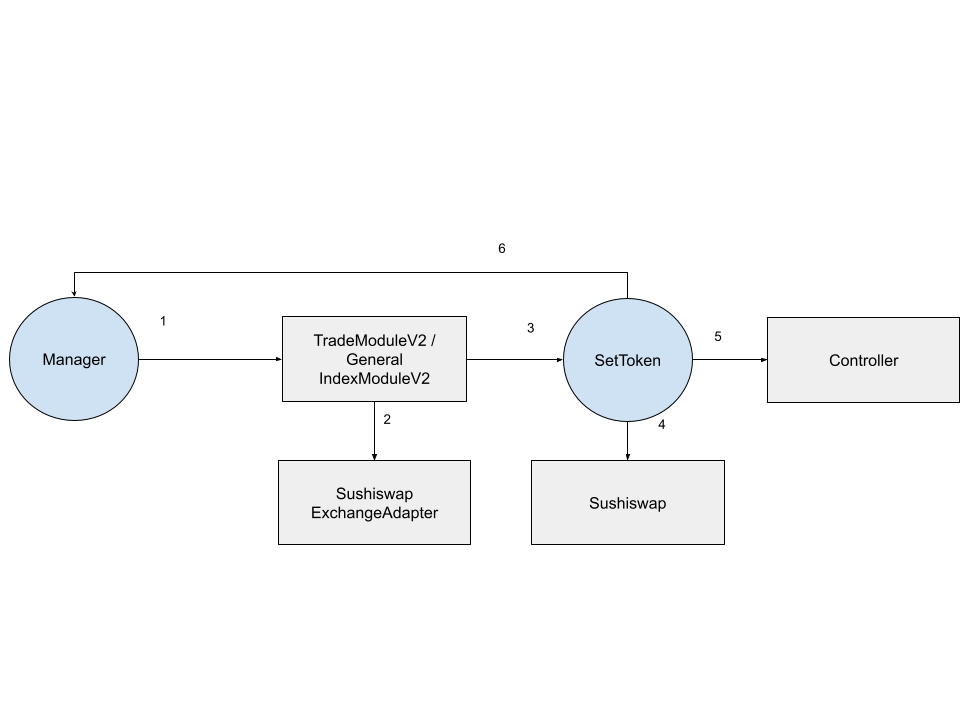

# STIP-006
*Using template v0.1*
## Abstract
The current TradeModule and GeneralIndexModule do not support volume based fees or rebates for the manager. This is in contrast to the issuance module. There is demand for additional fee types that managers can charge, specifically to be on par with exchanges where there are rebate / volume fee discounts.

## Motivation
This feature is a new version of a TradeModule (and GeneralIndexModule) that allows governance to specify a protocol fee and rebate split percentage which is sent to the manager's address. This will be denominated in the output token similar to the protocol fee assessed. The fee rebates will be automatic per trade.

TradeModuleV2 will be used in upcoming TokenSets deployments on other chains, and can replace the existing on Polygon and Mainnet. GeneralIndexModuleV2 can be used by index coop products to generate additional revenue

## Background Information
We have previously implemented the TradeModule and GeneralIndexModule. This will be an update to allow manager trade rebates charged on the output token. We have previously implemented modules for both manager and protocol fees (NAVIssuanceModule, DebtIssuanceModule) with differing mechanisms

## Open Questions
- [ ] Should we ensure that manager must have capital in the Set to charge volume fees?
    - No, we can encourage in the UI instead for retail managers. This would also break for cases where the manager is a smart contract
- [ ] Should we name this TradeModuleV2 or TradeModuleWithRebates (GeneralIndexModuleV2 or GeneralIndexModuleWithRebates)?
- [ ] How do we prevent managers charging an 100% fee and rugging the Set on a trade?
    - We will only allow governance to change rebate %s

## Feasibility Analysis

#### Option 1
Adding a managerFee % which is assessed on top of the protocol fee %. This will be least code changes to the TradeModule and General Index Module. To avoid rugging, there will be a maxManagerFee enforced.
```
uint256 protocolFeeTotal = getModuleFee(TRADE_MODULE_PROTOCOL_FEE_INDEX, _exchangedQuantity);

// Get manager fee here
```

#### Option 2
Governance specifies a protocol fee % and a rebate split %. The split gives the manager a rebate on a percentage of protocol fees. Manager has no say and cannot rug.

```
uint256 protocolFeeSplit = controller.getModuleFee(address(this), PROTOCOL_FEE_SPLIT_INDEX);

uint256 protocolDirectFee = controller.getModuleFee(address(this), PROTOCOL_DIRECT_FEE_SPLIT_INDEX);
protocolFee = protocolDirectFee.preciseMul(protocolFeeSplit);
rebateFee = protocolDirectFee.sub(protocolFee);
```

#### Recommendation
Option 4 gives us protection against rugging while providing us a base rebate mechanism. This means we will charge a protocol fee to start in order to activate rebates. E.g. start with a 10 bps protocol fee and 5 bps rebate. 

Because the rebate % is fixed by governance across all Sets, the only variable is AUM of the Set. The more user AUM vs manager AUM the more rebates managers receive (which eventually will become negative).

#### Future work
Tiered rebates: With this base rebate mechanism, manager contracts can be built on top in the future. Individual managers will always have the ability to specify a fee recipient address as their own, but manager contracts for a specific product (e.g. social trading) can abstract away the fee recipient to a shared peripheral contract. This central trading contract tracks cumulative volume done through trading all the Sets that are linked, and perform calculations that split the rebates collected. This way, at the base module level, rebates are flat across Sets but at the manager contract level, rebates can be tiered

## Timeline
- Spec + review: 2 days
- Implementation: 2 days
- Internal review: 1 days
- Deployment scripts: 1 day
- Deploy to testnet: 1 day
- Testing: 1 day
- Write docs: 1 day

## Checkpoint 1

**Reviewer**:

## Proposed Architecture Changes

### TradeModuleV2
- Inherit TradeModule
- Override `trade`
- Add `virtual` to TradeModule V1
- Add `_accrueManagerFee`
- Override constructor to add `managerRebateRecipient`

### GeneralIndexModuleV2
- Inherit GeneralIndexModule
- Override `trade` and `tradeRemainingWETH`
- Add `virtual` to GeneralIndexModule trade functions
- Add `_accrueManagerFee`
- Override constructor to add `managerRebateRecipient`

## Requirements
- GeneralIndexModule requires no changes to the IC extension contracts except a redeployment
- External trading interfaces stay exactly the same
- Manager fee recipient automatically receives the rebate in their wallet

## User Flows
  
### A manager is looking to trade 10 ETH to USDC.
1. Manager calls trade() on `TradeModule` passing in the input tokens, output tokens, path, slippage tolerance, and `SushiswapExchangeAdapter` as the exchange
2. `TradeModule` gets approval and trade calldata via `SushiswapExchangeAdapter`
3. `TradeModule` calls invoke on the SetToken, with the calldata to execute an approval and trade transaction.
4. The trade is executed on Sushiswap and USDC is returned to the SetToken and validated
5. The `TradeModuleV2` calculates the protocol fee % and sends the protocol's share to the Controller fee recipient
6. The `TradeModuleV2` calculates the rebate fee % and sends the manager's share to the manager fee recipient

## Checkpoint 2
Before we spec out the contract(s) in depth we want to make sure that we are aligned on all the technical requirements and flows for contract interaction. Again the who, what, when, why should be clearly illuminated for each flow. It is up to the reviewer to determine whether we move onto the next step.

**Reviewer**:

Reviewer: []
## Specification
### [Contract Name]
#### Inheritance
- List inherited contracts
#### Structs
| Type  | Name  | Description   |
|------ |------ |-------------  |
|address|manager|Address of the manager|
|uint256|iterations|Number of times manager has called contract|  
#### Constants
| Type  | Name  | Description   | Value     |
|------ |------ |-------------  |-------    |
|uint256|ONE    | The number one| 1         |
#### Public Variables
| Type  | Name  | Description   |
|------ |------ |-------------  |
|uint256|hodlers|Number of holders of this token|
#### Functions
| Name  | Caller  | Description     |
|------ |------ |-------------  |
|startRebalance|Manager|Set rebalance parameters|
|rebalance|Trader|Rebalance SetToken|
|ripcord|EOA|Recenter leverage ratio|
#### Modifiers
> onlyManager(SetToken _setToken)
#### Functions
> issue(SetToken _setToken, uint256 quantity) external
- Pseudo code
## Checkpoint 3
Before we move onto the implementation phase we want to make sure that we are aligned on the spec. All contracts should be specced out, their state and external function signatures should be defined. For more complex contracts, internal function definition is preferred in order to align on proper abstractions. Reviewer should take care to make sure that all stake holders (product, app engineering) have their needs met in this stage.

**Reviewer**:

## Implementation
[Link to implementation PR]()
## Documentation
[Link to Documentation on feature]()
## Deployment
[Link to Deployment script PR]()  
[Link to Deploy outputs PR]()
