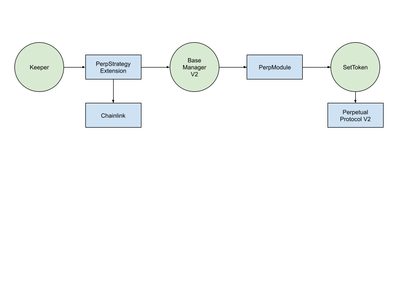

# STIP-007
*Using template v0.1*
## Abstract
Manager contracts to ensure decentralization, automation and safety of leverage tokens using perps

## Motivation
We’re interested in investigating perpetual futures contracts as a vehicle for designing:
- Leverage products for a wider range of base tokens
- Leverage products with larger leverage multiples (ex: BTC-FLI3X)
- Inverse leverage products
- Basis trading products, e.g for products that buy assets in the spot market and sell futures contracts for them, capturing the difference in price between these as revenue.

Similar to our leverage tokens that use lending protocols, we want to create manager contracts that ensure safety, decentralization and automated rebalances for the backend.

## Background Information
Previously we created Extension contracts for rebalancing the CompoundLeverageModule and AaveLeverageModule
- ITIP: [AaveLeverageStrategyExtension](https://github.com/SetProtocol/ITIPS/pull/4)
- ITIP: [FlexibleLeverageStrategyExtension](https://github.com/SetProtocol/ITIPS/pull/1)
- Implementation: [AaveLeverageStrategyExtension](https://github.com/SetProtocol/index-coop-smart-contracts/pull/72)
- Implementation: [FlexibleLeverageStrategyExtension](https://github.com/SetProtocol/index-coop-smart-contracts/pull/59)

Below are the key interfaces for the existing strategy extension contracts:
- function rebalance(string exchangeName) external
- function iterateRebalance(string exchangeName) external
- function ripcord(string exchangeName) external
- function shouldRebalance() external view returns (string[], ShouldRebalance[])

### Comparison between the ALM/CLM Leverage Token Extensions and Perpetual Token Extension
In general, external perpetual protocols simplify the lever and delever flows for rebalances, and many of the previous extension logic can be reused in the perpetuals extension.

| ALM/CLM Strategy Extension Feature | Perp Strategy Extension Feature |
|----------------------------------- |-------------------------------- |
|Methodology - Flexible leverage is a superset of most of the leverage token methodologies. Supports the fixed ratio (FTX), and Binance methodologies|Methodology - Can use the same methodology as FLI or another by toggling parameters on the smart contract|
|Rebalance execution - Use TWAP and oracle to limit slippage|Rebalance execution - Similarly, we need TWAP and oracle to limit slippage on rebalances. Need to keep track of what the virtual addresses and spot token addresses are. We need to make an assumption that prices of perp and spot are close|
|Exchanges - Ability to use any DEX to rebalance by passing in the exchange adapter name. Each exchange has its own TWAP trade sizes|Exchanges - There is only one exchange, so only need to parameterize for that|
|Safety - Ripcord functionality that rewards the caller with 1 ETH if above a certain leverage ratio|Safety - We can use a similar mechanism to add additional safety. The benefit of perp positions is that margin requirements are much lower|
|Leverage ratio calculation - Take the total collateral value / SetToken value. Valuation is calculated using Chainlink oracles|Leverage ratio calculation - Since there is only 1 USDC external position, the value must be derived from reading the perp exchange’s view functions. Perp V2 uses Chainlink oracles|
|Max borrow - Retrieve the collateralFactorMantissa in Compound and maxLtv and liquidationThreshold in Aave|Max "borrow" - call [getImRatio()](https://github.com/perpetual-protocol/perp-lushan/blob/c6b6a3810bdb37534d6931b8be24c5de0bbd122c/contracts/ClearingHouseConfig.sol#L91-L96) and (1 - imRatio) to get the "maxLtv" and call [getMmRatio()](https://github.com/perpetual-protocol/perp-lushan/blob/c6b6a3810bdb37534d6931b8be24c5de0bbd122c/contracts/ClearingHouseConfig.sol#L91-L96) and (1 - mmRatio) to get the liquidation threshold |
|Collateral value - Read the balance of collateral c or aToken and use Chainlink to price|Collateral value - call [getTotalAbsPositionValue](https://github.com/perpetual-protocol/perp-lushan/blob/main/contracts/AccountBalance.sol#L299)|
|Debt value - Read the balance of variable debt on Aave or borrowBalanceOf on cToken|Debt value - call [getTotalDebtValue](https://github.com/perpetual-protocol/perp-lushan/blob/main/contracts/AccountBalance.sol#L198)|

### Perp Module Interface
This is the current iteration of the interface we are thinking of for trading on the perp module:
```solidity
lever(ISetToken setToken, uint256 quoteUnits, uint256 quoteMinReceiveUnits)

delever(ISetToken setToken, uint256 quoteUnits, uint256 quoteMinReceiveUnits)
```

## Open Questions
- [ ] Can we keep the same interface for rebalancing?
    - Yes, this shouldn't be a problem. Remove the exchange name parameter
- [ ] Should we keep the ripcord / safety mechanism the same?
    - Yes. No good reason to change it and gas fees are much lower on L2 so incentive can be way lower
- [ ] What functions are needed to derive the state from Perp?
    - getTotalAbsPositionValue, getImRatio, getMmRatio, getTotalDebt
- [ ] Can this be generalized to use FST and PERP?
- [ ] Can we make an assumption that spot and perp prices are going to be very close?

## Feasibility Analysis
#### Solution
- Similar to Aave FLI extension, we encode the methodology in the contract
- Allow keepers to rebalance the perp leverage token via the native exchange
- No need for an external DEX
- No need for a viewer contract
- Use Chainlink oracles to price slippage and determine trade size. We need to assume that perp and spot prices will be within a reasonable %
- Retrieve leverage and max borrow calculations from Perp directly vs using Chainlink oracles on our own

Uses the existing strategy extension structure. We can always create new extension contracts and upgrade.

## Timeline
- Spec + review: 2 days
- Implementation: 4-5 days (comprehensive integration tests will be necessary)
- Internal review: 2 days
- Deployment scripts: 1 day
- Deploy to testnet: 1 day
- Testing: 3-5 days
- Write docs: 1-2 days

## Checkpoint 1
Before more in depth design of the contract flows lets make sure that all the work done to this point has been exhaustive. It should be clear what we're doing, why, and for who. All necessary information on external protocols should be gathered and potential solutions considered. At this point we should be in alignment with product on the non-technical requirements for this feature. It is up to the reviewer to determine whether we move onto the next step.

**Reviewer**:

## Proposed Architecture Changes
### PerpetualLeverageStrategyExtension
- Remove the “FLIViewer” Contract from architecture
- Remove need to pass in a DEX to trade
- Use Chainlink to retrieve oracle prices to price slippage
- Use PerpModule view function instead to calculate account leverage 
- Updates data structures to reflect new contracts
- Update calculateMaxBorrow
- Update calculateCurrentLeverageRatio

  

## Requirements
- Same interfaces as original FLI strategy extension (do not pass in an exchangeName)
- Supports the FLI methodology, fixed leverage ratio methodology, and Binance flexible methodology
- Same mechanism to limit trade slippage using max trade sizes and slippage limits

## User Flows
#### Rebalance
A keeper wants to rebalance the Perp token which last rebalanced a day ago so calls shouldRebalance on the strategy contract directly
- The keeper calls `rebalance` on the PerpStrategyExtension
- The exchange's max trade size is grabbed from storage
- The account leverage / max leverage is grabbed from the Perp Module's helper functions. This is used to calculate the current leverage ratio
- Validate leverage ratio isn't above ripcord and that enough time has elapsed since lastTradeTimestamp (unless outside bounds)
- Validate not in TWAP
- Calculate new leverage ratio using Perp helpers
- Calculate the total rebalance size and the chunk rebalance size, the chunk rebalance size is less than total rebalance size
- Use Chainlink oracles
- Read max leverage parameter from perp exchange and ensure that we are below it
- Create calldata for invoking trade on PerpModule
- Log the last trade timestamp
- Set the twapLeverageRatio so that we don't have to recalculate the target leverage ratio again for this TWAP

### Iterate Flow
1. A keeper wants to rebalance the token which kicked off a TWAP rebalance one block ago so calls shouldRebalance which tells it to iterate
2. The keeper calls `iterateRebalance` 
3. The max trade size and last trade timestamp are grabbed from storage
4. Validate leverage ratio isn't above ripcord and that enough time has elapsed since lastTradeTimestamp 
5. Validate leverage ratio isn't above ripcord and that enough time has elapsed since last lastTradeTimestamp 
6. Validate TWAP is underway
7. Calculate new leverage ratio using Perp helpers
8. Check that prices haven't moved making continuing rebalance unnecessary
9. Calculate the total rebalance size and the chunk rebalance size, the chunk rebalance size equals total rebalance size
10. Create calldata for invoking lever/delever
11. Log the last trade timestamp
12. Delete twapLeverageRatio since the TWAP is over

### Ripcord Flow
1. A keeper wants to rebalance in the middle of a falling market and calls shouldRebalance which tells it to ripcord
2. The keeper calls `ripcord` 
3. The incentivized max trade size and last trade timestamp are grabbed from storage
4. The current leverage ratio is calculated and all params are gathered for the rebalance including incentivized trade size
5. Validate that leverage ratio outside bounds and that incentivized cool down period has elapsed from lastTradeTimestamp
6. Calculate the notional amount of the chunk rebalance size
7. Create calldata for invoking delever on CLM
8. Log last trade timestamp
9. Delete twapLeverageRatio
10. Transfer ether to keeper

## Checkpoint 2
Before we spec out the contract(s) in depth we want to make sure that we are aligned on all the technical requirements and flows for contract interaction. Again the who, what, when, why should be clearly illuminated for each flow. It is up to the reviewer to determine whether we move onto the next step.

**Reviewer**:

Reviewer: []
## Specification
### [Contract Name]
#### Inheritance
- List inherited contracts
#### Structs
| Type 	| Name 	| Description 	|
|------	|------	|-------------	|
|address|manager|Address of the manager|
|uint256|iterations|Number of times manager has called contract|  
#### Constants
| Type 	| Name 	| Description 	| Value 	|
|------	|------	|-------------	|-------	|
|uint256|ONE    | The number one| 1       	|
#### Public Variables
| Type 	| Name 	| Description 	|
|------	|------	|-------------	|
|uint256|hodlers|Number of holders of this token|
#### Functions
| Name  | Caller  | Description 	|
|------	|------	|-------------	|
|startRebalance|Manager|Set rebalance parameters|
|rebalance|Trader|Rebalance SetToken|
|ripcord|EOA|Recenter leverage ratio|
#### Modifiers
> onlyManager(SetToken _setToken)
#### Functions
> issue(SetToken _setToken, uint256 quantity) external
- Pseudo code
## Checkpoint 3
Before we move onto the implementation phase we want to make sure that we are aligned on the spec. All contracts should be specced out, their state and external function signatures should be defined. For more complex contracts, internal function definition is preferred in order to align on proper abstractions. Reviewer should take care to make sure that all stake holders (product, app engineering) have their needs met in this stage.

**Reviewer**:

## Implementation
[Link to implementation PR]()
## Documentation
[Link to Documentation on feature]()
## Deployment
[Link to Deployment script PR]()  
[Link to Deploy outputs PR]()
