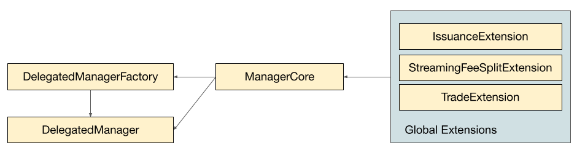

# STIP-009: Self Service Manager Contracts

*Using template v0.1*

## Abstract

Historically, Set Protocol has deployed SetToken specific manager contracts and extensions for IndexCoop issued funds. These contracts encode fee management and rebalance trading logic and provide better security guarantees to SetToken holders than direct management via EOA.

This STIP proposes that we automate manager contract deployments using on-chain factories and support "self-service" manager enabled SetToken creation as a feature available to anyone in the SetProtocol UI (tokensets.com).

This involves creating:
+ a standard set of manager contracts that are:
    + able to delegate responsibilities to certain participants (owners and operators)
    + define the assets that participants are able to trade

+ a SetToken and DelegatedManager contract factory that deploys and wires all the contract components up.

## Motivation

This feature will allow us to:
+ provide a standardized experience to SetToken owners that want to use the TokenSets UI to manage their Set
+ make previously bespoke SetToken management systems available to any TokenSets user
+ improve the security of Tokensets-issued assets for Set holders by binding managers to smart-contract defined logics
+ introduce clearly defined roles for SetToken stakeholders and add the ability for SetToken managers to restrict Sets to a white-listed group of assets

## Background Information

At the moment there are two ways to manage Sets:
1. directly via an EOA or multi-sig,
2. via manager contract(s).

EOAs/multi-sigs provide the greatest amount of flexibility because they interact directly with the system. However they do not allow for advanced permissioning or restrictions on how the Set can be rebalanced.

Currently there are no "standard" manager contracts supported by the TokenSets UI for general use. However, there are several manager contracts that have been developed to support IndexCoop funds we can draw design ideas from:

[ICManager](https://github.com/IndexCoop/index-coop-smart-contracts/blob/master/contracts/manager/ICManager.sol) - This was the monolithic, first iteration of a manager contract that contains `operator` and `methodologist` roles. It is not extensible via other contracts but did contain a function that allowed the `operator` to pass arbitrary bytedata to a target contract address (to call modules). This contract wasn't desirable due to it being unable to be conveniently upgraded as well as its poor UX for managers who were required to submit arbitrary bytestrings instead of having clear interfaces.

[BaseManager](https://github.com/IndexCoop/index-coop-smart-contracts/blob/master/contracts/manager/BaseManager.sol) - This next generation manager contract system implements a more modular approach where extensions can be added to a BaseManager contract to add new functionality. This contract maintained the idea of an `operator` and `methodologist`, giving the `operator` the ability to add new functionality. Extensions became the only addresses permissioned to call an `interactManager` function on the manager which forwarded arbitrary bytedata to a target address (generally a module). This gave `operator`s much of the same powers as in the `ICManager` but the ability to add clean interfaces to interact with as well as be able to encode strategies to govern SetTokens within one of their extensions to allow for more decentralized execution of rebalances.

[BaseManagerV2](https://github.com/IndexCoop/index-coop-smart-contracts/blob/master/contracts/manager/BaseManagerV2.sol) - This manager contract is very similar to `BaseManager` it just gave `methodologists` greater ability to counteract `operators` ablility to add and remove privileged functionalities from the manager in case of an adversarial relationship between the `operator` and `methodologist`.

## Open Questions

Pose any open questions you may still have about potential solutions here. We want to be sure that they have been resolved before moving ahead with talk about the implementation. This section should be living and breathing through out this process.

- [ ] When accruing streaming fees where do we send the fees to? The manager?
    - The manager. We don't want to pool fees in generalized extensions.
- [ ] How do we validate that trades for *x* asset are actually for *x* asset when the trade is encoded in a bunch of bytedata?
    - *Answer*
- [ ] What data needs to be held on every extension? What data needs to be passed in for initialization on each extension?
    - *Initialization and Data Needs:*
        - *SetToken address*
        - *Manager contract address*
- [ ] Do we need an initialization flow similar to SetTokens/modules?
    - *Answer*
- [ ] During migration when does the EOA manager update the manager address to the deployed manager?
    - *Current thoughts are that extension initialization and module initialization happen in same step. However the manager would need to be the manager contract at that point for it to not fail. Given that the initialization step is being called by the factory we would need to update the manager on the SetToken before initialization*

## Feasibility Analysis

### Single-user vs. Mutli-user Manager Contracts

Single-user manager contracts would be deployed once per SetToken by a manager factory contract, while a multi-user manager contract would be deployed once overall and could subsequently be used by all SetTokens. Single-user manager contracts maintain separation between SetTokens at the contract level but require individual deployments for each SetToken. A multi-user manager contract requires only one deployment but has functionality across many SetTokens, which may open up attack vectors.

### Modular vs. Monolithic Manager Contracts

With modular manager contracts, operators call extension contracts which invoke the manager with arbitrary logic. With monolithic manager contracts, operators call the manager contract directly with logic defined on deployment. The modular manager contracts maintain more flexiblity but require extensions to be deployed and enabled. The monolithic manager contract requires migration for upgradeability but does not need extensions for functionality.

### Individual vs. Global Extensions

With individual extensions, a new extension contract must be deployed and enabled to provide some functionality to the manager. With global extensions, a collection of extension contracts would be deployed by Set Protocol and made available to managers by simply enabling them. Individual extensions offer more flexibility to managers but require individual contract deployments from managers. Global extensions offer less flexibility but do not require managers to make contract deployments.

### Recommended Solution

We recommend deploying single-user, modular manager contracts from a manager factory contract along with a collection of multi-user, "global" extensions providing basic functionality. Manager contracts will define `owner`, `methodologist`, and `operator` roles and an asset whitelist which will be used by extensions.

**Design features**

+ single-user manager contracts mirror the separation of SetTokens from each other at the contract level.
+ modular manager contracts allow for functionaity to be flexible and extensible.
+ a collection of multi-use extensions gives managers access to basic functionality without requiring a dedicated contract deployment.
+ managers will retain the option of deploying individual extensions for more complicated functionality.

## Timeline

|  Action               |  End Date  |
|---                    |---         |
| Technical Spec        |   2/25     |
| Implementation        |   3/2      |
| Auditors              |   3/11     |
| Launch                |   3/18     |

## Checkpoint 1

**Reviewer**: LGTM @bweick

## Proposed Architecture Changes


**ManagerCore**: Contract that houses state for approvals for DelegatedManager factories and managers they create. Used by the global extensions to verify managers are valid.



**DelegatedManagerFactory**: Factory smart contract which provides asset managers (`deployer`) the ability to create a SetToken with a DelegatedManager manager, create a DelegatedManager manager for an existing SetToken to migrate to, and `initialize` extensions and modules.

**DelegatedManager**: Manager smart contract which provides asset managers three permissioned roles (`owner`, `methodologist`, `operator`) and asset whitelist functionality. The `owner` grants permissions to `operator`(s) to interact with extensions. The `owner` can restrict the `operator`(s) permissions with an asset whitelist.

**TradeExtension**: Global extension which provides privileged `operator`(s) the ability to `trade` on a DEX and the `owner` the ability to restrict `operator`(s) permissions with an asset whitelist.

**IssuanceExtension**: Global extension which provides the `owner` and `methodologist` the ability to accrue and split issuance and redemption fees. `owner` may configure the fee split percentages.

**StreamingFeeSplitExtension**: Global extension which provides the `owner` and `methodologist` the ability to accrue and split streaming fees. `owner` may configure the fee split percentages.

## Requirements

### ManagerCore

- Allow system `owner` to add and remove approved manager factories
- Allow approved `factory` to add approved managers

### DelegatedManagerFactory

- Allow `deployer` to create new set tokens with a DelegatedManager manager
- Allow `deployer` to create a new DelegatedManager for an existing set token to migrate to
- Allow `deployer` to initialize extensions tracked on the ManagerCore
- Allow `deployer` to initialize modules with extensions if they create a set token through the factory

### DelegatedManager

**NOTE**: Although this manager supports management fee splitting with multiple beneficiaries, its owner
ultimately has total control over these as well as any funds accidentally sent to the contract. We are not
supporting any logic to guarantee that fee split arrangements are irrevocable.

- Allow `owner` to add and remove global `operator` permissions on extensions
- Allow `owner` to limit `operator`(s) functionality on extensions with an asset whitelist
- Allow `owner` to update asset whitelist
- Allow `owner` to perform SetToken admin functions such as `addModule`, `removeModule`, and `setManager`
- Allow `owner` to update ownerFeeSplit
- Allow `owner` to update ownerFeeRecipient
- Allow `owner` to transfer tokens held by the BaseManager to another address (sweeper)
- Allow `owner` to update useAllowedAssetList flag. (When false, manager can trade any asset)
- Allow extensions to interact with modules

### TradeExtension

- Allow `owner` to enable functionality of TradeModule with only a state change and no contract deployment
- Allow privileged `operator`(s) to perform trades on a DEX
- Allow `owner` to restrict assets the privileged `operator`(s) can trade into with an asset whitelist

### IssuanceExtension

- Allow `owner` to enable functionality of IssuanceModule with only a state change and no contract deployment
- Allow `owner` and `methodologist` to split issuance and redemption fees
- Allow `owner` to update the issuance and redemption fee
- Allow `owner` to update the issuance and redemption fee recipient

### StreamingFeeSplitExtension

- Allow `owner` to enable functionality of StreamingFeeModule with only a state change and no contract deployment
- Allow `owner` and `methodologist` to split streaming fees
- Allow `owner` to update the streaming fee
- Allow `owner` to update the streaming fee recipient

## User Flows

### DelegatedManagerFactory.createSetAndManager()


A `deployer` wants to create a new SetToken with a DelegatedManager smart contract manager.

1. The `deployer` calls createSetAndManager() passing in parameters to create a SetToken, parameters for the permissioning on DelegatedManager, and the desired extensions. Specifically,

    - components: List of addresses of components for initial positions
    - units: List of units for initial positions
    - name: Name of SetToken
    - symbol: Symbol of SetToken
    - owner: The address of the `owner`
    - methodologist: The address of the `methodologist`
    - operators: List of addresses of the `operator`(s)
    - modules: List of addresses of modules to be enabled
    - assets: List of addresses of assets for initial asset whitelist
    - extensions: List of addresses of global extensions to be enabled

2. Creation Parameters are validated:
    - If assets are defined, asset list must match components

3. A SetToken is deployed using SetTokenCreator

4. A DelegatedManager is deployed with the DelegatedManagerFactory as the temporary `owner` and `methodologist` until after initialization
    - If assets are defined, constructor param *useAssetAllowlist* is set to true, false otherwise.

5. The DelegatedManager is added to ManagerCore by the Factory

6. The `deployer`, `owner`, `methodologist`, and DelegatedManager are stored on the Factory in pending state

### DelegatedManagerFactory.createManager()


A `deployer` wants to migrate an existing SetToken to a DelegatedManager smart contract manager.

1. The `deployer` calls createManager() passing in the SetToken address, parameters for the permissioning on DelegatedManager, and the desired extensions. Specifically,

    - owner: The address of the `owner`
    - methodologist: The address of the `methodologist`
    - operators: List of addresses of the `operator`(s)
    - assets: List of addresses of assets for initial asset whitelist
    - extensions: List of addresses of global extensions to be enabled

2. createManager parameters are validated:
    - If assets are defined, asset list must match SetToken's existing components

3. A DelegatedManager is deployed with the DelegatedManagerFactory as the temporary `owner` and `methodologist` until after initialization
    - If assets are defined, constructor param *useAssetAllowlist* is set to true, false otherwise.

4. The DelegatedManager is added to ManagerCore by the Factory

5. The `deployer`, `owner`, `methodologist`, and DelegatedManager are stored on the Factory in pending state

### DelegatedManagerFactory.initialize()


The `deployer` wants to initialize extensions and transfer the manager `owner` role.

1. The `deployer` calls initialize() passing in the parameters for initializing modules and extensions

2. Initialization parameters are validated:
    - `initializationState` must be `pending`
    - `initialize` caller must be the `deployer`
    - `extensions` (extension addresses tracked on the ManagerCore) must be the same length as `initializeBytecode` (initialization instructions)

3. If the setToken manager is the factory, transfer `manager` role to the DelegatedManager contract

4. All extensions are initialized for the SetToken
    - Each `extension` must be tracked on the ManagerCore
    - The first argument of each `initializeBytecode` must be the DelegatedManager address corresponding to the `deployer`

5. The DelegatedManager state is set
    - The `ownerFeeSplit` and `ownerFeeRecipient` are updated
    - The `owner` role on the DelegatedManager is transfered from the Factory to the `owner` designated during the creation step.
    - The `methodologist` role on the DelegatedManager is transfered from the Factory to the `methodologist` designated during the creation step.

6. The Factory deletes the `InitializeParams` entry for the set token, removing it from pending state

7. (Optional) If migrating, the SetToken's current manager address must be reset to point at the newly deployed DelegatedManager contract in a separate step.
    - If SetToken manager is EOA, call setToken.setManager(_newAddress)
    - If SetToken manager is contract, call CurrentManagerContract.setManager(_newAddress)

### StreamingFeeExtension.accrueFeeAndDistribute()


An interested party wants to accrue streaming fees and distribute them to the `owner` and `methodologist`.

1. The interested party calls accrueFeeAndDistribute() on the StreamingFeeExtension
2. Fees are accrued to the DelegatedManager
3. Fees are distributed to the `owner` and `methodologist`


## Checkpoint 2

**Reviewer**:

Reviewer: []

## Specification

### ManagerCore

#### Inheritance

- Ownable

#### Events

##### ExtensionAdded

| Type  | Name  | Description   |
|------ |------ |-------------  |
|address|extension|Address of extension added|

##### ExtensionRemoved

| Type  | Name  | Description   |
|------ |------ |-------------  |
|address|extension|Address of extension removed|

##### FactoryAdded

| Type  | Name  | Description   |
|------ |------ |-------------  |
|address|factory|Address of manager factory added|

##### FactoryRemoved

| Type  | Name  | Description   |
|------ |------ |-------------  |
|address|factory|Address of manager factory removed|

##### ManagerAdded

| Type  | Name  | Description   |
|------ |------ |-------------  |
|address|manager|Address of manager added|

##### ManagerRemoved

| Type  | Name  | Description   |
|------ |------ |-------------  |
|address|manager|Address of manager removed|

#### Public Variables

| Type 	| Name 	| Description 	|
|------	|------	|-------------	|
|address[]|extensions|List of enabled extensions|
|address[]|factories|List of enabled factories of managers|
|address[]|managers|List of enabled managers|
|mapping(address => bool)|isExtension|Mapping to check whether address is valid extension|
|mapping(address => bool)|isFactory|Mapping to check whether address is valid factory|
|mapping(address => bool)|isManager|Mapping to check whether address is valid manager|
|bool|isInitialized|Bool to check whether ManagerCore is initialized|

#### Functions

| Name  | Caller  | Description 	|
|------	|------	|-------------	|
|initialize|owner|Initialize any predeployed factories|
|addExtension|extension|Allows governance to add an extension|
|removeExtension|owner|Allows governance to remove an extension|
|addFactory|owner|Allows governance to add a factory|
|removeFactory|owner|Allows governance to remove a factory|
|addManager|factory|Allows factory to add a manager|
|removeManager|owner|Allows governance to remove a manager|

#### Modifiers

| Name  | Description   |
|------ |-------------  |
|onlyOwner| Requires that the `owner` is caller |
|onlyFactory | Requires that caller is an enabled `factory` |
|onlyInitialized | Requires that `isInitialized` is true |

----

> initialize

ONLY OWNER: Initialize any predeployed factories. This function can only be called by the owner once to batch initialize factories.

```solidity
function initialize(
    address[] memory _extensions,
    address[] memory _factories
)
    external
    onlyOwner
```

+ require ManagerCore is not initialized
+ Set `extensions` public variable
+ Set `factories` public variable
+ for each extension in _extensions
  + require that extension is not zero address
  + set *isExtension[extension]* to true
  + emit *ExtensionAdded* event
+ for each factory in _factories
  + require that factory is not zero address
  + set *isFactory[factory]* to true
  + emit *FactoryAdded* event
+ Set `isInitialized` to true

> addExtension

ONLY OWNER: Allows governance to add an extension.

```solidity
function addExtension(
    address _extension
)
    external
    onlyInitialized
    onlyOwner
```

+ require `!isExtension[_extension]`
+ require that extension is not zero address
+ Set *isExtension[_extension]* to true
+ emit *ExtensionAdded* event
+ Add *_extension* to *extensions* array

> removeExtension

ONLY OWNER: Allows governance to remove an extension.

```solidity
function removeExtension(
    address _extension
)
    external
    onlyInitialized
    onlyOwner
```

+ require `isExtension[_extension]`
+ Remove *_extension* to *extensions* array
+ Set *isExtension[_extension]* to false
+ emit *ExtensionRemoved* event

> addFactory

ONLY OWNER: Allows governance to add a factory.

```solidity
function addFactory(
    address _factory
)
    external
    onlyInitialized
    onlyOwner
```

+ require `!isFactory[_factory]`
+ require that factory is not zero address
+ Set *isFactory[_factory]* to true
+ emit *FactoryAdded* event
+ Add *_factory* to *factories* array

> removeFactory

ONLY OWNER: Allows governance to remove a factory.

```solidity
function removeFactory(
    address _factory
)
    external
    onlyInitialized
    onlyOwner
```

+ require `isFactory[_factory]`
+ Remove *_factory* to *factories* array
+ Set *isFactory[_factory]* to false
+ emit *FactoryRemoved* event

> addManager

ONLY FACTORY: Allows factory to add a manager.

```solidity
function addManager(
    address _manager
)
    external
    onlyInitialized
    onlyFactory
```

+ require `!isManager[_manager]`
+ Set *isManager[_manager]* to true
+ Add *_manager* to *managers* array
+ emit *ManagerAdded* event

> removeManager

ONLY OWNER: Allows governance to remove a manager.

```solidity
function removeManager(
    address _manager
)
    external
    onlyInitialized
    onlyOwner
```

+ require `isManager[_manager]`
+ Remove *_manager* to *managers* array
+ Set *isManager[_manager]* to false
+ emit *ManagerRemoved* event

### DelegatedManagerFactory

#### Events

##### DelegatedManagerCreated

| Type  | Name  | Description   |
|------ |------ |-------------  |
|address|setToken|Address of SetToken to be managed|
|address|manager|Address of the DelegatedManager|
|address|deployer|Address of the deployer|


##### DelegatedManagerInitialized

| Type  | Name  | Description   |
|------ |------ |-------------  |
|address|setToken|Address of SetToken to be managed|
|address|manager|Address of the DelegatedManager|


#### Structs

##### InitializeParams

| Type 	| Name 	| Description 	|
|------	|------	|-------------	|
|address|deployer|Address of the deployer|
|address|owner|Address of the owner|
|address|methodologist|Address of the methodologist|
|address|manager|Address of the DelegatedManager|
|bool|isPending|Bool if manager in pending state|

#### Public Variables

| Type 	| Name 	| Description 	|
|------	|------	|-------------	|
|address|managerCore|Address of ManagerCore|
|address|controller|Address of Controller|
|address|setTokenFactory|Address of SetToken factory|
|mapping(address => InitializeParams)|initializeState|Mapping from SetToken to initialization parameters|


#### Functions

| Name  | Caller  | Description 	|
|------	|------	|-------------	|
|createSetAndManager |deployer|Create new SetToken with a DelegatedManager manager|
|createManager | SetToken owner |Migrate existing SetToken to a DelegatedManager manager|
|initialize |deployer or SetToken owner |Initialize extensions, set manager fee settings|

----

### Functions

> createSetAndManager

ANYONE CAN CALL: Deploys a new SetToken and DelegatedManager. Sets some temporary metadata about
the deployment which will be read during a subsequent intialization step which wires everything
together

```solidity
function createSetAndManager(
    address[] memory _components,
    uint256 _units,
    string memory _name,
    string memory _symbol,
    address _owner,
    address _methodologist,
    address[] memory _modules,
    address[] memory _operators,
    address[] memory _assets,
    address[] memory _extensions
)
    external
    returns (ISetToken, address)
```

+ if `_assets` are specified, require that all *_components* are included in the *_assets* array

+ deploy the set
    ```solidity
    address setTokenAddress = _deploySet(
        _components,
        _modules,
        _units,
        _name,
        _symbol
    );
    ```
+ deploy the manager, setting its *useAssetsAllowedList* constructor parameter to true if there are *_assets* and false otherwise.
    ```solidity
    address managerAddress = _deployManager(
        setTokenAddress,
        address(this),
        address(this),
        useAssetsAllowedList
        _operators,
        _assets,
        _extensions
    );
    ```
+ add manager to ManagerCore
+ set temporary initialization metadata for the newly created SetToken and DelegatedManager
    ```solidity
    initialize[setTokenAddress] = InitializeParams({
        deployer: msg.sender,
        owner: _owner,
        methodologist: _methodologist,
        manager: managerAddress,
        isPending: true
    });
    ```

ONLY SETTOKEN MANAGER: Deploys a DelegatedManager and sets some temporary metadata about
the deployment which will be read during a subsequent intialization step which wires everything
together. This method is used when migrating an existing SetToken to the DelegatedManager system.

(Note: This flow should work well for SetTokens managed by an EOA. However, existing contract-managed Sets
may need to have their ownership temporarily transferred to an EOA when migrating. We don't anticipate high demand for this migration case though.)

> createManager

```solidity
function createManager(
    address memory _setTokenAddress,
    address _owner,
    address _methodologist,
    address[] memory _modules,
    address[] memory _operators,
    address[] memory _assets,
    address[] memory _extensions
)
    external
    returns (address)
```
+ require *msg.sender* is *setToken.manager*
+ if `_assets` are specified, require that all of the sets existing *_components* are included in the *_assets* array

+ deploy the manager, setting its *useAssetsAllowedList* constructor parameter to true if there are *_assets* and false otherwise.
    ```solidity
    address managerAddress = _deployManager(
        setTokenAddress,
        address(this),
        address(this),
        useAssetsAllowedList
        _operators,
        _assets,
        _extensions
    );
    ```

+ add manager to ManagerCore
+ set temporary initialization metadata for the newly created SetToken and DelegatedManager
    ```solidity
    initialize[setTokenAddress] = InitializeParams({
        deployer: msg.sender,
        owner: _owner,
        methodologist: _methodologist,
        manager: managerAddress,
        isPending: true
    });
    ```

> initialize

ONLY DEPLOYER: Wires SetToken, DelegatedManager, global manager extensions, and modules together into
a functioning package. `extensions` includes any ManagerCore tracked extensions which need to be initialized. `initializeBytecode` is an encoded call to the relevant target's *initialize* function.

(Some DelegatedManager state variables are set in this method because the factory's creation methods
consume Solidity's stack depth limit.)

To generate the bytecode to call the TradeExtensions initialize function with the ethers.js library you'd write:

```js
const iFace = new ethers.utils.interface(["function initialize(address)"]);
const bytecode = iFace.encodeFunctionData("initialize", [delegatedManagerAddress]);
```

```solidity
function initialize(
    address memory _setTokenAddress,
    uint256 _ownerFeeSplit,
    address _ownerFeeRecipient,
    address[] memory _extensions,
    bytes[] memory _initializeBytecode,
)
    external
```
+ require that *initialize[_setTokenAddress].isPending* is `true`
+ require that caller be the *deployer* specified in the *initialize[_setTokenAddress]* mapping
+ require that *_extensions* and *_initializeBytecode* arrays have same length
+ if the setToken manager is the factory, transfer `manager` role to the DelegatedManager contract
+ for each (extension, bytecode)  in  (_extensions, _initializeBytecode)
    + require that the extension is tracked on the ManagerCore
    + require that the first argument in bytecode is the DelegatedManager corresponding to the `deployer`
    + call target.functionCallWithValue(bytecode, 0)
+ call DelegatedManager.updateOwnerFeeSplit with *_ownerFeeSplit*
+ call DelegatedManager.updateOwnerFeeRecipient with *_ownerFeeRecipient*
+ transfer ownership of manager from factory to *owner* specified in the *initialize[_setTokenAddress]* mapping
+ transfer methodologist role of manager from factory to *methodologist* specified in the *initialize[_setTokenAddress]* mapping
+ delete the *initialize[_setTokenAddress]* mapping entry

### DelegatedManager

#### Enums

##### ExtensionState

| Value  | Name  | Description   |
|------ |------ |-------------  |
| 0 | NONE | State when extension has not been added |
| 1 | PENDING | State when extension has been added but not yet initialized |
| 2 | INITIALIZED | State when extension has been initialized |

#### Events

##### MethodologistChanged

| Type  | Name  | Description   |
|------ |------ |-------------  |
|address|oldMethodologist| previous methodologist|
|address|newMethodologist| new methodologist|

#### ExtensionAdded

| Type  | Name  | Description   |
|------ |------ |-------------  |
|address|extension| added extension address |

#### ExtensionRemoved

| Type  | Name  | Description   |
|------ |------ |-------------  |
|address|extension| removed extension address |


#### ExtensionInitialized

| Type  | Name  | Description   |
|------ |------ |-------------  |
|address|extension| initialized extension address |


#### OperatorAdded

| Type  | Name  | Description   |
|------ |------ |-------------  |
|address|operator| added operator address |


#### OperatorRemoved

| Type  | Name  | Description   |
|------ |------ |-------------  |
|address|operator| removed operator address |

#### AllowedAssetAdded

| Type  | Name  | Description   |
|------ |------ |-------------  |
|address|asset| added allowed asset |

#### AllowedAssetRemoved

| Type  | Name  | Description   |
|------ |------ |-------------  |
|address|asset| added allowed asset |

#### UseAllowlistUpdated

| Type  | Name  | Description   |
|------ |------ |-------------  |
|bool|useAssetAllowlist| updated state of useAssetAllowlist flag|


#### Public Variables

| Type 	| Name 	| Description 	|
|------	|------	|-------------	|
|ISetToken|setToken|Instance of SetToken|
|address|factory|Address of factory contract used to deploy contract|
|address|methodologist|Address of methodologist which serves as providing methodology for the index|
|boolean|useAssetAllowed|when false, assetAllowlist restrictions are ignored |
|uint256|ownerFeeSplit|Percent of fees in precise units (10^16 = 1%) sent to owner, rest to methodologist|
|address|ownerFeeRecipient|Address which receives operator's share of fees when they're distributed|
|mapping(address => ExtensionState)|extensionAllowlist|Mapping to check if extension is enabled|
|mapping(address => bool)|operatorAllowlist|Mapping indicating if address is an approved operator|
|mapping(address => bool)|assetAllowlist|Mapping indicating if asset is approved to be traded for, wrapped into, claimed, etc.|

#### Private Variables

| Type 	| Name 	| Description 	|
|------	|------	|-------------	|
|address[]|extensions|Array of enabled extensions|
|address[]|operators|List of approved operators|
|address[]|allowedAssets|Array of enabled extensions|

#### Functions

| Name  | Caller  | Description 	|
|------	|------	|-------------	|
|interactManager|extension|Interact with a module registered on the SetToken|
|transferTokens|extension|Transfers tokens held by the manager to destination|
|initializeExtension|extension|Initializes an added extension from PENDING to INITIALIZED state|
|addExtensions|owner|Add a new extension that the DelegatedManager can call|
|removeExtensions|owner|Remove an existing extension tracked by the DelegatedManager|
|addOperators|owner|Add new operator(s) address|
|removeOperators|owner| Remove operator(s) address|
|addAllowedAssets|owner|Add new asset(s) that can be traded to, wrapped to, or claimed|
|removeAllowedAssets|owner|Remove asset(s) so that it/they can't be traded to, wrapped to, or claimed|
|updateUseAssetAllowed|owner|Set useAssetAllowed variable to true or false|
|updateOwnerFeeSplit|owner or methodologist|Update percent of fees that are sent to owner. Mutual upgrade between owner and methodologist|
|updateOwnerFeeRecipient|owner|Update address owner receives fees at|
|setMethodologist|methodologist|Update the methodologist address|
|setManager|owner|Update the manager of the SetToken|
|addModule|owner|Add module to SetToken|
|removeModule|owner|Remove module from SetToken|

#### Modifiers

| Name  | Description   |
|------ |-------------  |
|onlyOwner| Requires that DelegatedManager `owner` is caller |
|onlyMethodologist | Requires that DelegatedManager `methodologist` is caller |
|mutualUpgrade| Requires that both signing parties call function to execute |
|onlyExtension | Requires that msg.sender is an initialized extension in the `extensionAllowlist` array |

----

### Functions

> constructor

```solidity
constructor(
    ISetToken _setToken,
    address _factory,
    address _methodologist,
    bool _useAssetAllowlist
    address[] memory _extensions,
    address[] memory _operators,
    address[] memory _allowedAssets,
)
    public
```

+ Set *setToken*, *factory*, *methodologist*, and *useAssetAllowlist* public variables
+ emit *UseAssetAllowlistUpdated* event
+ for each extension in _extensions
  + require that extension state in *extensionAllowlist* is *NONE* (has not already been added)
  + set *extensionAllowlist[extension]* to PENDING
  + emit *ExtensionAdded* event
+ for each operator in _operators
  + require that operator is not already registered in the *operatorAllowlist* mapping
  + add operator to the *operators* array
  + set *operatorAllowlist[operator]* to `true`
  + emit *OperatorAdded* event
+ for each asset in _allowedAssets
  + require that asset is not already registered in the *assetAllowlist* mapping
  + add asset to the *assetAllowlist* array
  + set *assetAllowlist[asset]* to `true`
  + emit *AllowAssetAdded* event

----

> interactManager

ONLY EXTENSION: Interact with a module registered on the SetToken

```solidity
function interactManager(address _module, bytes calldata _data) external onlyExtension
```
+ require that _module is not the *setToken* (to prevent operator from bypassing extension interfaces)
+ Call `_module.functionCallWithValue(_data, 0)`

----

> transferTokens

ONLY OWNER: Transfers _tokens held by the manager to _destination. Can be used to
recover anything sent here accidentally.

```solidity
function transferTokens(address _token, address _destination, uint256 _amount) external onlyOwner
```

+ Call `IERC20(_token).safeTransfer(_destination, _amount)`

----

> initializeExtension

ONLY PENDING EXTENSION: Initializes an added extension from PENDING to INITIALIZED state. An address can only
enter a PENDING state if it is an enabled extension added by the manager. Only callable
by the extension itself, hence msg.sender is the subject of update.

```solidity
function initializeExtension() external
```

+ Require that extension calling method has been added and it's state is *PENDING*
+ Set *extensionAllowlist[msg.sender]* to *INITIALIZED*
+ Add *msg.sender* to *extensions* array
+ emit *ExtensionInitialized* event

----

> addExtension

ONLY OWNER: Add a new extension that the DelegatedManager can call

```solidity
function addExtensions(address[] memory _extensions) external onlyOwner
```

+ for each extension in _extensions
  + require that extension state in *extensionAllowlist* is *NONE* (has not already been added)
  + set *extensionAllowlist[extension]* to PENDING
  + emit *ExtensionAdded* event

----

> removeExtensions

ONLY OWNER: Remove an existing extension tracked by the DelegatedManager.

```solidity
function removeExtensions(address[] memory _extensions) external onlyOwner
```

+ for each extension in _extensions
  + require that extension state in *extensionAllowlist* is *INITIALZED*
  + delete extension from *extensions* array
  + set extension state to *NONE* in *extensionAllowlist*
  + call extensions's own *removeExtension* method for manager's setToken
  + emit *ExtensionRemoved* event


----

> addOperators

ONLY OWNER: Add new operator(s) address

```solidity
function addOperators(address[] memory _operators) external onlyOwner
```
+ for each operator in _operators
  + require that operator is not already registered in the *operatorAllowlist* mapping
  + add operator to the *operators* array
  + set *operatorAllowlist[operator]* to `true`
  + emit *OperatorAdded* event

----

> removeOperators

ONLY OWNER: Remove operator(s) from the allowlist

```solidity
function removeOperators(address[] memory _operators) external onlyOwner
```

+ for each operator in _operators
  + require that operator is in the *operatorAllowlist* mapping
  + delete operator from the *operators* array
  + set *operatorAllowlist[operator]* to `false`
  + emit *OperatorRemoved* event

----

> addAllowedAssets

ONLY OWNER: Add new asset(s) that can be traded to, wrapped to, or claimed

```solidity
function addAllowedAssets(address[] memory _assets) external onlyOwner
```
+ for each asset in _assets
  + require that asset is not already registered in the *assetAllowlist* mapping
  + add asset to the *assetAllowlist* array
  + set *assetAllowlist[asset]* to `true`
  + emit *AllowAssetAdded* event

----

> removeAllowedAssets

ONLY OWNER: Remove asset(s) so that it/they can't be traded to, wrapped to, or claimed

```solidity
function removeAllowedAssets(address[] memory _assets) external onlyOwner
```

+ for each asset in _assets
  + require that asset is present in the *assetAllowlist* mappiing
  + delete asset from the *allowedAssets* array
  + set *assetAllowlist[asset]* to `false`
  + emit AllowedAssetRemoved event

----

> setUseAssetAllowlist

ONLY OWNER: Toggles whether or not operator can trade any asset. When false, assetAllowlist
restrictions are ignored.

```solidity
function setUseAssetAllowlist(bool _useAssetAllowlist) external onlyOwner
```

+ set *useAssetAllowlist* to _useAssetAllowlist
+ emit *UseAllowlistUpdated* event

----

> updateOwnerFeeSplit

MUTUAL UPGRADE: Sets the *ownerFeeSplit*. Owner and Methodologist must each call this function to execute the update. If Owner and Methodologist point to the same address, update can be executed in a single call.

```solidity
function updateOwnerFeeSplit(uint256 _newFeeSplit) external mutualUpgrade(owner(), methodologist)
```

+ require _newFeeSplit to be less or equal to *PreciseUnitMath.preciseUnit()*
+ set *ownerFeeSplit* to _ownerFeeSplit
+ emit *OwnerFeeSplitUpdated* event

----

> updateOwnerFeeRecipient

ONLY OWNER: Sets the *ownerFeeRecipient*

```solidity
function updateOwnerFeeRecipient(address _newFeeRecipient) external onlyOwner
```

+ require _newFeeRecipient is not zero address
+ set *ownerFeeRecipient* to _ownerFeeRecipient
+ emit *OwnerFeeRecipientUpdated* event

----

> setMethodologist

ONLY METHODOLOGIST: Update the methodologist address

```solidity
function setMethodologist(address _newMethodologist) external onlyMethodologist
```

+ require _newMethodologist is not zero address
+ set *methodologist* to _newMethodologist
+ emit MethodologistChanged Event

----

> setManager

ONLY OWNER: Update the SetToken manager address

```solidity
function setManager(address _newManager) external onlyOwner
```

+ require that _newManager is not zero address
+ require that all extensions are removed
+ call `setToken.setManager(_newManager)`

----

> addModule

ONLY OWNER: Add a new module to the SetToken

```solidity
function addModule(address _module) external onlyOwner
```

+ call `setToken.addModule(_module)`

----

> removeModule

ONLY OWNER: Remove a new module from the SetToken

```solidity
function removeModule(address _module) external onlyOwner
```

+ call `setToken.removeModule(_module)`

----


#### Getters

> getExtensions

```solidity
function getExtensions()
```

+ returns *extensions* array

----

> getOperators

```solidity
function getOperators()
```

+ returns operators array

----

> getAllowedAssets

```solidity
function getAllowedAssets()
```

+ returns allowedAssets array

----

> isInitializedExtension

```solidity
function isInitializedExtension(address _extension)
```

+ if _extension state in *extensionAllowlist* is INITIALIZED, return true. Otherwise false;

----

> isPendingExtension

```solidity
function isPendingExtension(address _extension)
```

+ if _extension state in *extensionAllowlist* is PENDING, return true. Otherwise false;

> isAllowedAsset

```solidity
function isAllowedAsset(address _asset)
```

+ return allowedAssetList(_asset)


### BaseGlobalExtension

#### Modifiers

> onlyAllowedAsset

```solidity
modifier onlyAllowedAsset(address memory _receiveAsset) {
    if (manager.useAllowlist) {
        require(manager.assetAllowlist[_receiveAsset], "Must be allowed asset");
    }
    _;
}
```

> onlyOwner

```solidity
modifier onlyOwner(ISetToken _setToken) {
    require(msg.sender == _manager(_setToken).owner(), "Must be owner");
    _;
}
```

> onlyMethodologist

```solidity
modifier onlyMethodologist(ISetToken _setToken) {
    require(msg.sender == _manager(_setToken).methodologist(), "Must be methodologist");
    _;
}
```

> onlyOperator

```solidity
modifier onlyOperator(ISetToken _setToken) {
    require(_manager(_setToken).operatorAllowlist(msg.sender), "Must be approved operator");
    _;
}
```

> onlyOwnerAndValidManager

```solidity
modifier onlyOwnerAndValidManager(IDelegatedManager _delegatedManager) {
    require(msg.sender == _delegatedManager.owner(), "Must be owner");
    require(managerCore.isManager(address(_delegatedManager)), "Must be ManagerCore-enabled manager");
    _;
}
```

### Internal functions

> _invokeManager

Invoke call from manager

```solidity
function _invokeManager(IDelegatedManager _delegatedManager, address _module, bytes memory _encoded)
```

+ call *_delegatedManager.interactManager(_module, _encoded)*

----

> _manager

Internal function to grab manager of passed SetToken from extensions data structure

```solidity
function _manager(ISetToken _setToken) internal virtual view returns (IDelegatedManager)
```

+ return *setManager[_setToken]*

----

> _initializeExtension

Internal function to initialize extension to DelegatedManager

```solidity
function _initializeExtension(ISetToken _setToken, IDelegatedManager _delegatedManager) internal
```

+ set *setManager[_setToken]* to *_delegatedManager*
+ call *_delegatedManager.initializeExtension()*

----

> _removeExtension

Internal function to delete SetToken/Manager from extension

```solidity
function _removeExtension(ISetToken _setToken, IDelegatedManager _delegatedManager) internal
```

+ require *msg.sender* is the tracked manager *_manager(setToken)*
+ delete *setManagers[setToken]*
+ emit ExtensionRemoved event

### Abstract Functions

> removeExtension

Removes extension

```solidity
function removeExtension() external virtual;
```

### TradeExtension

#### Inheritance

- BaseGlobalExtension

#### Global Variables

| Type 	| Name 	| Description 	|
|------	|------	|-------------	|
|ITradeModule|tradeModule|Trade Module for SetToken|

#### Public Variables

| Type 	| Name 	| Description 	|
|------	|------	|-------------	|
|mapping(address => IDelegatedManager)|setManagers|Mapping from SetToken to DelegatedManager|

#### Functions

| Name  | Caller  | Description     |
|------	|------	|-------------	|
|initializeModule|owner|Initializes TradeModule on the SetToken associated with the DelegatedManager|
|initializeExtension|owner|Initialize the TradeExtension on the DelegatedManager|
|initializeExtensionAndModule|owner|Initialize the StreamingFeeModule on the SetToken and the StreamingFeeExtension on the DelegatedManager|
|removeExtension|manager|Remove an existing SetToken and DelegatedManager tracked by the TradeExtension|
|trade|operator|Trade between whitelisted assets on a DEX|

----

### Functions

> initializeModule

Initializes TradeModule on the SetToken associated with the DelegatedManager.

```solidity
function initializeModule(address _delegatedManager) external onlyOwnerAndValidManager(_delegatedManager)
```

+ require that extension state in delegatedManager's *extensionAllowlist* is *INITIALIZED*
+ call *_initializeModule(_delegatedManager.setToken(), _delegatedManager)*

----

> initializeExtension

Initialize the TradeExtension on the DelegatedManager

```solidity
function initializeExtension(address _delegatedManager) external onlyOwnerAndValidManager(_delegatedManager)
```

+ require that extension state in delegatedManager's *extensionAllowlist* is *PENDING*
+ call *_initializeExtension(_delegatedManager.setToken(), _delegatedManager)*
+ emit *TradeExtensionInitialized* event

----

> initializeModuleAndExtension

Initializes TradeExtension to the DelegatedManager and TradeModule to the SetToken.

```solidity
function initializeModuleAndExtension(IDelegatedManager _delegatedManager) external onlyOwnerAndValidManager(_delegatedManager)
```

+ require that extension state in delegatedManager's *extensionAllowlist* is *PENDING*
+ extract SetToken from DelegatedManager *ISetToken setToken = _delegatedManager.setToken()*
+ call *_initializeExtension(setToken, _delegatedManager)*
+ call *_initializeModule(setToken, _delegatedManager)*
+ emit *TradeExtensionInitialized* event

----

> removeExtension

Remove an existing SetToken and DelegatedManager tracked by the TradeExtension

```solidity
function removeExtension() external override
```

+ Extract DelegatedManager *IDelegatedManager(msg.sender)*
+ Extract SetToken *delegatedManager.setToken()*
+ call *_removeExtension(setToken, delegatedManager*

### Internal functions

> _initializeModule

Internal function to initialize TradeModule on the SetToken associated with the DelegatedManager

```solidity
function _initializeModule(ISetToken _setToken, IDelegatedManager _delegatedManager) internal
```

+ Formulate call to initialize module from manager
    ```solidity
    bytes memory callData = abi.encodeWithSignature(
        "initialize(address)",
        _setToken
    );
    ```
+ call *_invokeManager(_delegatedManager, address(tradeModule), callData)*

### IssuanceExtension

#### Inheritance

- BaseGlobalExtension

#### Global Variables

| Type 	| Name 	| Description 	|
|------	|------	|-------------	|
|IIssuanceModule|issuanceModule|Issuance Module for SetToken|

#### Public Variables

| Type 	| Name 	| Description 	|
|------	|------	|-------------	|
|mapping(address => IDelegatedManager)|setManagers|Mapping from SetToken to DelegatedManager|

#### Functions

| Name  | Caller  | Description     |
|------	|------	|-------------	|
|initializeModule|owner|Initialize IssuanceModule on the SetToken associated with the DelegatedManager |
|initializeExtension|owner|Initialize the IssuanceExtension on the DelegatedManager |
|initializeExtensionAndModule|owner|Initialize the IssuanceModule on the SetToken and the IssuanceExtension on the DelegatedManager |
|removeExtension|manager|Remove an existing SetToken and DelegatedManager tracked by the IssuanceExtension|
|updateIssueFee|owner|Update issue fee on IssuanceModule|
|updateRedeemFee|owner|Update redeem fee on IssuanceModule|

----

### Functions

> initializeModule

Initializes IssuanceModule on the SetToken associated with the DelegatedManager.

```solidity
function initializeModule(
    IDelegatedManager _delegatedManager,
    uint256 _maxManagerFee,
    uint256 _managerIssueFee,
    uint256 _managerRedeemFee,
    address _feeRecipient,
    address _managerIssuanceHook
)
    external
    onlyOwnerAndValidManager(_delegatedManager)
```

+ require that extension state in delegatedManager's *extensionAllowlist* is *INITIALIZED*
+ call
    ```solidity
    _initializeModule(
        _delegatedManager.setToken(),
        _delegatedManager,
        _maxManagerFee,
        _managerIssueFee,
        _managerRedeemFee,
        _feeRecipient,
        _managerIssuanceHook
    );
    ```

----

> initializeExtension

Initialize the IssuanceExtension on the DelegatedManager

```solidity
function initializeExtension(address _delegatedManager) external onlyOwnerAndValidManager(_delegatedManager)
```

+ require that extension state in delegatedManager's *extensionAllowlist* is *PENDING*
+ call *_initializeExtension(_delegatedManager.setToken(), _delegatedManager)*
+ emit *IssuanceExtensionInitialized* event

----

> initializeModuleAndExtension

Initializes IssuanceExtension to the DelegatedManager and IssuanceModule to the SetToken

```solidity
function initializeModuleAndExtension(
    IDelegatedManager _delegatedManager,
    uint256 _maxManagerFee,
    uint256 _managerIssueFee,
    uint256 _managerRedeemFee,
    address _feeRecipient,
    address _managerIssuanceHook
)
    external
    onlyOwnerAndValidManager(_delegatedManager)
```

+ require that extension state in delegatedManager's *extensionAllowlist* is *PENDING*
+ extract SetToken from DelegatedManager *ISetToken setToken = _delegatedManager.setToken()*
+ call *_initializeExtension(setToken, _delegatedManager)*
+ call
    ```solidity
    _initializeModule(
        _delegatedManager.setToken(),
        _delegatedManager,
        _maxManagerFee,
        _managerIssueFee,
        _managerRedeemFee,
        _feeRecipient,
        _managerIssuanceHook
    );
    ```
+ emit *IssuanceExtensionInitialized* event

----

> removeExtension

Remove an existing SetToken and DelegatedManager tracked by the IssuanceExtension

```solidity
function removeExtension() external override
```

+ Extract DelegatedManager *IDelegatedManager(msg.sender)*
+ Extract SetToken *delegatedManager.setToken()*
+ call *_removeExtension(setToken, delegatedManager*

### Internal functions

> _initializeModule

Internal function to initialize IssuanceModule on the SetToken associated with the DelegatedManager

```solidity
function _initializeModule(
    ISetToken _setToken,
    IDelegatedManager _delegatedManager,
    uint256 _maxManagerFee,
    uint256 _managerIssueFee,
    uint256 _managerRedeemFee,
    address _feeRecipient,
    address _managerIssuanceHook
)
    internal
```

+ Formulate call to initialize module from manager
    ```solidity
    bytes memory callData = abi.encodeWithSignature(
        "initialize(address,uint256,uint256,uint256,address,address)",
        _setToken,
        _maxManagerFee,
        _managerIssueFee,
        _managerRedeemFee,
        _feeRecipient,
        _managerIssuanceHook
    );
    ```
+ call *_invokeManager(_delegatedManager, address(issuanceModule), callData)*

### StreamingFeeSplitExtension

#### Inheritance

- BaseGlobalExtension

#### Structs

#### Global Variables

| Type 	| Name 	| Description 	|
|------	|------	|-------------	|
|IStreamingFeeModule|streamingFeeModule|Streaming Fee Module for SetToken|

#### Public Variables

| Type 	| Name 	| Description 	|
|------	|------	|-------------	|
|mapping(address => IDelegatedManager)|setManagers|Mapping from SetToken to DelegatedManager|

#### Functions

| Name  | Caller  | Description     |
|------	|------	|-------------	|
|accrueFeesAndDistribute|public|Accrue fees and distribute to owner and methodologist|
|initializeModule|owner|Initializes StreamingFeeModule on the SetToken associated with the DelegatedManager|
|initializeExtension|owner|Initialize the StreamingFeeSplitExtension|
|initializeExtensionAndModule|owner|Initialize the StreamingFeeModule and the StreamingFeeExtension|
|removeExtension|manager|Remove an existing SetToken and DelegatedManager tracked by the StreamingFeeSplitExtension|
|updateStreamingFee|owner|Migrate existing SetToken to a DelegatedManager manager|
|updateFeeRecipient|owner|Update fee recipient|

----

### Functions

> initializeModule

Initializes StreamingFeeModule on the SetToken associated with the DelegatedManager.

```solidity
function initializeModule(
    IDelegatedManager _delegatedManager,
    IStreamingFeeModule.FeeState memory _settings
)
    external
    onlyOwnerAndValidManager(_delegatedManager)
```

+ require that extension state in delegatedManager's *extensionAllowlist* is *INITIALIZED*
+ call *_initializeModule(_delegatedManager.setToken(), _delegatedManager, _settings)*

----

> initializeExtension

Initialize the StreamingFeeSplitExtension on the DelegatedManager

```solidity
function initializeExtension(address _delegatedManager) external onlyOwnerAndValidManager(_delegatedManager)
```

+ require that extension state in delegatedManager's *extensionAllowlist* is *PENDING*
+ call *_initializeExtension(_delegatedManager.setToken(), _delegatedManager)*
+ emit *StreamingFeeSplitExtensionInitialized* event

----

> initializeModuleAndExtension

Initializes StreamingFeeSplitExtension to the DelegatedManager and StreamingFeeModule to the SetToken

```solidity
function initializeModuleAndExtension(
    IDelegatedManager _delegatedManager,
    IStreamingFeeModule.FeeState memory _settings
)
    external
    onlyOwnerAndValidManager(_delegatedManager)
```

+ require that extension state in delegatedManager's *extensionAllowlist* is *PENDING*
+ extract SetToken from DelegatedManager *ISetToken setToken = _delegatedManager.setToken()*
+ call *_initializeExtension(setToken, _delegatedManager)*
+ call *_initializeModule(_delegatedManager.setToken(), _delegatedManager, _settings)*
+ emit *StreamingFeeSplitExtensionInitialized* event

----

> removeExtension

Remove an existing SetToken and DelegatedManager tracked by the StreamingFeeSplitExtension

```solidity
function removeExtension() external override
```

+ Extract DelegatedManager *IDelegatedManager(msg.sender)*
+ Extract SetToken *delegatedManager.setToken()*
+ call *_removeExtension(setToken, delegatedManager*

### Internal functions

> _initializeModule

Internal function to initialize StreamingFeeModule on the SetToken associated with the DelegatedManager

```solidity
function _initializeModule(
    ISetToken _setToken,
    IDelegatedManager _delegatedManager,
    IStreamingFeeModule.FeeState memory _settings
)
    internal
```

+ Formulate call to initialize module from manager
    ```solidity
    bytes memory callData = abi.encodeWithSignature(
        "initialize(address,(address,uint256,uint256,uint256))",
        _setToken,
        _settings);
    );
    ```
+ call *_invokeManager(_delegatedManager, address(streamingFeeModule), callData)*

## Checkpoint 3

Before we move onto the implementation phase we want to make sure that we are aligned on the spec. All contracts should be specced out, their state and external function signatures should be defined. For more complex contracts, internal function definition is preferred in order to align on proper abstractions. Reviewer should take care to make sure that all stake holders (product, app engineering) have their needs met in this stage.

**Reviewer**:

## Implementation
[Link to implementation PR]()
## Documentation
[Link to Documentation on feature]()
## Deployment
+ [Ethereum](https://github.com/SetProtocol/set-v2-strategies-deployments/pull/30)
+ [Polygon](https://github.com/SetProtocol/set-v2-strategies-deployments/pull/28)
+ [Optimism](https://github.com/SetProtocol/set-v2-strategies-deployments/pull/32)