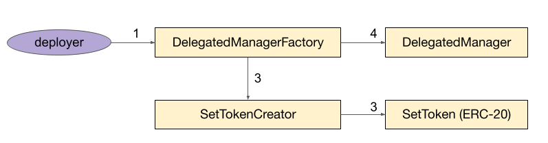
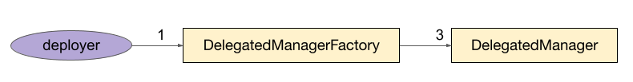

# STIP-009: Self Service Manager Contracts

*Using template v0.1*

## Abstract

Historically, SetProtocol has deployed SetToken specific manager contracts and extensions for IndexCoop issued funds. These contracts encode fee management and rebalance trading logic and provide better security guarantees to SetToken holders than direct management via EOA.

This STIP proposes that we automate manager contract deployments using on-chain factories and support "self-service" manager enabled SetToken creation as a feature available to anyone in the SetProtocol UI (tokensets.com).

This involves creating:
+ a standard set of manager contracts that are:
    + able to delegate responsibilities to certain participants (owners and operators)
    + define the assets that participants are able to trade

+ a SetToken and DelegatedManager contract factory that deploys and wires all the contract components up.

## Motivation

This feature will allow us to:
+ provide a standardized experience to SetToken owners that want to use the TokenSets UI to manage their Set
+ make previously bespoke SetToken management systems available to any TokenSets user
+ improve the security of Tokensets-issued assets for Set holders by binding managers to smart-contract defined logics
+ introduce clearly defined roles for SetToken stakeholders and add the ability for SetToken managers to restrict Sets to a white-listed group of assets

## Background Information

At the moment there are two ways to manage Sets:
1. directly via an EOA or multi-sig,
2. via manager contract(s).

EOAs/multi-sigs provide the greatest amount of flexibility because they interact directly with the system. However they do not allow for advanced permissioning or restrictions on how the Set can be rebalanced.

Currently there are no "standard" manager contracts supported by the TokenSets UI for general use. However, there are several manager contracts that have been developed to support IndexCoop funds we can draw design ideas from:

[ICManager](https://github.com/IndexCoop/index-coop-smart-contracts/blob/master/contracts/manager/ICManager.sol) - This was the monolithic, first iteration of a manager contract that contains `operator` and `methodologist` roles. It is not extensible via other contracts but did contain a function that allowed the `operator` to pass arbitrary bytedata to a target contract address (to call modules). This contract wasn't desirable due to it being unable to be conveniently upgraded as well as its poor UX for managers who were required to submit arbitrary bytestrings instead of having clear interfaces.

[BaseManager](https://github.com/IndexCoop/index-coop-smart-contracts/blob/master/contracts/manager/BaseManager.sol) - This next generation manager contract system implements a more modular approach where extensions can be added to a BaseManager contract to add new functionality. This contract maintained the idea of an `operator` and `methodologist`, giving the `operator` the ability to add new functionality. Extensions became the only addresses permissioned to call an `interactManager` function on the manager which forwarded arbitrary bytedata to a target address (generally a module). This gave `operator`s much of the same powers as in the `ICManager` but the ability to add clean interfaces to interact with as well as be able to encode strategies to govern SetTokens within one of their extensions to allow for more decentralized execution of rebalances.

[BaseManagerV2](https://github.com/IndexCoop/index-coop-smart-contracts/blob/master/contracts/manager/BaseManagerV2.sol) - This manager contract is very similar to `BaseManager` it just gave `methodologists` greater ability to counteract `operators` ablility to add and remove privileged functionalities from the manager in case of an adversarial relationship between the `operator` and `methodologist`.

## Open Questions

Pose any open questions you may still have about potential solutions here. We want to be sure that they have been resolved before moving ahead with talk about the implementation. This section should be living and breathing through out this process.

- [ ] When accruing streaming fees where do we send the fees to? The manager?
    - The manager. We don't want to pool fees in generalized extensions.
- [ ] How do we validate that trades for *x* asset are actually for *x* asset when the trade is encoded in a bunch of bytedata?
    - *Answer*
- [ ] What data needs to be held on every extension? What data needs to be passed in for initialization on each extension?
    - *Initialization and Data Needs:*
        - *SetToken address*
        - *Manager contract address*
- [ ] Do we need an initialization flow similar to SetTokens/modules?
    - *Answer*
- [ ] During migration when does the EOA manager update the manager address to the deployed manager?
    - *Current thoughts are that extension initialization and module initialization happen in same step. However the manager would need to be the manager contract at that point for it to not fail. Given that the initialization step is being called by the factory we would need to update the manager on the SetToken before initialization*

## Feasibility Analysis

### Single-user vs. Mutli-user Manager Contracts

Single-user manager contracts would be deployed once per Set Token by a manager factory contract, while a multi-user manager contract would be deployed once overall and could subsequently be used by all Set Tokens. Single-user manager contracts maintain separation between Set Tokens at the contract level but require individual deployments for each Set Token. A multi-user manager contract requires only one deployment but has functionality across many Set Tokens, which may open up attack vectors.

### Modular vs. Monolithic Manager Contracts

With modular manager contracts, operators call extension contracts which invoke the manager with arbitrary logic. With monolithic manager contracts, operators call the manager contract directly with logic defined on deployment. The modular manager contracts maintain more flexiblity but require extensions to be deployed and enabled. The monolithic manager contract requires migration for upgradeability but does not need extensions for functionality.

### Individual vs. Global Extensions

With individual extensions, a new extension contract must be deployed and enabled to provide some functionality to the manager. With global extensions, a collection of extension contracts would be deployed by Set Protocol and made available to managers by simply enabling them. Individual extensions offer more flexibility to managers but require individual contract deployments from managers. Global extensions offer less flexibility but do not require managers to make contract deployments.

### Recommended Solution

We recommend deploying single-user, modular manager contracts from a manager factory contract along with a collection of multi-user, "global" extensions providing basic functionality. Manager contracts will define `owner`, `methodologist`, and `operator` roles and an asset whitelist which will be used by extensions.

**Design features**

+ single-user manager contracts mirror the separation of Set Tokens from each other at the contract level.
+ modular manager contracts allow for functionaity to be flexible and extensible.
+ a collection of multi-use extensions gives managers access to basic functionality without requiring a dedicated contract deployment.
+ managers will retain the option of deploying individual extensions for more complicated functionality.

## Timeline

|  Action               |  End Date  |
|---                    |---         |
| Technical Spec        |   2/25     |
| Implementation        |   3/2      |
| Auditors              |   3/11     |
| Launch                |   3/18     |

## Checkpoint 1

**Reviewer**: LGTM @bweick

## Proposed Architecture Changes


**DelegatedManagerFactory**: Factory smart contract which provides asset managers (`deployer`) the ability to create a Set Token with a DelegatedManager manager, create a DelegatedManager manager for an existing Set Token to migrate to, and `initialize` extensions and modules.

**DelegatedManager**: Manager smart contract which provides asset managers three permissioned roles (`owner`, `methodologist`, `operator`) and asset whitelist functionality. The `owner` grants permissions to `operator`(s) to interact with extensions. The `owner` can restrict the `operator`(s) permissions with an asset whitelist.

**TradeExtension**: Global extension which provides privileged `operator`(s) the ability to `trade` on a DEX and the `owner` the ability to restrict `operator`(s) permissions with an asset whitelist.

**BasicIssuanceExtension**: Global extension which provides the `owner` and `methodologist` the ability to accrue and split issuance and redemption fees at an mutable percentage.

**StreamingFeeSplitExtension**: Global extension which provides the `owner` and `methodologist` the ability to accrue and split streaming fees at an mutable percentage.

## Requirements

### DelegatedManagerFactory

- Allow `deployer` to create new set tokens with a DelegatedManager manager
- Allow `deployer` to create a new DelegatedManager for an existing set token to migrate to
- Allow `deployer` to initialize extensions and modules

### DelegatedManager

**NOTE**: Although this manager supports management fee splitting with multiple beneficiaries, its owner
ultimately has total control over these as well as any funds accidentally sent to the contract. We are not
supporting any logic to guarantee that fee split arrangements are irrevocable.

- Allow `owner` to add and remove global `operator` permissions on extensions
- Allow `owner` to limit `operator`(s) functionality on extensions with an asset whitelist
- Allow `owner` to update asset whitelist
- Allow `owner` to perform Set Token admin functions such as `addModule`, `removeModule`, and `setManager`
- Allow `owner` to update ownerFeeSplit
- Allow `owner` to update ownerFeeRecipient
- Allow `owner` to transfer tokens held by the BaseManager to another address (sweeper)
- Allow `owner` to update useAllowedAssetList flag. (When false, manager can trade any asset)
- Allow extensions to interact with modules

### TradeExtension

- Allow `owner` to enable functionality of TradeModule with only a state change and no contract deployment
- Allow privileged `operator`(s) to perform trades on a DEX
- Allow `owner` to restrict assets the privileged `operator`(s) can trade into with an asset whitelist

### BasicIssuanceExtension

- Allow `owner` to enable functionality of BasicIssuanceModule with only a state change and no contract deployment
- Allow `owner` and `methodologist` to split issuance and redemption fees
- Allow `owner` to update the issuance and redemption fee
- Allow `owner` to update the issuance and redemption fee recipient

### StreamingFeeSplitExtension

- Allow `owner` to enable functionality of StreamingFeeModule with only a state change and no contract deployment
- Allow `owner` and `methodologist` to split streaming fees
- Allow `owner` to update the streaming fee
- Allow `owner` to update the streaming fee recipient

## User Flows

### DelegatedManagerFactory.createSetAndManager()


A `deployer` wants to create a new Set Token with a DelegatedManager smart contract manager.

1. The `deployer` calls createSetAndManager() passing in parameters to create a Set Token, parameters for the permissioning on DelegatedManager, and the desired extensions. Specifically,

    - components: List of addresses of components for initial positions
    - units: List of units for initial positions
    - name: Name of SetToken
    - symbol: Symbol of SetToken
    - owner: The address of the `owner`
    - methodologist: The address of the `methodologist`
    - operators: List of addresses of the `operator`(s)
    - modules: List of addresses of modules to be enabled
    - assets: List of addresses of assets for initial asset whitelist
    - extensions: List of addresses of global extensions to be enabled

2. Creation Parameters are validated:
    - If assets are defined, asset list must match components

3. A Set Token is deployed using SetTokenCreator

4. A DelegatedManager is deployed with the DelegatedManagerFactory as the temporary `owner` until after initialization
    - If assets are defined, constructor param *useAssetAllowlist* is set to true, false otherwise.

5. The `deployer`, `owner`, and DelegatedManager are stored on the Factory in pending state

### DelegatedManagerFactory.createManager()



A `deployer` wants to migrate an existing Set Token to a DelegatedManager smart contract manager.

1. The `deployer` calls createManager() passing in the Set Token address, parameters for the permissioning on DelegatedManager, and the desired extensions. Specifically,

    - owner: The address of the `owner`
    - methodologist: The address of the `methodologist`
    - operators: List of addresses of the `operator`(s)
    - assets: List of addresses of assets for initial asset whitelist
    - extensions: List of addresses of global extensions to be enabled

2. createManager parameters are validated:
    - If assets are defined, asset list must match SetToken's existing components

3. A DelegatedManager is deployed with the DelegatedManagerFactory as the temporary `owner` until after initialization
    - If assets are defined, constructor param *useAssetAllowlist* is set to true, false otherwise.

4. The `deployer`, `owner`, and DelegatedManager are stored on the Factory in pending state

### DelegatedManagerFactory.initialize()



The `deployer` wants to enable all extensions, initialize all corresponding modules, and transfer the manager `owner` role.

1. The `deployer` calls initialize() passing in the parameters for initializing modules and extensions

2. Initialization parameters are validated:
    - `initializationState` must be `pending`
    - `initialize` caller must be the `deployer`
    - `initializeTargets` (extension and module addresses) must be the same length as `initializeBytecode` (initialization instructions)

3. All modules and extensions are initialized for the SetToken

4. If the setToken manager is the factory, transfer `manager` role to the DelegatedManager contract

5. The `owner` role on the DelegatedManager is transfered from the Factory to the `owner` designated during the creation step.

6. The Factory deletes the `InitializeParams` entry for the set token, removing it from pending state

7. (Optional) If migrating, the SetToken's current manager address must be reset to point at the newly deployed DelegatedManager contract in a separate step.
    - If SetToken manager is EOA, call setToken.setManager(_newAddress)
    - If SetToken manager is contract, call CurrentManagerContract.setManager(_newAddress)

### StreamingFeeExtension.accrueFeeAndDistribute()


An interested party wants to accrue streaming fees and distribute them to the `owner` and `methodologist`.

1. The interested party calls accrueFeeAndDistribute() on the StreamingFeeExtension
2. Fees are accrued to the DelegatedManager
3. Fees are distributed to the `owner` and `methodologist`


## Checkpoint 2

**Reviewer**:

Reviewer: []

## Specification

### DelegatedManagerFactory

#### Events

##### DelegatedManagerDeployed

| Type  | Name  | Description   |
|------ |------ |-------------  |
|address|setToken|Address of SetToken to be managed|
|address|deployer|Address of the deployer|
|address|owner|Address of the owner|
|address|manager|Address of the DelegatedManager|


##### DelegatedManagerInitialized

| Type  | Name  | Description   |
|------ |------ |-------------  |
|address|setToken|Address of SetToken to be managed|
|address|deployer|Address of the deployer|
|address|owner|Address of the owner|
|address|manager|Address of the DelegatedManager|


#### Structs

##### InitializeParams

| Type 	| Name 	| Description 	|
|------	|------	|-------------	|
|address|deployer|Address of the deployer|
|address|owner|Address of the owner|
|address|manager|Address of the DelegatedManager|
|bool|isPending|Bool if manager in pending state|

#### Public Variables

| Type 	| Name 	| Description 	|
|------	|------	|-------------	|
|address|factory|Address of Set Token factory|
|mapping(address => InitializeParams)|initialize|Mapping from Set Token to initialization parameters|


#### Functions

| Name  | Caller  | Description 	|
|------	|------	|-------------	|
|createSetAndManager |deployer|Create new Set Token with a DelegatedManager manager|
|createManager | SetToken owner |Migrate existing Set Token to a DelegatedManager manager|
|initialize |deployer or SetToken owner |Initialize modules and extensions, set manager fee settings|

----

### Functions

> createSetAndManager

ANYONE CAN CALL: Deploys a new SetToken and DelegatedManager. Sets some temporary metadata about
the deployment which will be read during a subsequent intialization step which wires everything
together

```solidity
function createSetAndManager(
    address[] memory _components,
    uint256 _units,
    string memory _name,
    string memory _symbol,
    address _owner,
    address _methodologist,
    address[] memory _modules,
    address[] memory _operators,
    address[] memory _assets,
    address[] memory _extensions
)
```

+ if `_assets` are specified, require that all *_components* are included in the *_assets* array

+ deploy the set
    ```solidity
    address setTokenAddress = _deploySet(
        _components,
        _modules,
        _units,
        _name,
        _symbol
    );
    ```
+ deploy the manager, setting its *useAssetsAllowedList* constructor parameter to true if there are *_assets* and false otherwise.
    ```solidity
    address managerAddress = _deployManager(
        setTokenAddress,
        address(this),
        _methodologist,
        useAssetsAllowedList
        _operators,
        _assets,
        _extensions
    );
    ```

+ set temporary initialization metadata for the newly created SetToken and DelegatedManager
    ```solidity
    initialize[setTokenAddress] = InitializeParams({
        deployer: msg.sender,
        owner: _owner,
        manager: managerAddress,
        isPending: true
    });
    ```

ONLY SETTOKEN MANAGER: Deploys a DelegatedManager and sets some temporary metadata about
the deployment which will be read during a subsequent intialization step which wires everything
together. This method is used when migrating an existing SetToken to the DelegatedManager system.

(Note: This flow should work well for SetTokens managed by an EOA. However, existing contract-managed Sets
may need to have their ownership temporarily transferred to an EOA when migrating. We don't anticipate high demand for this migration case though.)

> createManager

```solidity
function createManager(
    address memory _setTokenAddress,
    address _owner,
    address _methodologist,
    address[] memory _modules,
    address[] memory _operators,
    address[] memory _assets,
    address[] memory _extensions
)
```
+ require *msg.sender* is *setToken.manager*
+ if `_assets` are specified, require that all of the sets existing *_components* are included in the *_assets* array

+ deploy the manager, setting its *useAssetsAllowedList* constructor parameter to true if there are *_assets* and false otherwise.
    ```solidity
    address managerAddress = _deployManager(
        setTokenAddress,
        address(this),
        _methodologist,
        useAssetsAllowedList
        _operators,
        _assets,
        _extensions
    );
    ```

+ set temporary initialization metadata for the newly created SetToken and DelegatedManager
    ```solidity
    initialize[setTokenAddress] = InitializeParams({
        deployer: msg.sender,
        owner: _owner,
        manager: managerAddress,
        isPending: true
    });
    ```

> initialize

ONLY DEPLOYER: Wires SetToken, DelegatedManager, global manager extensions, and modules together into
a functioning package. `_initializeTargets` includes any extensions or modules which need to be initialized. `initializeBytecode` is an encoded call to the relevant target's *initialize* function.

To generate the bytecode to call the TradeModules initialize function with the ethers.js library you'd write:

```js
const iFace = new ethers.utils.interface(["initialize(address)"]);
const bytecode = iFace.encodeFunctionData("initialize", [setTokenAddress]);
```

```solidity
function initialize(
    address memory _setTokenAddress,
    uint256 _ownerFeeSplit,
    address _ownerFeeRecipient,
    address[] memory _initializeTargets,
    bytes[] memory _initializeBytecode,
)
```
+ require that caller be the *deployer* specified in the *initialize[_setTokenAddress]* mapping
+ require that *initialize[_setTokenAddress].isPending* is `true`
+ require that *_initializeExtensionTargets* and *initializeExtensionBytecode* arrays have same length
+ call DelegatedManager.updateOwnerFeeSplit with *_ownerFeeSplit*
+ call DelegatedManager.updateOwnerFeeRecipient with *_ownerFeeRecipient*

+ for each (target, bytecode)  in  (_initializeTargets, _initializeBytecode)
    + call target.functionCallWithValue(bytecode, 0)

+ if setToken manager is this factory we're creating a new SetToken rather than migrating
  + call `setToken.setManager(initialize[_setTokenAddress].manager)`
+ transfer ownership of manager from factory to *owner* specified in the *initialize[_setTokenAddress]* mapping
+ delete the *initialize[_setTokenAddress]* mapping entry


### DelegatedManager

#### Enums

##### ExtensionState

| Value  | Name  | Description   |
|------ |------ |-------------  |
| 0 | NONE | State when extension has not been added |
| 1 | PENDING | State when extension has been added but not yet initialized |
| 2 | INITIALIZED | State when extension has been initialized |

#### Events

##### MethodologistChanged

| Type  | Name  | Description   |
|------ |------ |-------------  |
|address|oldMethodologist| previous methodologist|
|address|newMethodologist| new methodologist|

#### ExtensionAdded

| Type  | Name  | Description   |
|------ |------ |-------------  |
|address|extension| added extension address |

#### ExtensionRemoved

| Type  | Name  | Description   |
|------ |------ |-------------  |
|address|extension| removed extension address |


#### ExtensionInitialized

| Type  | Name  | Description   |
|------ |------ |-------------  |
|address|extension| initialized extension address |


#### OperatorAdded

| Type  | Name  | Description   |
|------ |------ |-------------  |
|address|operator| added operator address |


#### OperatorRemoved

| Type  | Name  | Description   |
|------ |------ |-------------  |
|address|operator| removed operator address |

#### AllowedAssetAdded

| Type  | Name  | Description   |
|------ |------ |-------------  |
|address|asset| added allowed asset |

#### AllowedAssetRemoved

| Type  | Name  | Description   |
|------ |------ |-------------  |
|address|asset| added allowed asset |

#### UseAllowlistUpdated

| Type  | Name  | Description   |
|------ |------ |-------------  |
|bool|useAssetAllowlist| updated state of useAssetAllowlist flag|


#### Public Variables

| Type 	| Name 	| Description 	|
|------	|------	|-------------	|
|ISetToken|setToken|Instance of SetToken|
|address|factory|Address of factory contract used to deploy contract|
|address|methodologist|Address of methodologist which serves as providing methodology for the index|
|boolean|useAssetAllowed|when false, assetAllowlist restrictions are ignored |
|uint256|ownerFeeSplit|Percent of fees in precise units (10^16 = 1%) sent to owner, rest to methodologist|
|address|ownerFeeRecipient|Address which receives operator's share of fees when they're distributed|
|mapping(address => ExtensionState)|extensionAllowlist|Mapping to check if extension is enabled|
|mapping(address => bool)|operatorAllowlist|Mapping indicating if address is an approved operator|
|mapping(address => bool)|assetAllowlist|Mapping indicating if asset is approved to be traded for, wrapped into, claimed, etc.|

#### Private Variables

| Type 	| Name 	| Description 	|
|------	|------	|-------------	|
|address[]|extensions|Array of enabled extensions|
|address[]|operators|List of approved operators|
|address[]|allowedAssets|Array of enabled extensions|

#### Functions

| Name  | Caller  | Description 	|
|------	|------	|-------------	|
|interactManager|extension|Interact with a module registered on the Set Token|
|initializeExtension|extension|Initializes an added extension from PENDING to INITIALIZED state|
|addExtensions|owner|Add a new extension that the DelegatedManager can call|
|removeExtensions|owner|Remove an existing extension tracked by the DelegatedManager|
|addOperators|owner|Add new operator(s) address|
|addAllowedAssets|owner|Add new asset(s) that can be traded to, wrapped to, or claimed|
|removeAllowedAssets|owner|Remove asset(s) so that it/they can't be traded to, wrapped to, or claimed|
|setUseAssetAllowed|owner|set useAssetAllowed variable to true or false|
|setMethodologist|methodologist|Update the methodologist address|
|setManager|owner|Update the manager of the Set Token|
|addModule|owner|Add module to Set Token|
|removeModule|owner|Remove module from Set Token|

#### Modifiers

| Name  | Description   |
|------ |-------------  |
|onlyOwner| Requires that DelegatedManager `owner` is caller |
|onlyMethodologist | Requires that DelegatedManager `methodologist` is caller |
|onlyExtension | Requires that msg.sender is an initialized extension in the `extensionAllowlist` array |

----

### Functions

> constructor

```solidity
constructor(
    ISetToken _setToken,
    address _factory,
    address _methodologist,
    bool _useAssetAllowlist
    address[] memory _extensions,
    address[] memory _operators,
    address[] memory _allowedAssets,
)
```

+ Set *setToken*, *factory*, *methodologist*, and *useAssetAllowlist* public variables
+ Add allowed *_extensions* (these will be in set to *PENDING* state)
+ Add approved *_operators*

----

> interactManager

ONLY EXTENSION: Interact with a module registered on the SetToken

```
function interactManager(address _module, bytes calldata _data) external onlyExtension
```
+ require that _module is not the *setToken* (to prevent operator from bypassing extension interfaces)
+ Call `_module.functionCallWithValue(_data, 0)`

----

> transferTokens

ONLY OWNER: Transfers _tokens held by the manager to _destination. Can be used to
recover anything sent here accidentally.

```solidity
function transferTokens(address _token, address _destination, uint256 _amount)
```

+ Call `IERC20(_token).safeTransfer(_destination, _amount)`

----

ONLY PENDING EXTENSION > initializeExtension

Initializes an added extension from PENDING to INITIALIZED state. An address can only
enter a PENDING state if it is an enabled extension added by the manager. Only callable
by the extension itself, hence msg.sender is the subject of update.

```solidity
function initializeExtension()
```

+ Require that extension calling method has been added and it's state is *PENDING*
+ Set *extensionAllowlist[msg.sender]* to *INITIALIZED*
+ Add *msg.sender* to *extensions* array
+ emit *ExtensionInitialized* event

----

> addExtension

ONLY OWNER: Add a new extension that the DelegatedManager can call

```solidity
function addExtensions(address[] memory _extensions)
```

+ for each extension in _extensions
  + require that extension state in *extensionAllowlist* is *NONE* (has not already been added)
  + set *extensionAllowlist[extension]* to PENDING
  + emit *ExtensionAdded* event

----

> removeExtensions

ONLY OWNER: Remove an existing extension tracked by the DelegatedManager.

```solidity
function removeExtensions(address[] memory _extensions)
```

+ for each extension in _extensions
  + require that extension state in *extensionAllowlist* is *INITIALZED*
  + delete extension from *extensions* array
  + set extension state to *NONE* in *extensionAllowlist*
  + call extensions's own *removeExtension* method for manager's setToken
  + emit *ExtensionRemoved* event


----

> addOperators

ONLY OWNER: Add new operator(s) address

```solidity
function addOperators(address[] memory _operators)
```
+ for each operator in _operators
  + require that operator is not already registered in the *operatorAllowlist* mapping
  + add operator to the *operators* array
  + set *operatorAllowlist[operator]* to `true`
  + emit *OperatorAdded* event

----

> removeOperators

ONLY OWNER: Remove operator(s) from the allowlist

```solidity
function removeOperators(address[] memory _operators)
```

+ for each operator in _operators
  + require that operator is in the *operatorAllowlist* mapping
  + delete operator from the *operators* array
  + set *operatorAllowlist[operator]* to `false`
  + emit *OperatorRemoved* event

----

> addAllowedAssets

ONLY OWNER: Add new asset(s) that can be traded to, wrapped to, or claimed

```solidity
function addAllowedAssets(address[] memory _assets)
```
+ for each asset in _assets
  + require that asset is not already registered in the *assetAllowlist* mapping
  + add asset to the *assetAllowlist* array
  + set *assetAllowlist[asset]* to `true`
  + emit *AllowAssetAdded* event

----

> removeAllowedAssets

ONLY OWNER: Remove asset(s) so that it/they can't be traded to, wrapped to, or claimed

```solidity
function removeAllowedAssets(address[] memory _assets)
```

+ for each asset in _assets
  + require that asset is present in the *assetAllowlist* mappiing
  + delete asset from the *allowedAssets* array
  + set *assetAllowlist[asset]* to `false`
  + emit AllowedAssetRemoved event

----

> setUseAssetAllowlist

ONLY OWNER: Toggles whether or not operator can trade any asset. When false, assetAllowlist
restrictions are ignored.

```solidity
function setUseAssetAllowlist(bool _useAssetAllowlist)
```

+ set *useAssetAllowlist* to _useAssetAllowlist
+ emit *UseAllowlistUpdated* event

----

> updateOwnerFeeSplit

ONLY OWNER: Sets the *ownerFeeSplit*

```solidity
function updateOwnerFeeSplit(uint256 _ownerFeeSplit)
```

+ set *ownerFeeSplit* to _ownerFeeSplit

----

> updateOwnerFeeRecipient

ONLY OWNER: Sets the *ownerFeeRecipient*

```solidity
function updateOwnerFeeRecipient(address _ownerFeeRecipient)
```

+ set *ownerFeeRecipient* to _ownerFeeRecipient

----

> setMethodologist

ONLY METHODOLOGIST: Update the methodologist address

```solidity
function setMethodologist(address _newMethodologist)
```

+ set *methodologist* to _newMethodologist
+ emit MethodologistChanged Event

----

> setManager

ONLY OWNER: Update the SetToken manager address

```solidity
function setManager(address _newManager)
```

+ require that _newManager is not a null address
+ call `setToken.setManager(_newManager)`

----

> addModule

ONLY OWNER: Add a new module to the SetToken

```solidity
function addModule(address _module)
```

+ call `setToken.addModule(_module)`

----

> removeModule

ONLY OWNER: Remove a new module from the SetToken

```solidity
function removeModule(address _module)
```

+ call `setToken.removeModule(_module)`

----


#### Getters

> getExtensions

```solidity
function getExtensions()
```

+ returns *extensions* array

----

> getOperators

```solidity
function getOperators()
```

+ returns operators array

----

> getAllowedAssets

```solidity
function getAllowedAssets()
```

+ returns allowedAssets array

----

> isInitializedExtension

```solidity
function isInitializedExtension(address _extension)
```

+ if _extension state in *extensionAllowlist* is INITIALIZED, return true. Otherwise false;

----

> isPendingExtension

```solidity
function isPendingExtension(address _extension)
```

+ if _extension state in *extensionAllowlist* is PENDING, return true. Otherwise false;

> isAllowedAsset

```solidity
function isAllowedAsset(address _asset)
```

+ return allowedAssetList(_asset)


### BaseGlobalExtension

#### Modifiers

> onlyAllowedAsset

```solidity
modifier onlyAllowedAsset(address memory _receiveAsset) {
    if (manager.useAllowlist) {
        require(manager.assetAllowlist[_receiveAsset], "Must be allowed asset");
    }
    _;
}
```

> onlyOwner

```solidity
modifier onlyOwner(ISetToken _setToken) {
    require(msg.sender == _manager(_setToken).owner(), "Must be owner");
    _;
}
```

> onlyMethodologist

```solidity
modifier onlyMethodologist(ISetToken _setToken) {
    require(msg.sender == _manager(_setToken).methodologist(), "Must be methodologist");
    _;
}
```

> onlyOperator

```solidity
modifier onlyOperator(ISetToken _setToken) {
    require(_manager(_setToken).operatorAllowlist(msg.sender), "Must be approved operator");
    _;
}
```

> onlyManager

```solidity
modifier onlyManager(ISetToken _setToken) {
    require(address(_manager(_setToken)) == msg.sender, "Manager must be sender");
    _;
}
```

### Internal functions

> invokeManager

Invoke call from manager

```solidity
function invokeManager(ISetToken _setToken, address _module, bytes memory _encoded)
```

+ call *_manager(_setToken).interactManager(_module, _encoded)*

### Abstract Functions

> _manager

Internal function to grab manager of passed SetToken from extensions data structure

```solidity
function _manager(ISetToken _setToken) internal virtual view returns (IDelegatedManager)
```

----

> removeExtension

Removes extension

```solidity
function removeExtension(ISetToken _setToken) external virtual;
```

### TradeExtension

#### Inheritance

- BaseGlobalExtension

#### Global Variables

| Type 	| Name 	| Description 	|
|------	|------	|-------------	|
|ITradeModule|tradeModule|Trade Module for Set Token|

#### Public Variables

| Type 	| Name 	| Description 	|
|------	|------	|-------------	|
|mapping(address => IDelegatedManager)|setManagers|Mapping from Set Token to DelegatedManager|

#### Functions

| Name  | Caller  | Description     |
|------	|------	|-------------	|
|initialize|owner|Initialize the TradeExtension on the DelegatedManager and initialize the TradeModule on the SetToken if necessary|
|trade|operator|Trade between whitelisted assets on a DEX|

----

### Functions

> initializeExtension

ONLY OWNER: Initialize the TradeExtension on the DelegatedManager

```solidity
function initializeExtension(address _delegatedManager)
```
+ require that extension state in delegatedManager's *extensionAllowlist* is *PENDING*
+ set *setManagers[_setTokenAddress]* to manager
+ call `manager.initializeExtension()`
+ emit *ExtensionInitialized* event

----

> initializeModuleAndExtension

ONLY OWNER: Initialize the TradeModule and the TradeExtension

```
function initializeModuleAndExtension(address _delegatedManager, IManagerIssuanceHook _preIssueHook)
```

+ call *initializeExtension(_delegatedManager)*
+ Formulate call to initialize module from manager
    ```solidity
    bytes memory callData = abi.encodeWithSelector(
        ITradeModule.initialize.selector,
        delgatedManager.setToken()
    );
    ```

+ call *invokeManager(streamingFeeModule, callData)*

### BasicIssuanceExtension

#### Inheritance

- BaseGlobalExtension

##### FeeState

| Type 	| Name 	| Description 	|
|------	|------	|-------------	|
|address|feeRecipient|Address to accrue fees to|
|uint256|maxIssueFee|Max issuance fee manager commits to using (1% = 1e16, 100% = 1e18)|
|uint256|issueFee|Percent of Set accruing to manager on issuance (1% = 1e16, 100% = 1e18)|
|uint256|maxRedeemFee|Max redemption fee manager commits to using (1% = 1e16, 100% = 1e18)|
|uint256|redeemFee|Percent of Set accruing to manager on redemption (1% = 1e16, 100% = 1e18)|

#### Global Variables

| Type 	| Name 	| Description 	|
|------	|------	|-------------	|
|IIssuanceModule|issuanceModule|Issuance Module for Set Token|

#### Public Variables

| Type 	| Name 	| Description 	|
|------	|------	|-------------	|
|mapping(address => IDelegatedManager)|setManagers|Mapping from Set Token to DelegatedManager|

#### Functions

| Name  | Caller  | Description     |
|------	|------	|-------------	|
|initialize|owner|Initialize the BasicIssuanceExtension on the DelegatedManager and initialize the BasicIssuanceModule on the SetToken if necessary|
|updateIssueFee|owner|Update issue fee on IssuanceModule|
|updateRedeemFee|owner|Update redeem fee on IssuanceModule|

----

### Functions

> initializeExtension

ONLY OWNER: Initialize the BasicIssuanceExtension on the DelegatedManager

```solidity
function initializeExtension(address _delegatedManager)
```

+ read _setTokenAddress from _delegatedManager
+ require that caller be the *deployer* specified in the factory's *initialize[_setTokenAddress]* mapping
+ require that extension state in delegatedManager's *extensionAllowlist* is *PENDING*
+ set *setManagers[_setTokenAddress]* to manager
+ call `manager.initializeExtension()`
+ emit *ExtensionInitialized* event

----

> initializeModuleAndExtension

ONLY OWNER: Initialize the BasicIssuanceModule and the BasicIssuanceExtension

```
function initializeModuleAndExtension(address _delegatedManager, IManagerIssuanceHook _preIssueHook)
```

+ call *initializeExtension(_delegatedManager)*
+ Formulate call to initialize module from manager
    ```solidity
    bytes memory callData = abi.encodeWithSelector(
        IBasicIssuanceModule.initialize.selector,
        delgatedManager.setToken(),
        _preIssueHook
    );
    ```

+ call *invokeManager(streamingFeeModule, callData)*

### StreamingFeeSplitExtension

#### Inheritance

- BaseGlobalExtension

#### Structs

##### FeeState

| Type 	| Name 	| Description 	|
|------	|------	|-------------	|
|address|feeRecipient|Address to accrue fees to|
|uint256|maxStreamingFeePercentage|Max streaming fee manager commits to using (1% = 1e16, 100% = 1e18)|
|uint256|streamingFeePercentage|Percent of Set accruing to manager annually (1% = 1e16, 100% = 1e18)|
|uint256|lastStreamingFeeTimestamp|Timestamp last streaming fee was accrued|

#### Global Variables

| Type 	| Name 	| Description 	|
|------	|------	|-------------	|
|IStreamingFeeModule|streamingFeeModule|Streaming Fee Module for Set Token|

#### Public Variables

| Type 	| Name 	| Description 	|
|------	|------	|-------------	|
|mapping(address => IDelegatedManager)|setManagers|Mapping from Set Token to DelegatedManager|

#### Functions

| Name  | Caller  | Description     |
|------	|------	|-------------	|
|accrueFeesAndDistribute|public|Accrue fees and distribute to owner and methodologist|
|initialize|owner|Initialize the StreamingFeeSplitExtension on the DelegatedManager and initialize the StreamingFeeModule on the SetToken if necessary|
|updateStreamingFee|owner|Migrate existing Set Token to a DelegatedManager manager|
|updateFeeRecipient|owner|Update fee recipient|

----

### Functions

> initializeExtension

ONLY OWNER: Initialize the StreamingFeeSplitExtension on the DelegatedManager

```solidity
function initializeExtension(address _delegatedManager)
```

+ require that extension state in delegatedManager's *extensionAllowlist* is *PENDING*
+ set *setManagers[_setTokenAddress]* to _delagatedManager
+ call `manager.initializeExtension()`
+ emit *ExtensionInitialized* event

----

> initializeModuleAndExtension

ONLY OWNER: Initialize the StreamingFeeModule and the StreamingFeeExtension

```
function initializeExtensionAndModule(address _delegatedManager, FeeState memory _settings)
```

+ call *initializeExtension(_delegatedManager)*
+ Formulate call to initialize module from manager
    ```solidity
    bytes memory callData = abi.encodeWithSelector(
        IStreamingFeeModule.initialize.selector,
        _delegatedManager.setToken(),
        _settings
    );
    ```

+ call *invokeManager(streamingFeeModule, callData)*

## Checkpoint 3

Before we move onto the implementation phase we want to make sure that we are aligned on the spec. All contracts should be specced out, their state and external function signatures should be defined. For more complex contracts, internal function definition is preferred in order to align on proper abstractions. Reviewer should take care to make sure that all stake holders (product, app engineering) have their needs met in this stage.

**Reviewer**:

## Implementation
[Link to implementation PR]()
## Documentation
[Link to Documentation on feature]()
## Deployment
[Link to Deployment script PR]()
[Link to Deploy outputs PR]()