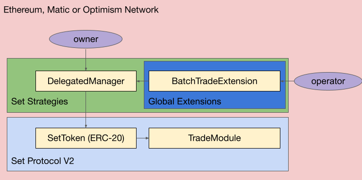
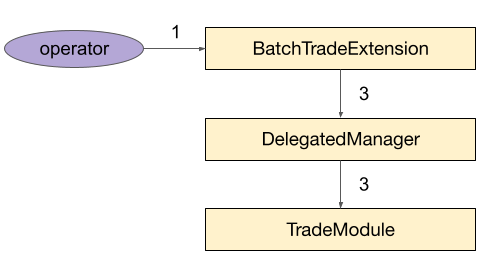

# STIP-011: Batch Trading
*Using template v0.1*
## Abstract

Rebalancing Set Token indices is a complicated process which involves managers and operators executing multiple transactions. Making this process simpler improves the experience of current asset managers and makes index management more approachable for new asset managers.

## Motivation

This STIP proposes we provide infrastructure to batch trade calls together into one transaction. This will make Set Token index rebalancing less cumbersome for asset managers by reducing the number of transactions necessary to rebalance an index.

## Background Information

[TradeModule](https://github.com/SetProtocol/set-protocol-v2/blob/master/contracts/protocol/modules/v1/TradeModule.sol) with [TradeExtension](https://github.com/SetProtocol/set-v2-strategies/blob/master/contracts/extensions/TradeExtension.sol) - This module and accompanying extension allow managers to make individual swaps. A complete index rebalance could be done by executing multiple transactions through the `TradeExtension`.

[GeneralIndexModule](https://github.com/SetProtocol/set-protocol-v2/blob/master/contracts/protocol/modules/v1/GeneralIndexModule.sol) - This module is tailored to the complete rebalance of Set Token indices. The manager begins the rebalance by specifying a target allocation in `startRebalance()`. Once this allocation is passed in, allowed traders can submit rebalance transactions by calling `trade()` and specifying the component they wish to rebalance.

[Multicall2](https://github.com/makerdao/multicall/blob/master/src/Multicall2.sol) - This contract aggregates results from multiple contract constant function calls. This reduces the number of separate JSON RPC requests and guarantees that all values returned are from the same block. `Multicall2` allows calls within the batch to fail.

## Open Questions
- [ ] How often will trades within a batch fail? What factors effect this failure rate?
    - *Answer*
- [ ] Is there a trade ordering algorithm which can be provided to managers to sequence trades into batches for a desired rebalance?
    - *Answer*
## Feasibility Analysis

### BatchTradeExtension

This extension submits multiple calls to the `TradeModule` in a single transaction. Events are emitted if any of the individual calls fail. This implementation is simple but has some gas inefficiencies. Permissions are checked on each call to the `TradeModule`, but permissions only need to be checked once. Also if components are present in multiple trades in the batch, their position will be updated multiple times when only one update per component is necessary.

### BatchTradeModule

This module is similar to the `TradeModule`, but executes multiple trades in a single transaction. Logic duplication during permission checking and position updating can be avoided with this module. This implementation is more complicated because it requires a module with new logic, an accompanying extension, and integrations added to the `IntegrationRegistry`.

### Recommended Solution

We recommend implementing the `BatchTradeExtension`. This solution requires less smart contract implementation, leverages all current and future `TradeModule` integrations, and only performs from an estimated ~10% worse on gas usage compared to the `BatchTradeModule`.

## Timeline

|  Action               |  End Date  |
|---                    |---         |
| Technical Spec        |   4/18     |
| Implementation        |   4/20     |
| Auditors              |   4/22     |
| Launch                |   4/29     |


**Reviewer**:

cgewecke: Approved
controtie: Approved

## Proposed Architecture Changes



**BatchTradeExtension**: Global extension which provides privileged `operator`(s) the ability to `batchTrade` on a DEX and the `owner` the ability to restrict the `operator`(s) permissions with an asset whitelist.

## Requirements

### BatchTradeExtension

- Allow `owner` to enable functionality of TradeModule with only a state change and no contract deployment
- Allow privileged `operator`(s) to perform batches of trades on a DEX
- Allow `owner` to restrict assets the privileged `operator`(s) can trade into with an asset whitelist

## User Flows

### BatchTradeExtension.batchTrade()



An `operator` wants to execute a batch of trades on a DEX.

1. The operator calls `batchTrade` passing in the parameters for each call to the `TradeModule`
2. Each `receiveToken` is validated to be on the asset whitelist
3. Each trade in the batch is executed

    - Trade `callData` is encoded using the provided inputs
    - Try to route the `callData` to the `TradeModule` through the `DelegatedManager`
    - Catch string and byte errors and emit corresponding events

## Checkpoint 2
Before we spec out the contract(s) in depth we want to make sure that we are aligned on all the technical requirements and flows for contract interaction. Again the who, what, when, why should be clearly illuminated for each flow. It is up to the reviewer to determine whether we move onto the next step.

**Reviewer**:

Reviewer: []
## Specification

### BatchTradeExtension

#### Inheritance

- BaseGlobalExtension

#### Events

##### BatchTradeExtensionInitialized

| Type  | Name  | Description   |
|------ |------ |-------------  |
|address|_setToken|Address of SetToken with BatchTradeExtension initialized|
|address|_delegatedManager|Address of DelegatedManager with BatchTradeExtension initialized|

##### StringTradeFailed

| Type  | Name  | Description   |
|------ |------ |-------------  |
|address|_setToken|Address of SetToken targeted with trade|
|uint256|_index|Index of trade in the batch|
|string|_reason|String reason for trade failure|

##### BytesTradeFailed

| Type  | Name  | Description   |
|------ |------ |-------------  |
|address|_setToken|Address of SetToken targeted with trade|
|uint256|_index|Index of trade in the batch|
|bytes|_reason|Bytes encoding custom error thrown during trade failure|

#### Structs

##### TradeInfo

| Type 	| Name 	| Description 	|
|------	|------	|-------------	|
|string|exchangeName|Human readable name of the exchange in the integrations registry|
|address|sendToken|Address of the token to be sent to the exchange|
|uint256|sendQuantity|Units of token in SetToken sent to the exchange|
|address|receiveToken|Address of the token that will be received from the exchange|
|uint256|minReceiveQuantity|Min units of token in SetToken to be received from the exchange|
|bytes|data|Arbitrary bytes to be used to construct trade call data|

#### Global Variables

| Type 	| Name 	| Description 	|
|------	|------	|-------------	|
|ITradeModule|tradeModule|Trade Module for SetToken|

#### Public Variables

| Type 	| Name 	| Description 	|
|------	|------	|-------------	|
|mapping(address => IDelegatedManager)|setManagers|Mapping from SetToken to DelegatedManager|

#### Modifiers

```solidity
modifier onlyAllowedAssets(ISetToken _setToken, TradeInfo[] memory _trades) {
    for(uint256 i = 0; i < _trades.length; i++) {
        require(_manager(_setToken).isAllowedAsset(_trades[i].receiveToken), "Must be allowed asset");
    }
    _;
}
```

#### Functions

| Name  | Caller  | Description     |
|------	|------	|-------------	|
|initializeModule|owner|Initializes TradeModule on the SetToken associated with the DelegatedManager|
|initializeExtension|owner|Initialize the BatchTradeExtension on the DelegatedManager|
|initializeExtensionAndModule|owner|Initialize the TradeModule on the SetToken and the BatchTradeExtension on the DelegatedManager|
|removeExtension|manager|Remove an existing SetToken and DelegatedManager tracked by the BatchTradeExtension|
|batchTrade|operator|Executes a batch of trades between whitelisted assets on a DEX|

----

### Functions

> batchTrade

Executes a batch of trades between whitelisted assets on a DEX.

```solidity
function batchTrade(
        ISetToken _setToken,
        TradeInfo[] memory _trades
    )
        external
        onlyOperator(_setToken)
        onlyAllowedAssets(_setToken, _trades)
```

+ require that the operator state in delegatedManager's *operatorAllowList* is `true`
+ require that each `receiveToken` state is an allowed asset on the delegatedManager
+ for each trade  in  _trades
    + encode the TradeInfo into callData
    + try to call the TradeModule through the DelegatedManager
    + catch string errors
        + emit *StringTradeFailed* event
    + catch bytes errors
        + emit *BytesTradeFailed* event

> initializeModule

Initializes TradeModule on the SetToken associated with the DelegatedManager.

```solidity
function initializeModule(address _delegatedManager) external onlyOwnerAndValidManager(_delegatedManager)
```

+ require that extension state in delegatedManager's *extensionAllowlist* is *INITIALIZED*
+ call *_initializeModule(_delegatedManager.setToken(), _delegatedManager)*

----

> initializeExtension

Initialize the BatchTradeExtension on the DelegatedManager.

```solidity
function initializeExtension(address _delegatedManager) external onlyOwnerAndValidManager(_delegatedManager)
```

+ require that extension state in delegatedManager's *extensionAllowlist* is *PENDING*
+ call *_initializeExtension(_delegatedManager.setToken(), _delegatedManager)*
+ emit *BatchTradeExtensionInitialized* event

----

> initializeModuleAndExtension

Initializes BatchTradeExtension to the DelegatedManager and TradeModule to the SetToken.

```solidity
function initializeModuleAndExtension(IDelegatedManager _delegatedManager) external onlyOwnerAndValidManager(_delegatedManager)
```

+ require that extension state in delegatedManager's *extensionAllowlist* is *PENDING*
+ extract SetToken from DelegatedManager *ISetToken setToken = _delegatedManager.setToken()*
+ call *_initializeExtension(setToken, _delegatedManager)*
+ call *_initializeModule(setToken, _delegatedManager)*
+ emit *BatchTradeExtensionInitialized* event

----

> removeExtension

Remove an existing SetToken and DelegatedManager tracked by the BatchTradeExtension.

```solidity
function removeExtension() external override
```

+ Extract DelegatedManager *IDelegatedManager(msg.sender)*
+ Extract SetToken *delegatedManager.setToken()*
+ call *_removeExtension(setToken, delegatedManager*

### Internal functions

> _initializeModule

Internal function to initialize TradeModule on the SetToken associated with the DelegatedManager

```solidity
function _initializeModule(ISetToken _setToken, IDelegatedManager _delegatedManager) internal
```

+ Formulate call to initialize module from manager
    ```solidity
    bytes memory callData = abi.encodeWithSignature(
        "initialize(address)",
        _setToken
    );
    ```
+ call *_invokeManager(_delegatedManager, address(tradeModule), callData)*

## Checkpoint 3

**Reviewer**:

cgewecke: Approved

## Implementation
[Implementation PR](https://github.com/SetProtocol/set-v2-strategies/pull/30)
## Documentation
[Link to Documentation on feature]()
## Deployment
[Link to Deployment script PR]()
[Link to Deploy outputs PR]()
